# F.E.A.R. (2005) — AI Case Study: Goal-Oriented Action Planning & Emergent Cooperation

> **Source:** Tommy Thompson, *"Building the AI of F.E.A.R. with Goal Oriented Action Planning | AI 101"* — AI and Games (YouTube)
> **Related:** [[half-life-ai-fsm|Half-Life FSM Case Study]] · [[fsm-theory-and-implementation|FSM Theory & Implementation]]

---

## Overview

F.E.A.R. (First Encounter Assault Recon, 2005) is the game that brought **Goal-Oriented Action Planning (GOAP)** to the attention of the game development industry. Its enemy soldiers are still cited as some of the most tactically credible opponents in shooter history — not because of sophisticated scripting, but because of a planning architecture that lets the AI reason about *what to do* and *in what order* at runtime.

The deeper story is about emergence: F.E.A.R.'s soldiers have **no knowledge of each other's existence**. Their legendary cooperative behavior — flanking, covering fire, leapfrogging through cover — is not designed. It falls out of independently planning agents being given goals that spatially align.

This case study traces the theory from first principles through to F.E.A.R.'s specific implementation, and then examines what makes GOAP a fundamentally different approach to game AI than FSMs or behavior trees.

---

## Part 1 — Automated Planning: Theory from First Principles

GOAP is a game-adapted form of **automated planning** — a branch of AI research dating to the 1970s concerned with generating sequences of actions that achieve a goal. To understand GOAP, you need to understand the planning model it's built on.

### The Three Building Blocks

**1. Predicates (Facts)**
Predicates are boolean statements about the world — things that are either true or false at any moment. They are the AI's world model.

```
door_1_is_open       = false
npc_is_in_room_a     = true
npc_has_ammo         = true
enemy_is_visible     = false
```

**2. State**
The full collection of predicates at a given moment is the **world state**. Every action the planner evaluates is applied to a state to determine if it's valid and what the resulting state would look like.

**3. Actions**
Each planning action has three parts:

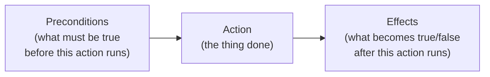

A concrete example — opening a door:

| Component | Value |
|-----------|-------|
| **Involved objects** | door_1 |
| **Preconditions** | `door_1_is_open = false`, `npc_in_same_room_as_door = true` |
| **Effects** | `door_1_is_open = true` |

### Planning as Graph Search

Given an initial state and a goal state, a planner searches for a sequence of actions whose cumulative effects transform the world from the initial state into the goal state:

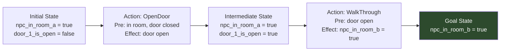

This is the plan: `[OpenDoor, WalkThrough]`. The planner generated it automatically from the action definitions — no designer scripted "if door closed, open it first."

### Real-World Applications

Planning as a field predates games entirely:

| Domain | Application |
|--------|-------------|
| Robotics (1970s onward) | Lunar/Mars rovers, home automation devices |
| Industrial control | Turbines, power stations, manufacturing lines |
| Logistics | Search-and-rescue, military planning, disaster relief |

F.E.A.R. (2005) brought this 35-year-old research tradition into mainstream game development.

---

## Part 2 — The Planning-Reality Gap

Planning models work in abstraction. Reality is messier. The door example hides a critical problem:

> *"The NPC can open the door if they're in a room that the door connects to — meaning this wee fella is apparently telekinetic and can open doors from very far away."*

In the planning model, `npc_in_same_room_as_door = true` is a predicate — it doesn't encode *where* in the room the NPC is. A more realistic precondition would be `npc_is_adjacent_to_door = true`. But now you need an action to get adjacent to the door, which requires knowing the door's position in world space, which the planner doesn't natively model.

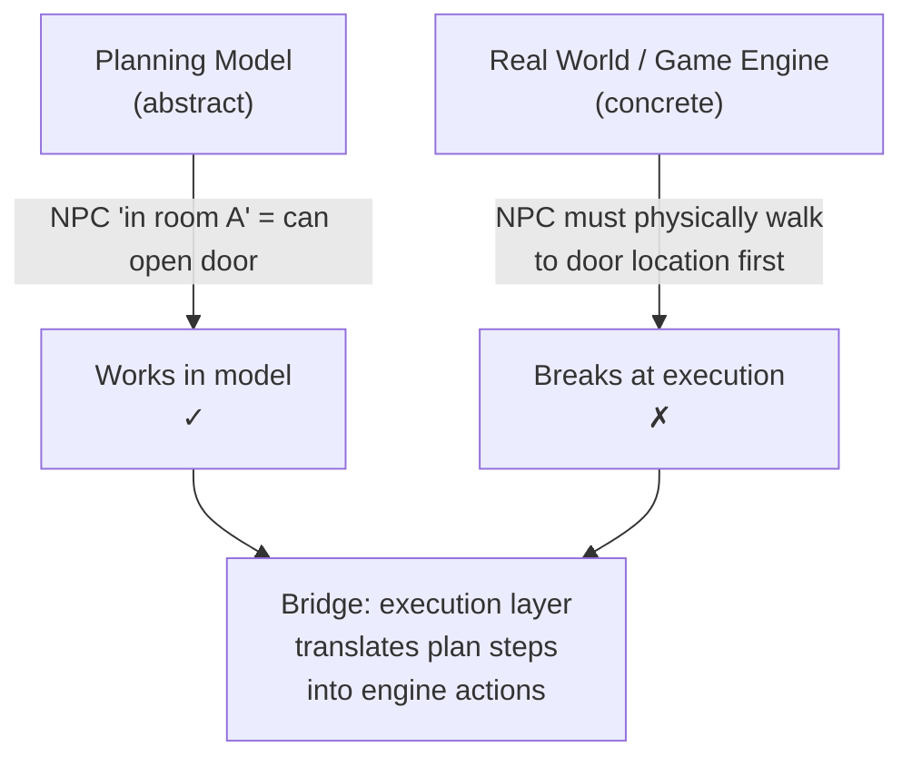

This gap — between what the planner reasons about and what the game engine executes — is the central engineering challenge of GOAP. The planner is great at answering "what should I do?" but the answer needs to be translated into physical agent behavior in a world that doesn't match the model's assumptions.

F.E.A.R.'s solution to this is elegant, and it's covered in Part 4.

---

## Part 3 — GOAP: Adapting Planning for Game AI

### Origins

GOAP adapts **STRIPS** (Stanford Research Institute Problem Solver, 1971) — one of the earliest automated planning systems — for use in real-time games. The key challenge: STRIPS-style planning is computationally expensive and was designed for offline use. Making it run per-frame on 20+ active NPCs required significant engineering.

Lead developer: **Dr. Jeff Orkin**, AI lead at Monolith Productions. Orkin implemented GOAP in *No One Lives Forever 2* (2002) and refined it for *F.E.A.R.* (2005). His 2006 GDC paper documenting the system is the canonical reference.

### GOAP's Core Reframing

FSMs and behavior trees require designers to enumerate every possible behavior and connect them explicitly. GOAP inverts this:

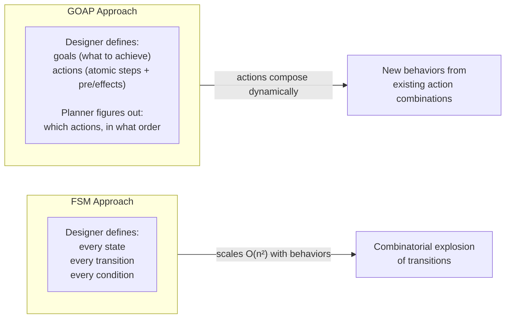

In GOAP, the designer doesn't connect behaviors — they define what behaviors *need* and *produce*. The planner discovers connections at runtime.

---

## Part 4 — The GOAP FSM: Three States That Cover Everything

Here is GOAP's most surprising architectural choice. Despite replacing the complex FSMs of earlier games, F.E.A.R.'s GOAP system is *itself* driven by an FSM. But this FSM has only **three states**:

| State | Description | Examples |
|-------|-------------|---------|
| **GoTo** | Move to a position in the world | Walk, run, jump, dive, climb |
| **Animate** | Play an animation in place | Reload, shoot, react to hit, idle |
| **UseSmartObject** | Interact with an annotated world object | Open door, sit in chair, flip table, use cover node |

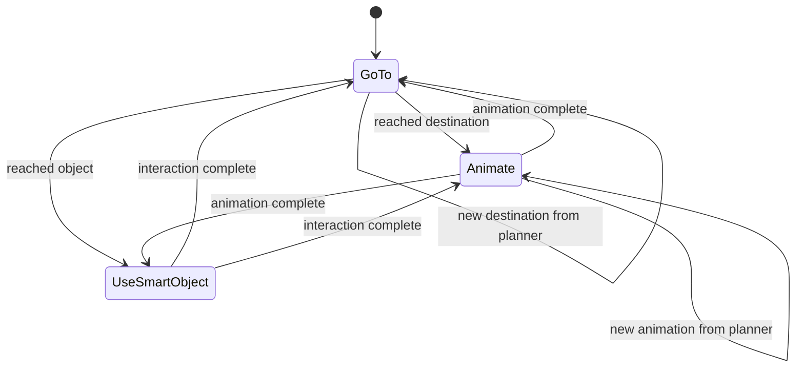

### Why Three States Are Sufficient

This is the insight that makes GOAP architecturally radical:

> *"If you consider an AI in a game — be it the headcrabs in Half-Life, the Elites in Halo, or even the Xenomorph in Alien: Isolation — all they do is play animations in very specific circumstances. It's when that animation is played in the right place at the right time that it appears clever, and when several clever animations are played in sequence, the behavior appears intelligent."*

Every NPC behavior, no matter how complex-seeming, reduces to:
1. **Move somewhere** (GoTo)
2. **Do something** (Animate)
3. **Interact with something** (UseSmartObject)

"Taking cover" = GoTo(cover node) + Animate(crouch animation)
"Flanking" = GoTo(flanking position) + Animate(shoot animation)
"Calling for backup" = Animate(radio animation) + (triggers a goal for another NPC)

The planner determines *which* animation, *where* to go, and *what* to interact with. The FSM's three states are just the execution vehicles for those decisions.

### Smart Objects

Smart objects are world objects annotated with AI interaction data. Rather than the AI system knowing how to open every door, flip every table, or use every cover spot — **the object itself describes the interaction**:

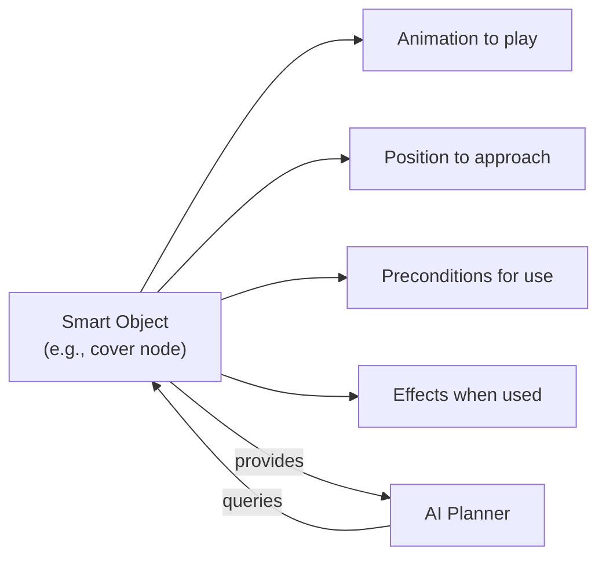

This is data-driven design: level designers populate the world with smart objects, and NPCs discover how to use them through the planning system rather than through hardcoded AI logic. Adding a new cover type, furniture piece, or door variant only requires annotating the object — no AI code changes.

---

## Part 5 — F.E.A.R.'s Implementation: Goals, Actions, and the Search

### Goals (~70 in F.E.A.R.)

Every AI character (soldiers, assassins, specters, and **even the rats**) is assigned a set of goals by the designer. Goals are not behavioral scripts — they are **desired world states**. The planner figures out how to achieve them.

Each goal has:
- `Initialize()` — set up goal parameters
- `Update()` — monitor goal progress
- `Terminate()` — clean up
- `CalculatePriority()` — return a numeric priority based on current world state

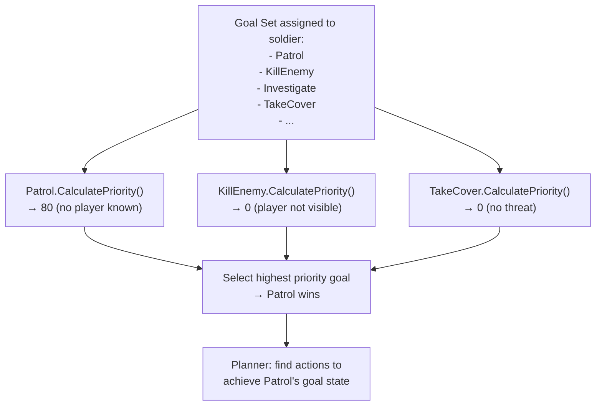

When the player is detected:

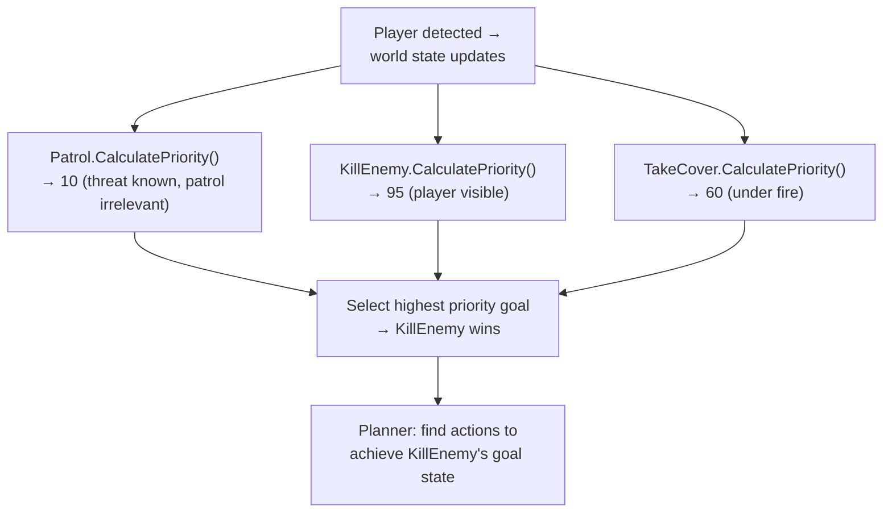

Goal priority shifts dynamically with world state. The NPC doesn't decide to engage — the priority function makes patrolling irrelevant when a threat is known.

### Actions (~120 in F.E.A.R.)

Each action is a C++ class with:
- Preconditions (what must be true)
- Effects (what becomes true/false)
- Cost (used by A* to prefer cheaper actions)

**Not all NPCs can use all actions.** Designers use a database editor to assign action subsets to each enemy type — controlling how sophisticated each character can be without modifying AI code.

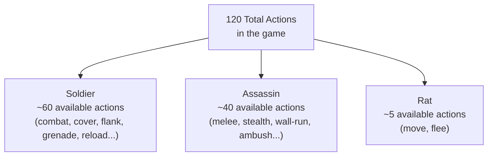

### A* Search Through Action Space

Given a goal (desired world state) and a starting world state, GOAP uses **A\* search** to find the optimal action sequence:

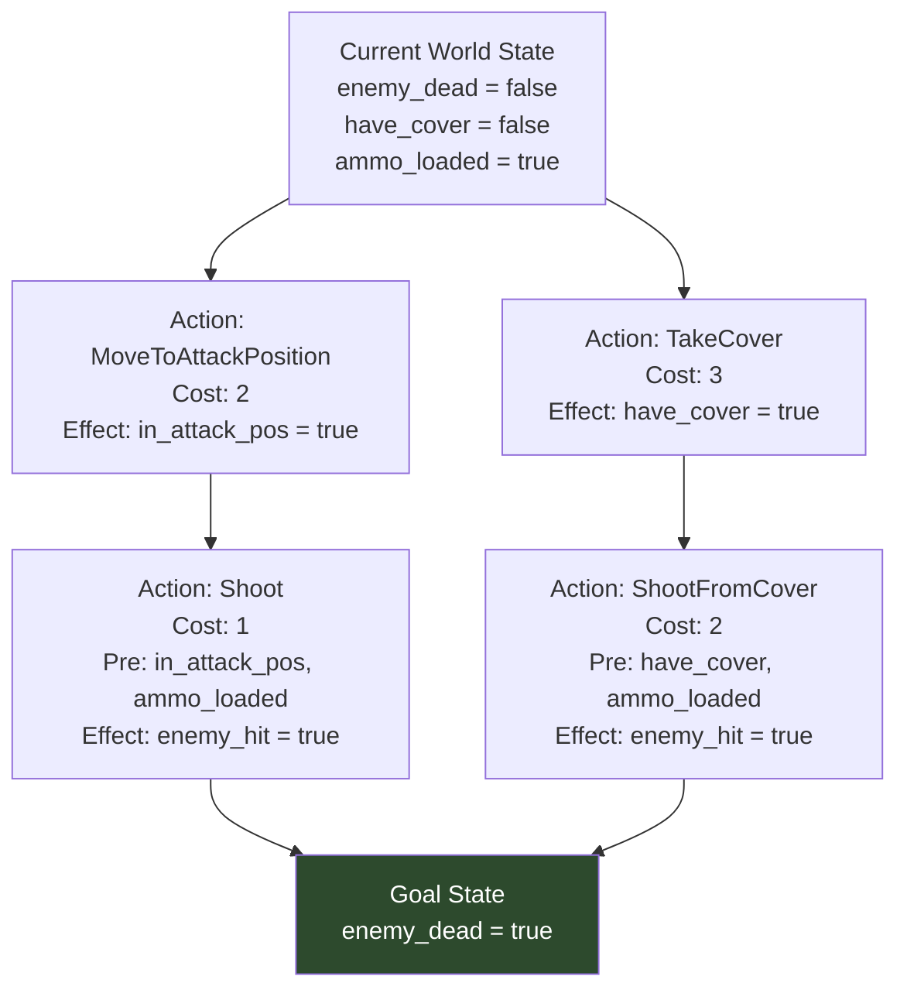

A* evaluates action costs to find the cheapest valid plan. Actions that are dangerous, costly, or situationally suboptimal can be given higher costs to make the planner prefer alternatives. This is how designers tune AI behavior without changing logic — just adjust action costs.

---

## Part 6 — Plan Validation: Three Mechanisms

F.E.A.R.'s plans can be invalidated by the dynamic game world — another character opens the door the NPC planned to open, a grenade destroys the cover node it was moving to, the player ducks behind a wall. Three mechanisms handle this:

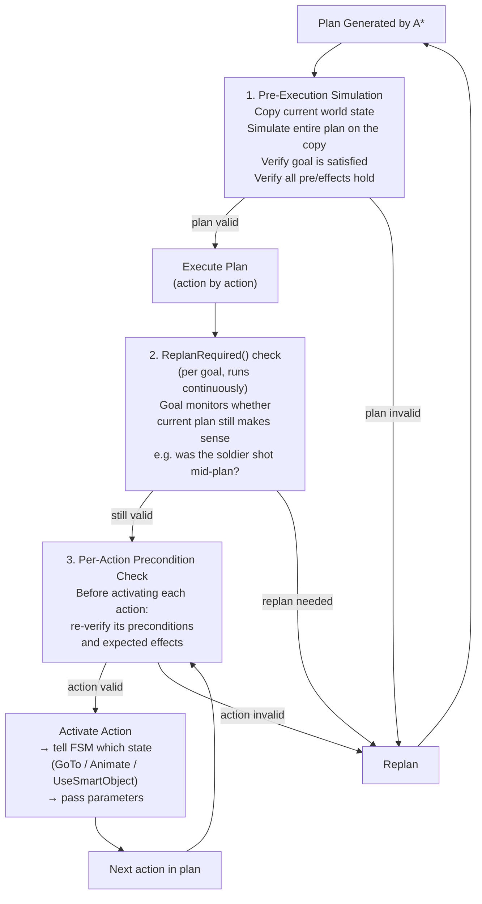

**Key constraint on Mechanism 2:** `ReplanRequired()` cannot interrupt an animation that is flagged as non-interruptible. A character that has started a grenade-throw animation will complete it even if the plan is otherwise invalidated. This mirrors real-world committed actions and prevents jittery behavior.

Once a plan completes successfully, the goal is resolved, and the system selects the next highest-priority goal and plans again. This loop runs continuously, keeping the NPC always purposeful.

---

## Part 7 — NPCs Don't Know Each Other Exist

This is the most important emergent property of F.E.A.R.'s AI, and the most counterintuitive:

> *"None of the enemy AI in F.E.A.R. know that each other exists. Cooperative behaviors are simply two AI characters being given goals that line up nicely to create what looks like coordinated behavior when executed."*

When soldiers flank the player from both sides, it looks like communication. It's coincidence arising from structure:

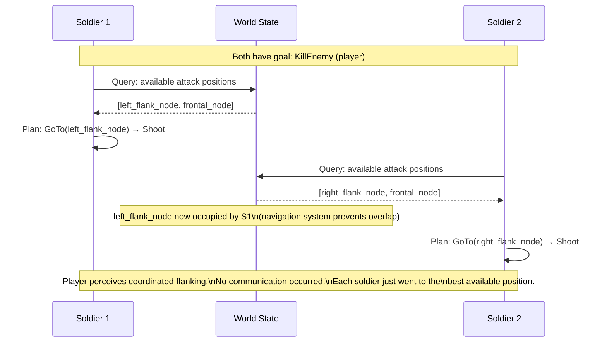

The navigation system (which prevents NPCs from pathing to occupied nodes) is the hidden coordinator. Two soldiers cannot occupy the same position, so they naturally distribute across available positions — which often means approaching the player from different angles.

Emergence here is driven by **exclusion**, not coordination. The soldiers don't choose to flank together; they independently choose the best position available to them, and the best positions happen to create a flanking geometry.

This extends to all observed "cooperative" behaviors:
- **Suppressive fire**: Soldier A is shooting → Soldier B moves; Soldier B's movement plan selects a node in a different direction → produces covering movement pattern
- **Leapfrog advances**: Each soldier plans independently; sequential goal resolution happens to produce staggered movement
- **Calling out**: An audio cue (a smart object interaction) triggers a world-state update that adjusts other NPCs' goal priorities — not direct communication, but state-mediated coordination

---

## Part 8 — The Rat Problem: Unexpected Emergent Failure

A 2014 research paper by Prof. Le Jia Coupon revealed a performance bug that Monolith's own developers didn't know about for years:

> *"The rats in F.E.A.R. use the same GOAP system as the soldiers."*

Rats have extremely simple goals: move to another location, preferably away from the player. Their plans are trivially short. But the `ReplanRequired()` check doesn't filter on whether the rat's goal is still relevant to its current situation — so rats that encounter the player in the first seconds of a level will continue replanning every few frames for the **entire level**, even 20 minutes later when the player is on the other side of the map.

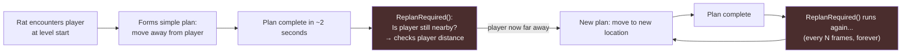

The rat's `ReplanRequired()` implementation doesn't consider player distance — it just keeps checking. Tiny overhead per check × many rats × full level duration = measurable performance hit across some levels.

This is a case study in the **cost of generality**. Using the same planning system for all agents regardless of complexity is architecturally clean, but it removes the opportunity for cheap-path optimizations for simple agents. The rats didn't need GOAP — a simple two-state FSM (wander, flee) would have been sufficient and free of this overhead.

---

## Part 9 — Emergent Behavior Analysis

### The Emergence Stack in GOAP

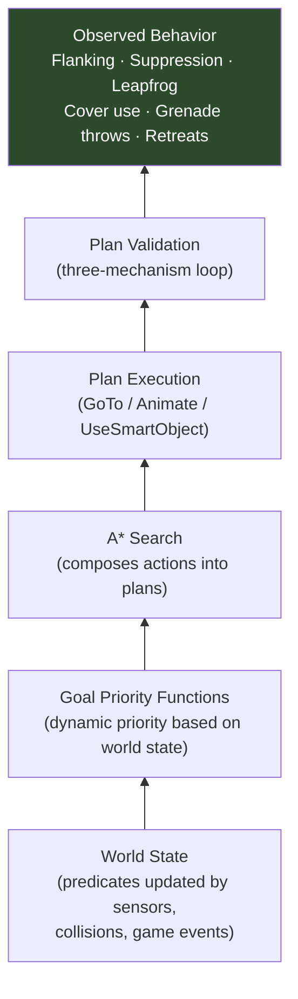

### GOAP vs. FSM Emergence Comparison

| Property | FSM (Half-Life) | GOAP (F.E.A.R.) |
|----------|----------------|-----------------|
| Behavior source | Hand-authored transitions | Runtime-planned action sequences |
| How new behaviors appear | Designer adds states/transitions | Actions compose in novel combinations |
| Context sensitivity | Conditions invalidate schedules | World state shifts goal priorities, re-plans |
| Inter-agent awareness | None (same as GOAP) | None |
| Coordination mechanism | Independent agents, shared world | Independent agents, shared world + navigation exclusion |
| Complexity limit | Transitions scale O(n²) | Actions compose; adding actions doesn't break existing plans |

The crucial shared property: **neither system has inter-agent awareness**. Group behavior in both cases is emergent from independent agents interacting with shared world state. The difference is that GOAP agents reason about *what sequence of actions to take*, not just *which pre-defined behavior to switch into*.

### What GOAP Makes Possible That FSMs Don't

In an FSM, the NPC can only do behaviors the designer explicitly connected. A soldier that has states {Attack, TakeCover, Reload, Grenade} can only do those things. Adding "throw grenade while retreating" requires a new state and new transitions.

In GOAP, if the actions `ThrowGrenade` and `Retreat` both exist with compatible preconditions and effects, the planner may combine them in a plan without the designer ever specifically authoring that combination. **Novel behavior emerges from novel goal states that the planner satisfies using existing action building blocks.**

This is the strongest form of emergent behavior in the case studies so far: not just behavior arising from rule interactions (as in Half-Life), but **behavior the designers never anticipated**, generated by the planner discovering action combinations they didn't consciously design.

---

## Part 10 — Comparison to Other Techniques

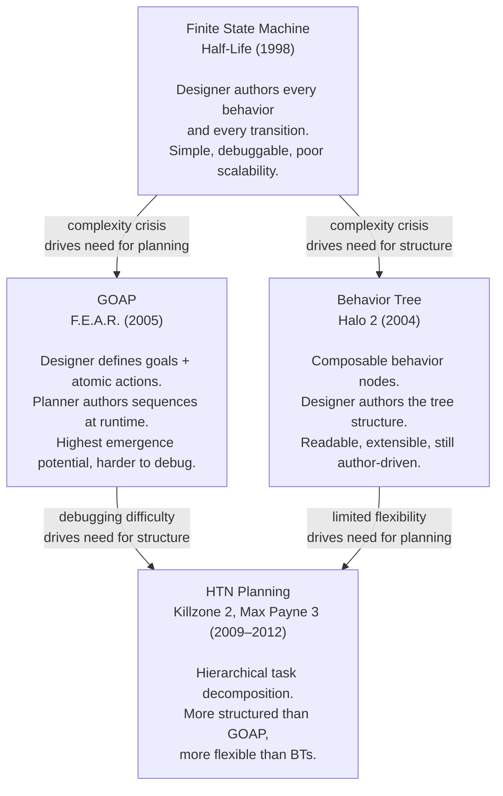

### The GOAP Debugging Problem

GOAP's generative power comes with a cost: when behavior is unexpected, tracing *why* the planner chose a particular action sequence is non-trivial. In an FSM, you can follow the transition graph. In a behavior tree, you can trace the node evaluation. In GOAP, you have to reconstruct the A* search — understanding which actions were available, what their costs were, what the world state was at each step.

This is a significant reason why behavior trees became more prevalent in the industry despite GOAP's more impressive emergent properties. Authoring and debugging GOAP systems requires understanding planning theory, not just game logic.

---

## Part 11 — Legacy and Successors

### Games That Adopted GOAP or Similar Systems

| Game | Developer | Notes |
|------|-----------|-------|
| Condemned: Criminal Origins (2005) | Monolith | Same developer, similar system |
| S.T.A.L.K.E.R.: Shadow of Chernobyl (2007) | GSC Game World | Modified planning approach |
| Just Cause 2 (2010) | Avalanche Studios | GOAP-influenced |
| Deus Ex: Human Revolution (2011) | Eidos Montréal | Planning-based AI |
| Tomb Raider (2013) | Crystal Dynamics | GOAP-influenced enemy AI |
| Middle-Earth: Shadow of Mordor / War (2014/2017) | Monolith | Direct GOAP lineage |

### The Shift to HTN Planning

By the late 2000s, **Hierarchical Task Network (HTN) planning** began replacing STRIPS-style GOAP in new titles. HTN decomposes high-level tasks into sub-tasks recursively, giving designers more structural control over behavior while retaining planning flexibility:

| Property | GOAP (STRIPS) | HTN |
|----------|--------------|-----|
| Plan structure | Flat sequence of actions | Hierarchical task tree |
| Designer control | Low (planner decides ordering) | Higher (designer defines decomposition structure) |
| Debuggability | Difficult | Better (hierarchy is inspectable) |
| Expressiveness | High | Very high |

Notable HTN titles: *Killzone 2* (2009), *Max Payne 3* (2012), *Dying Light* (2015), *Horizon Zero Dawn* (2017), *Transformers: Fall of Cybertron*.

---

## References

| Source | Author | URL |
|--------|--------|-----|
| "Building the AI of F.E.A.R. with Goal Oriented Action Planning \| AI 101" | Tommy Thompson (AI and Games) | YouTube |
| "Three States and a Plan: The AI of F.E.A.R." (GDC 2006) | Jeff Orkin | GDC Vault |
| F.E.A.R. SDK / Public Tools | Monolith Productions | Available for download |
| Performance analysis of F.E.A.R.'s GOAP (2014) | Prof. Le Jia Coupon | Academic paper |
| [[half-life-ai-fsm\|Half-Life AI Case Study]] | — | Internal vault |
| [[fsm-theory-and-implementation\|FSM Theory & Implementation]] | — | Internal vault |
