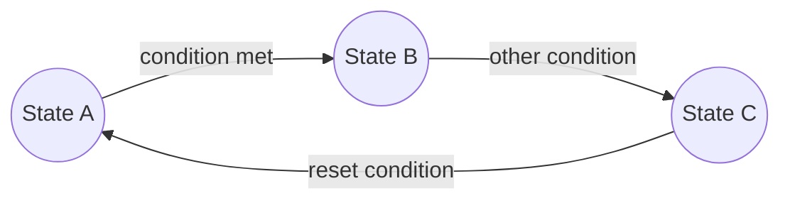
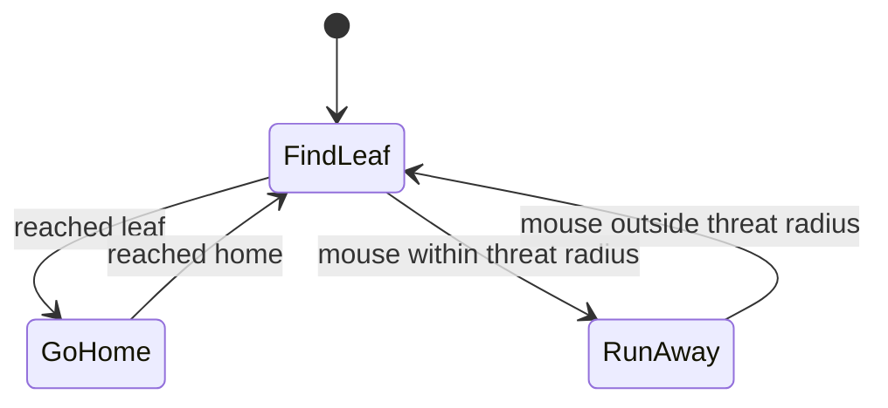
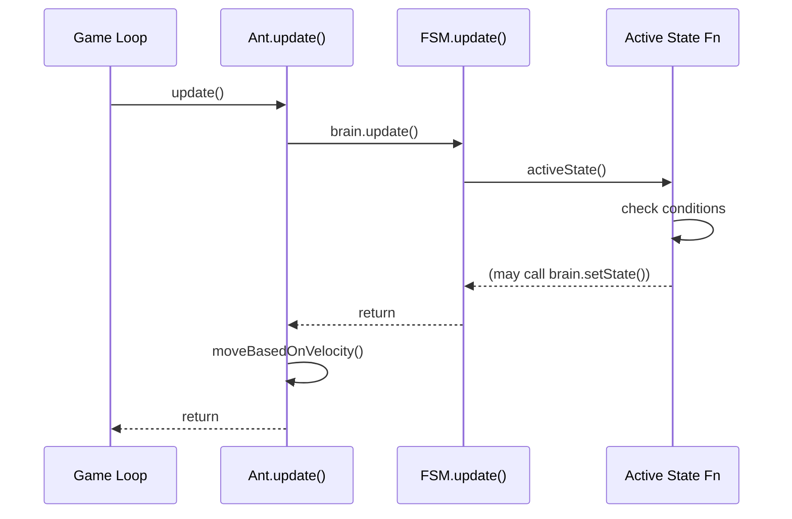
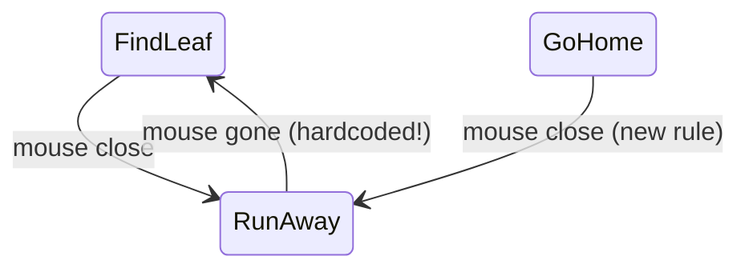
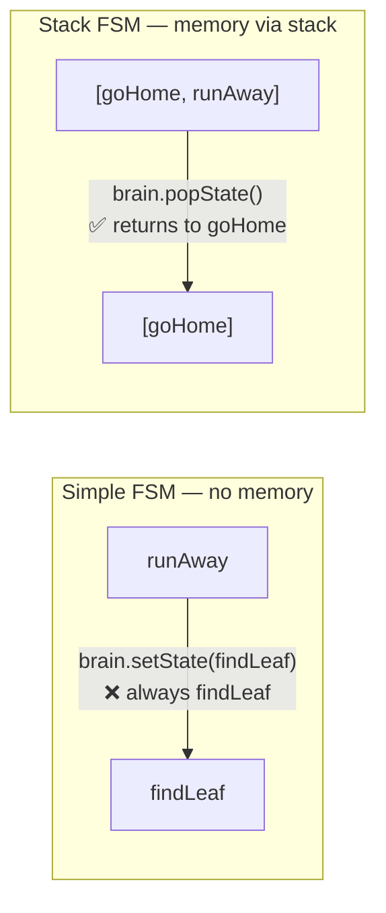
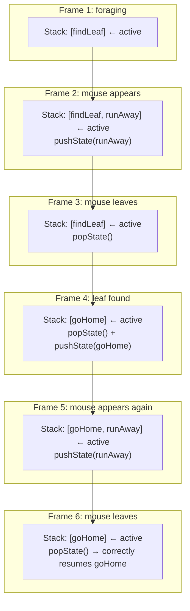
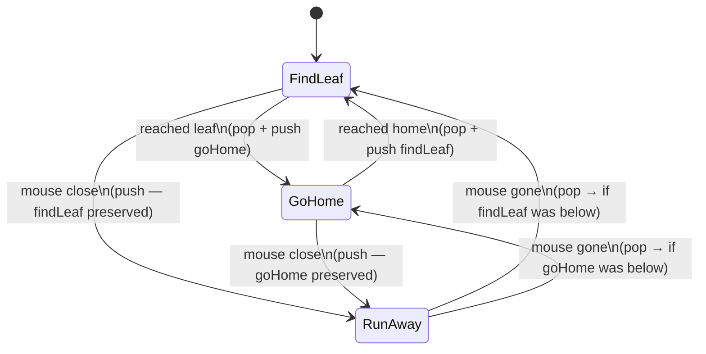
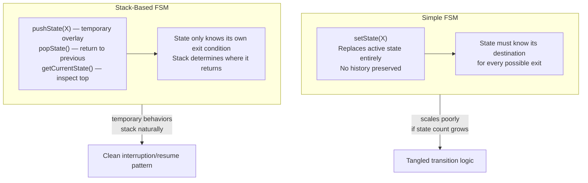
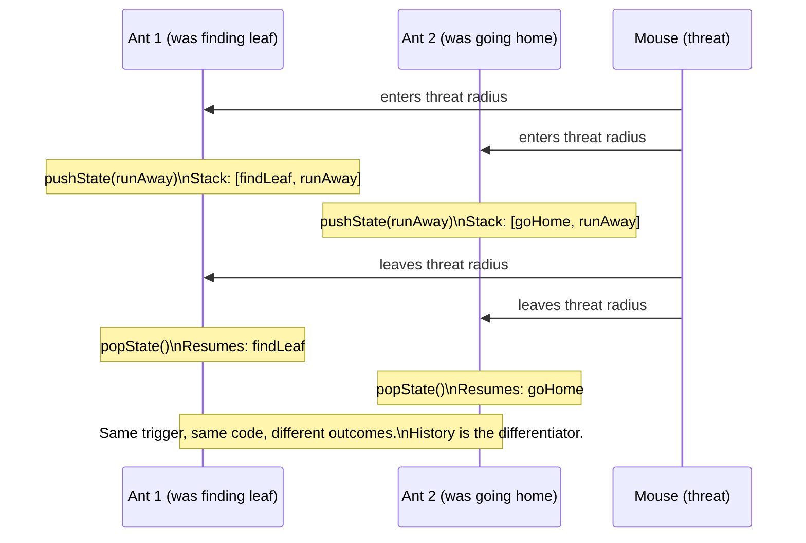

# FSM Theory & Implementation — Simple and Stack-Based

> **Primary source:** Fernando Bevilacqua, *"Finite-State Machines: Theory and Implementation"* — Tuts+ Game Dev
> **Related:** [[half-life-ai-fsm|Half-Life AI Case Study]] — applies these patterns at production scale

---

## Overview

This case study builds on FSM theory from first principles by working through a concrete, minimal implementation: an ant with three behaviors — foraging, returning home, and fleeing from threats. The source article covers two distinct FSM architectures, each solving a different class of problem. Understanding the gap between them is the central lesson.

---

## Part 1 — Theory Recap: What Is an FSM?

An FSM is a computational model where:
- The machine exists in exactly **one state** at any given time
- **Transitions** move the machine from one state to another when conditions are met
- Each state encapsulates **what the system should do** while that state is active

Visually, an FSM is a directed graph: nodes are states, edges are transitions, and labels on edges are the conditions that trigger them.



The key constraint — **only one state active at a time** — is what makes FSMs tractable. The machine never has to reconcile conflicting behaviors; it simply *is* in one mode.

---

## Part 2 — The Ant: Designing States and Transitions

The ant is a minimal but complete AI agent. It has three states:

| State | Behavior |
|-------|----------|
| **Find Leaf** | Navigate toward the leaf (the "food" target) |
| **Go Home** | Carry the leaf back to the home position |
| **Run Away** | Flee from the mouse cursor (threat) |

### Designing Transitions

Not every state connects to every other state. This is a deliberate design choice — it encodes **behavioral constraints**:

- The ant flees (`Find Leaf → Run Away`) when the mouse gets close
- Once safe again, it resumes foraging (`Run Away → Find Leaf`)
- On reaching the leaf, it heads home (`Find Leaf → Go Home`)
- On reaching home, it goes back out (`Go Home → Find Leaf`)
- **Critically:** the ant does NOT flee mid-transit home (`Go Home` has no `Run Away` transition)

This last point is a design decision, not a technical limitation. The designer chose that the ant, once carrying the leaf, is committed to getting home even under threat.



Notice: `GoHome` has no outgoing arrow to `RunAway`. That behavioral absence is as meaningful as any transition.

---

## Part 3 — Simple FSM: Implementation

### The FSM Class

The core insight of this implementation: **states are functions**. The FSM holds a pointer to whichever function is currently active and calls it every frame.

```actionscript
// ActionScript 3 — but the pattern is language-agnostic
public class FSM {
    private var activeState : Function;

    public function setState(state : Function) : void {
        activeState = state;
    }

    public function update() : void {
        if (activeState != null) {
            activeState();
        }
    }
}
```

That's the entire FSM. Three things:
1. A reference to the current state (a function)
2. A way to change that reference (`setState`)
3. A way to invoke it each frame (`update`)

No switch statements. No enums. No inheritance hierarchy for states. The "state" is just *which function is currently being called*.

### The Ant Class

```actionscript
public class Ant {
    public var position : Vector3D;
    public var velocity : Vector3D;
    public var brain   : FSM;

    public function Ant(posX : Number, posY : Number) {
        position = new Vector3D(posX, posY);
        velocity = new Vector3D(-1, -1);
        brain    = new FSM();
        brain.setState(findLeaf);   // initial state
    }

    public function update() : void {
        brain.update();             // runs the active state function
        moveBasedOnVelocity();
    }
}
```

The ant's `brain` is its FSM. Each frame: the brain runs the current state function, the state function sets the velocity, then the ant moves.

### The State Functions

**`findLeaf()`** — navigate toward the leaf; transition away on two conditions:

```actionscript
public function findLeaf() : void {
    // Set velocity toward the leaf
    velocity = new Vector3D(
        Game.instance.leaf.x - position.x,
        Game.instance.leaf.y - position.y
    );

    // Transition: reached the leaf
    if (distance(Game.instance.leaf, this) <= 10) {
        brain.setState(goHome);
    }

    // Transition: mouse is threatening
    if (distance(Game.mouse, this) <= MOUSE_THREAT_RADIUS) {
        brain.setState(runAway);
    }
}
```

**`goHome()`** — navigate toward the home position; only one exit:

```actionscript
public function goHome() : void {
    velocity = new Vector3D(
        Game.instance.home.x - position.x,
        Game.instance.home.y - position.y
    );

    // Transition: reached home
    if (distance(Game.instance.home, this) <= 10) {
        brain.setState(findLeaf);
    }
    // No mouse check — intentional design choice
}
```

**`runAway()`** — flee from the mouse:

```actionscript
public function runAway() : void {
    velocity = new Vector3D(
        position.x - Game.mouse.x,
        position.y - Game.mouse.y
    );

    // Transition: safe again
    if (distance(Game.mouse, this) > MOUSE_THREAT_RADIUS) {
        brain.setState(findLeaf);
    }
}
```

### Data Flow Each Frame



---

## Part 4 — The Problem with the Simple FSM

The simple FSM has a hidden ambiguity. Consider this scenario:

1. Ant is in `goHome` (carrying the leaf)
2. Mouse gets dangerously close
3. The designer later changes their mind: the ant **should** flee even when carrying the leaf

To add this, you'd update `goHome` to also check for the mouse and call `brain.setState(runAway)`. That's fine. But now `runAway` has a problem:



When the mouse leaves the threat radius, `runAway` calls `brain.setState(findLeaf)` — **always**. But if the ant was mid-transit home when it fled, it forgets that and goes back to foraging. It dropped the leaf.

The simple FSM has **no memory of where it came from**. Every transition must hard-code a destination. The more states you add, the more complex and fragile these destination decisions become.

This is the fundamental scalability limit of the simple FSM: **transitions are stateless**, which forces each state to know too much about the overall machine.

---

## Part 5 — Stack-Based FSM: The Solution

The stack-based FSM replaces the single `activeState` with a **stack of states**. The top of the stack is always the active state. This gives the machine a memory: when a temporary state finishes, it pops itself off the stack, and whatever was below it resumes automatically.



### The StackFSM Class

```actionscript
public class StackFSM {
    private var stack : Array;

    public function StackFSM() {
        this.stack = new Array();
    }

    public function update() : void {
        var currentStateFunction : Function = getCurrentState();
        if (currentStateFunction != null) {
            currentStateFunction();
        }
    }

    public function pushState(state : Function) : void {
        if (getCurrentState() != state) {
            stack.push(state);
        }
    }

    public function popState() : Function {
        return stack.pop();
    }

    public function getCurrentState() : Function {
        return stack.length > 0 ? stack[stack.length - 1] : null;
    }
}
```

Key note: `pushState` guards against pushing the same state that's already on top — preventing infinite stack growth if the same condition fires every frame.

### Stack State Visualization



### Updated Ant Implementation

Now both `findLeaf` and `goHome` can respond to the mouse threat — and `runAway` doesn't need to know where it came from:

```actionscript
public function findLeaf() : void {
    velocity = new Vector3D(
        Game.instance.leaf.x - position.x,
        Game.instance.leaf.y - position.y
    );

    if (distance(Game.instance.leaf, this) <= 10) {
        brain.popState();
        brain.pushState(goHome);
    }

    if (distance(Game.mouse, this) <= MOUSE_THREAT_RADIUS) {
        brain.pushState(runAway);    // push — findLeaf stays below on stack
    }
}

public function goHome() : void {
    velocity = new Vector3D(
        Game.instance.home.x - position.x,
        Game.instance.home.y - position.y
    );

    if (distance(Game.instance.home, this) <= 10) {
        brain.popState();
        brain.pushState(findLeaf);
    }

    if (distance(Game.mouse, this) <= MOUSE_THREAT_RADIUS) {
        brain.pushState(runAway);    // push — goHome stays below on stack
    }
}

public function runAway() : void {
    velocity = new Vector3D(
        position.x - Game.mouse.x,
        position.y - Game.mouse.y
    );

    if (distance(Game.mouse, this) > MOUSE_THREAT_RADIUS) {
        brain.popState();            // pop — resumes whatever was below
    }
}
```

`runAway` now has **zero knowledge** of what it interrupted. It just pops itself when it's done. The stack handles the rest.

### Updated State Diagram (Stack FSM)



The `RunAway → FindLeaf` and `RunAway → GoHome` arrows are the same line of code (`brain.popState()`) — the destination is determined by the stack, not by `runAway` itself.

---

## Part 6 — Architecture Comparison



| Concern | Simple FSM | Stack FSM |
|---------|-----------|-----------|
| Implementation complexity | Minimal | Slightly higher |
| Transition logic ownership | Each state knows destinations | Stack handles returns automatically |
| Adding a new interruption | Must update all affected states' exit logic | Push the new state; pop when done |
| Memory of prior context | None | Full stack preserved |
| Risk of misuse | Transitions can conflict or be forgotten | Stack can grow unbounded if pushes aren't paired with pops |
| Best for | Well-bounded, static transition graphs | Systems with temporary/interruptible behaviors |

---

## Part 7 — Design Patterns Extracted

### 1. State as Function (not class)
Using a function pointer rather than a class hierarchy for each state is a significant simplification. There's no `IState` interface, no polymorphism, no boilerplate. The trade-off: state functions can't hold their own state — all data lives on the owner object (the `Ant`). This is fine for simple agents; for complex ones, a class-per-state approach allows states to have their own local state (timers, counters, etc.).

### 2. The FSM as a "Brain"
The ant holds its FSM as a `brain` member — a named collaborator, not a base class. This composition-over-inheritance pattern means the FSM is independently testable and swappable. You could give the ant a different brain type (simple vs. stack) without touching the ant's movement or render code.

### 3. Transition Logic Lives in States, Not the FSM
The FSM class itself has no knowledge of the ant's conditions. It just runs the active function. All transition logic (`if distance(leaf) <= 10 → setState(goHome)`) lives inside each state function. This separation keeps the FSM generic and reusable across different agent types.

### 4. Push/Pop as Interruption Primitive
The stack FSM's push/pop pair is a general-purpose **interruption pattern**. Any behavior that should temporarily override the current state and then yield control back is expressible as:
```
pushState(interruptingBehavior)
// later, when done:
popState()
```
This maps cleanly onto many real game AI scenarios: NPC reacts to a sound → investigates → resumes patrol; player character enters dialogue → exits → resumes movement.

---

## Part 8 — Emergent Behavior in the Ant

The ant has three states and ~four conditions. Yet it produces coherent, believable behavior:

- Ants that were mid-transit home don't abandon the leaf when startled (if you only add the `goHome` mouse check in the stack version)
- The threat response is contextual — the ant's post-flight destination depends on what it was doing, not on any explicit "remember what I was doing" code
- Multiple ants, each running the same FSM with different positions, create the impression of an ant colony with natural-feeling variation in routing and timing

The stack FSM in particular demonstrates a key emergent property: **the machine's history (the stack) encodes context that produces differentiated responses to identical inputs**. Two ants fleeing the same mouse cursor may return to different states afterward based on what each was doing when interrupted.



This is emergence: the same rule system applied to agents with different histories produces different, contextually appropriate behavior — without any logic that explicitly reasons about context.

---

## Part 9 — Connecting to Production Systems

The patterns in this minimal ant implementation appear directly in Half-Life's AI (see [[half-life-ai-fsm|Half-Life case study]]) scaled up significantly:

| Ant concept | Half-Life equivalent |
|-------------|---------------------|
| State function | Task (~80 atomic behaviors) |
| State transitions | Schedule invalidation + new schedule selection |
| `brain` FSM | The full Monster AI pipeline |
| Stack memory | Goals (5 directives sequencing schedules) |
| Threat interrupt (runAway) | Condition flags invalidating current schedule |
| `pushState` / `popState` | Schedule selection based on conditions + active goal |

Half-Life adds sensors (vision, sound, smell) as the condition-update mechanism, and schedules as macro-sequences that chain multiple tasks — but the fundamental pattern is identical: **each behavior owns its own transition logic, and the machine's current context determines what behavior is restored after an interrupt.**

---

## References

| Source | Author | URL |
|--------|--------|-----|
| "Finite-State Machines: Theory and Implementation" | Fernando Bevilacqua | [Tuts+ Game Dev](https://code.tutsplus.com/finite-state-machines-theory-and-implementation--gamedev-11867t) |
| Half-Life SDK (source code) | Valve Software | [GitHub](https://github.com/ValveSoftware/halflife) |
| [[half-life-ai-fsm\|Half-Life AI Case Study]] | Tommy Thompson (sourced) | Internal vault |
