# Half-Life (1998) — AI Case Study: Finite State Machines & Emergent Behavior

> **Source:** Tommy Thompson, *"The AI of Half-Life | Finite State Machines | AI 101"* — AI and Games (YouTube)

---

## Overview

This case study examines Valve's *Half-Life* (1998) as a foundational example of Finite State Machine (FSM) design in game AI. Beyond just documenting the implementation, the goal is to understand **how simple rule-sets at multiple layers interact to produce emergent behavior** — NPC actions that appear intelligent and contextual without being explicitly scripted.

Half-Life's AI was groundbreaking in 1998 and remains instructive today because it demonstrates a core truth about complex systems: **emergence doesn't require complexity at any single layer; it requires structured interaction between layers.**

---

## Part 1 — Finite State Machine Theory

### What Is an FSM?

A **Finite State Machine (FSM)** — also called a finite state automaton — is a model for simulating sequential logic. Two bodies of work form its theoretical foundation:

- **George H. Mealy** (1955)
- **Prof. Edward F. Moore** (1956)

The three core components:

| Component | Definition | Game AI equivalent |
|-----------|------------|-------------------|
| **States** | Discrete modes; only one active at a time | Idle, Patrol, Attack, Flee |
| **Inputs** | Signals the machine recognizes | Enemy spotted, took damage, timer elapsed |
| **Transitions** | Rules mapping (state + input) → next state | If Alert + enemy visible → Attack |

In game AI, each state typically encapsulates behavior: the animations, sounds, decisions, and actions appropriate for that mode.

### Deterministic vs. Non-Deterministic FSMs

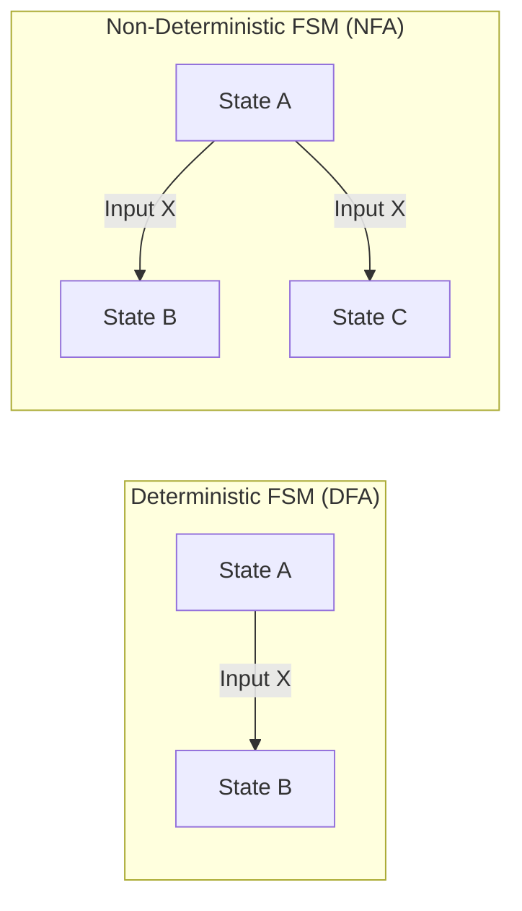

| Type | Behavior | Trade-off |
|------|----------|-----------|
| **Deterministic (DFA)** | One input → exactly one transition | Predictable, easy to debug, less nuance |
| **Non-Deterministic (NFA)** | One input → multiple eligible transitions | Models variance; harder to reason about |

NFAs allow different characters to respond to the same input in different ways — the foundation for individualized enemy personalities within a shared behavioral framework.

### A Generic Combat FSM

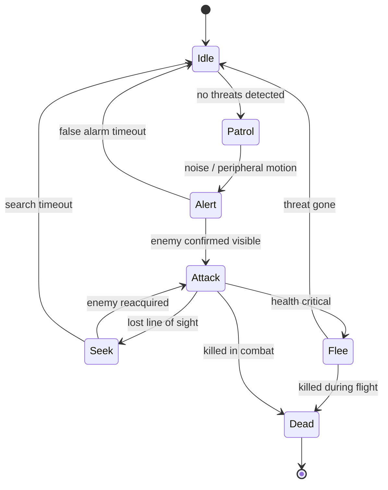

---

## Part 2 — FSMs in Game AI History

### Pac-Man — The Textbook Example of Shared Transitions + Individual State Logic

Pac-Man's ghosts are a near-perfect classroom example of **non-deterministic FSMs producing emergent group behavior from individual rules**:

- Each ghost has its own **Hunt** state with unique targeting logic (Blinky chases directly, Pinky predicts, Inky uses Blinky as a reference point, Clyde retreats when close)
- All ghosts share a single **Evade** state with identical logic
- One input (player grabs power pill) triggers the **same transition** for all ghosts simultaneously

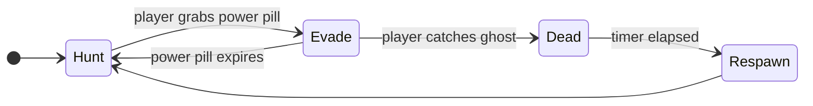

**The emergent property:** The player perceives the ghosts as a coordinated pack that retreats en masse. No coordination code exists. It's an epiphenomenon of four independent FSMs receiving the same input at the same time.

---

### Batman: Arkham Asylum / City — FSMs at AAA Scale

The Arkham franchise uses FSMs to govern enemy behavior in both combat and stealth:

**Combat behavior:**
- The combat *system* (not the enemy AI) sends input signals to each character's FSM
- This creates dynamic, coordinated-feeling combat without explicit coordination logic
- Enemies pick up weapons, reposition, and time attacks based on their individual FSM states and the inputs they receive

**Stealth behavior:**

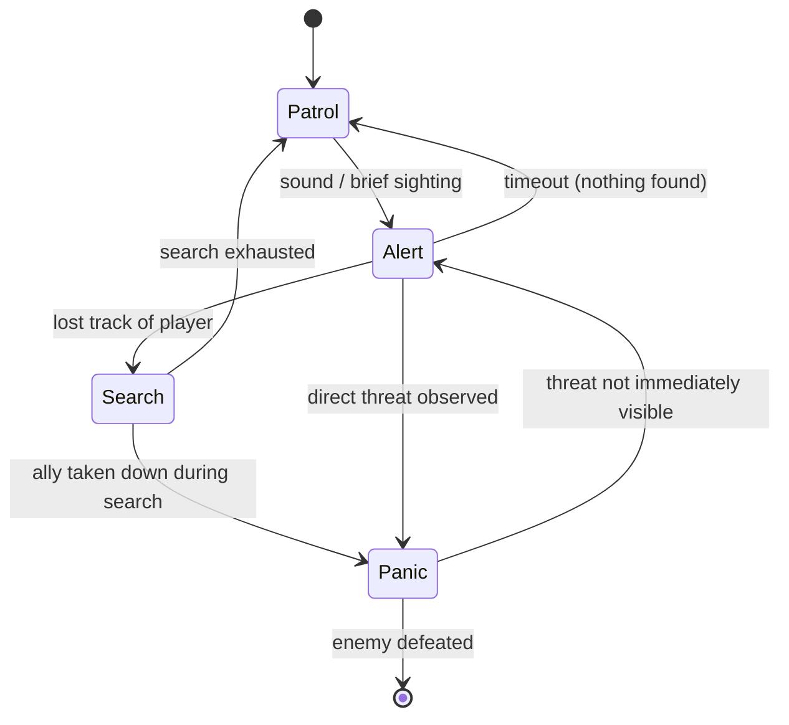

The **Panic** state is a good emergent design: guards who reach Panic call for backup, cluster, and behave erratically — not because panic behavior is scripted, but because the FSM's transitions to Panic coincide with conditions (allies gone, threat unknown) that make those behaviors the only rational outputs.

---

## Part 3 — The Scalability Problem

As FSMs grow, two compounding issues emerge:

1. **Labor intensity** — every possible transition must be hand-authored
2. **Combinatorial explosion** — transitions scale roughly as O(n²) with state count

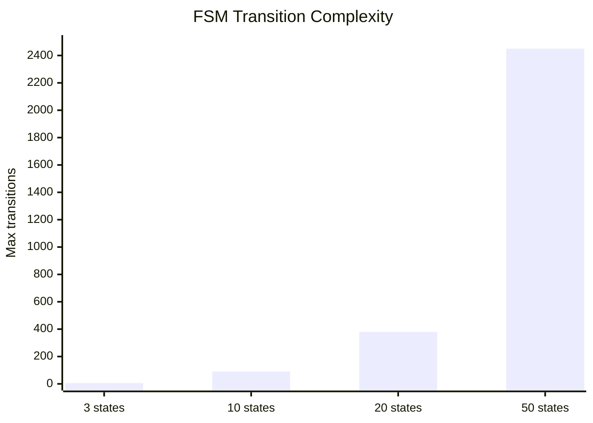

In practice this means:
- Small FSMs (3–10 states): tractable, debuggable
- Medium FSMs (10–20 states): manageable with discipline
- Large FSMs (20+ states): increasingly brittle; edge cases multiply faster than they can be tested

### Hierarchical FSMs (HFSMs)

Conceived in **1987**, HFSMs group states into sub-machines. A top-level FSM transitions between sub-FSMs rather than individual states, and each sub-FSM manages its own internal transitions.

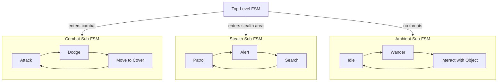

HFSMs were still in active use as recently as **2016** in id Tech Engine 5 (*Wolfenstein: The New Order*, *Doom 2016*). However, they only push the complexity problem up one level — the top-level FSM still faces combinatorial growth as the number of sub-machines increases.

### Why the Industry Moved On

| Technique | Origin game | Key advantage over FSMs |
|-----------|-------------|------------------------|
| **Behavior Trees** | *Halo 2* (2004) | Composable, readable, easily extended without cascading changes |
| **GOAP** (Goal-Oriented Action Planning) | *F.E.A.R.* (2005) | AI plans dynamically at runtime; no explicit transitions needed |

FSMs remain excellent for **small, well-bounded systems** and are still widely used for lower-level state management even in games that use behavior trees or GOAP at the higher level.

---

## Part 4 — Half-Life (1998): Deep Dive

### The Architecture at a Glance

Every NPC in Half-Life derives from a common C++ base class: `CBaseMonster`. The AI pipeline has five layered abstractions that feed into each other:

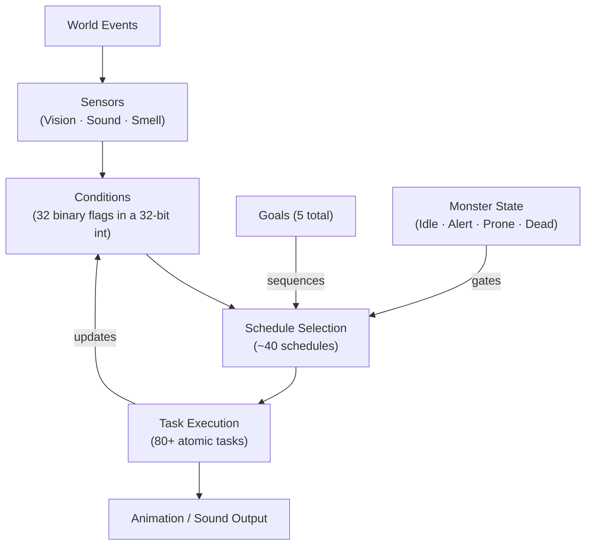

**The feedback loop is the key insight:** task execution updates conditions, which can invalidate the running schedule, triggering new schedule selection — all without any external script driving it.

---

### Layer 1 — Monster State (Meta-State)

This is **not** an FSM state in the traditional sense. It reflects the NPC's operational status — a gate that controls whether the AI can make decisions at all.

| State | Meaning | Effect |
|-------|---------|--------|
| `IDLE` | No known threats | Low-priority schedules selected |
| `ALERT` | Aware of potential threat | Higher-vigilance schedules |
| `PRONE` | Suppressed / incapacitated | Limited schedule access |
| `DEAD` | Killed | No schedule selection; AI halted |

---

### Layer 2 — Conditions (32 Binary Flags)

The AI's **world model** — what it knows at any given moment. Stored in a single 32-bit integer: every condition is either true or false.

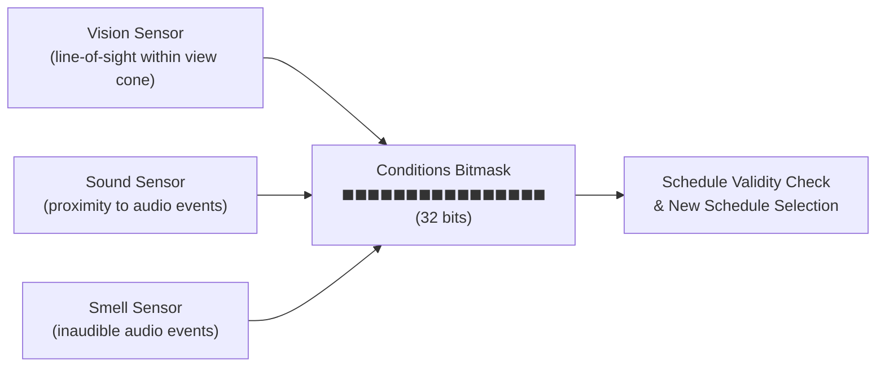

**Sample conditions:**

| Flag | Meaning |
|------|---------|
| `CAN_SEE_ENEMY` | Enemy is within view cone |
| `HEAR_SOUND` | Relevant audio within proximity |
| `LIGHT_DAMAGE` | Took minor damage this frame |
| `HEAVY_DAMAGE` | Took significant damage this frame |
| `NO_AMMO_LOADED` | Out of ammo |
| `ENEMY_DEAD` | Last known enemy is dead |
| *(2 custom fields)* | Per-monster-type extension points |

**Design note on the smell system:** Smell is implemented as "inaudible sound events" played at a location. The smell sensor *is* the audio sensor — just listening for a different event type. This is code reuse producing an entirely new sensory modality without new infrastructure. A reminder that clever constraints produce elegant design.

**Why 32 bits?** Beyond performance, this artificially caps the AI's world-model complexity. The AI cannot "know" more than 32 things at once. This forces the designer to prioritize what matters — and prevents the AI from becoming an omniscient planner that feels uncanny.

---

### Layer 3 — Tasks (80+ Atomic Behaviors)

Tasks are the atomic unit of behavior. Each task ≈ one FSM state. They're granular by design — too granular to be interesting alone, but composable into anything.

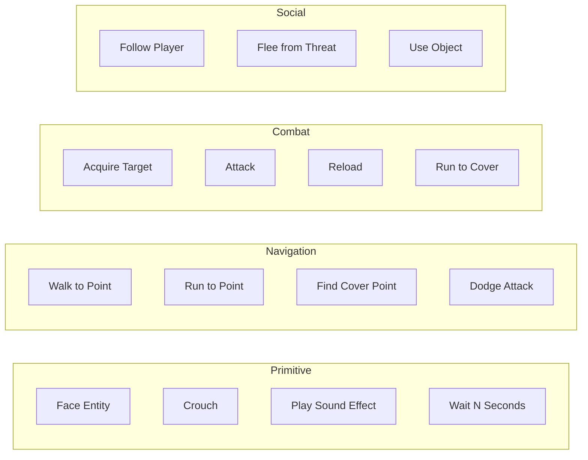

**Polymorphism for differentiation:** `CBaseMonster` handles common tasks. Each NPC subclass overrides tasks specific to its role:
- Scientists and security guards have unique variants of movement and idle behaviors
- Different soldier types handle target acquisition and cover differently
- Aliens can have completely alien task logic in the same slots

This means **one codebase supports radically different NPCs** without duplicating the scheduling and condition infrastructure.

---

### Layer 4 — Schedules (~40 Macro-Behaviors)

Schedules chain tasks into coherent behaviors. This is where **emergence begins** — a schedule of 3–5 tasks produces something that *reads* as intelligent strategy.

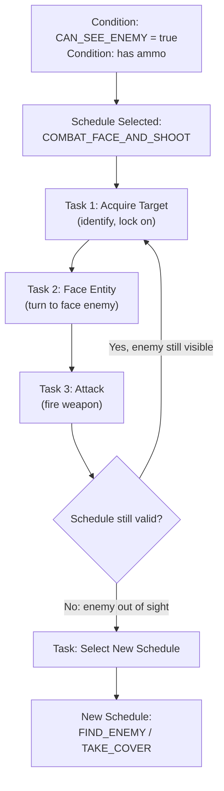

**The critical architectural constraint:** Tasks cannot be blended or run in parallel. If an NPC needs to both retreat and shoot, they **stop shooting first, then move**. 

This looks like a limitation — and it is — but it produces a naturalistic behavioral priority. NPCs don't try to do two things at once. They commit to one task until it completes or their schedule is invalidated. The AI feels decisive rather than jittery.

**Schedule invalidation** is the engine of reactivity:

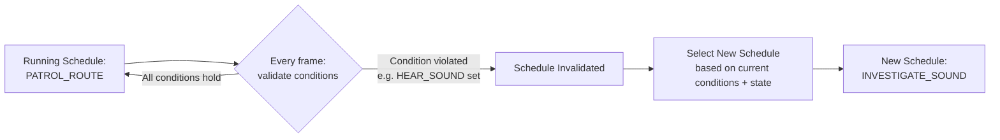

---

### Layer 5 — Goals (5 High-Level Directives)

Goals provide **multi-schedule strategy**. After completing a schedule, the active goal determines which schedule runs next — enabling the AI to pursue longer-term objectives than any single schedule captures.

Only 5 goals exist in the entire game. This is intentional: more goals would create a combinatorial problem at the goal level. Instead, the goals are abstract enough that schedules within them cover a wide range of situations.

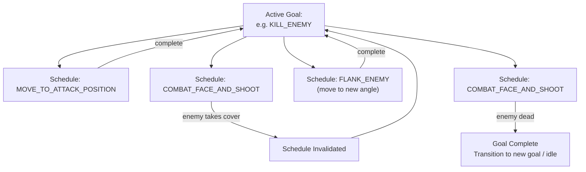

This is **deliberative** AI, not purely reactive. The enemy isn't just responding to the current frame — it's executing a sequence of actions toward an objective.

---

### Full Pipeline: From Sensor Input to Behavioral Output

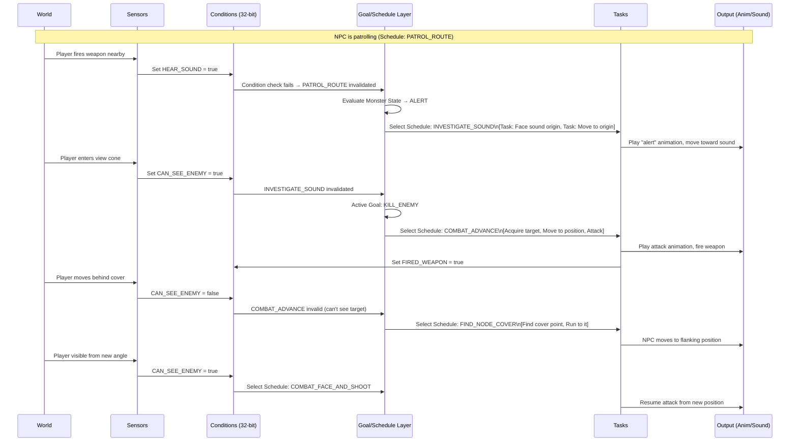

No individual rule in this pipeline produces "flanking." The behavior emerges from the interaction of sensor updates, condition flags, and schedule selection across multiple frames.

---

## Part 5 — Emergent Behavior Analysis

### The Emergence Stack

Half-Life's AI produces complex behavior not by scripting complex scenarios, but by defining simple rules at each layer and allowing layer interactions to compose upward:

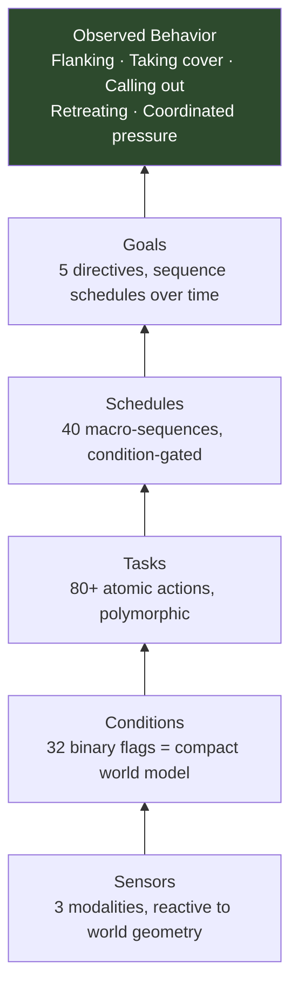

### How Group Behavior Emerges Without Coordination Code

When multiple NPCs share the same schedule-selection logic but differ in:
- Current sensor readings (different positions = different line-of-sight)
- Current conditions (different histories of what they've seen/heard)
- Current schedules (different phases of their individual loops)

...they naturally:
- Approach from different angles (independent pathfinding to the same goal node)
- Avoid clustering (each NPC pathfinds independently; collision avoidance is built into movement)
- Stagger their attacks (different schedule phases produce different timing)
- Create crossfire situations (two NPCs advancing from different directions happen to pin the player)

None of this is designed. It **falls out of** independent agents running the same rule system with different inputs.

### The Role of Schedule Invalidation as a Reactivity Mechanism

Schedule invalidation is arguably the most powerful design decision in the system. It means:

1. **NPCs are never locked into behavior** — conditions that made a schedule valid can change, immediately canceling it
2. **The AI is always contextually appropriate** — at every frame, the running schedule is validated against the current world state
3. **Reactivity feels intelligent** — the player sees the NPC "decide" to change behavior, even though no decision was made; the prior behavior simply became invalid

This is emergence through **constraint**, not through explicit logic.

---

## Part 6 — Design Lessons

| Lesson | Half-Life example | General principle |
|--------|------------------|------------------|
| **Decompose into clean layers** | Sensors → Conditions → Tasks → Schedules → Goals | Clean seams allow independent iteration of each layer |
| **Constraints drive realism** | Tasks can't blend; NPCs commit to one action at a time | Artificial limits often produce more believable behavior than unlimited freedom |
| **Compact world models** | 32 conditions in 32 bits | Forcing designers to pick what the AI "knows" prevents overengineering and uncanny omniscience |
| **Code reuse as modality invention** | Smell = inaudible audio events | Don't build new infrastructure if existing systems can model the new concept |
| **Emergence over scripting** | No NPC behavior is explicitly scripted | Define rules at each layer; let interactions produce the behavior |
| **Polymorphism for differentiation** | `CBaseMonster` base + per-NPC overrides | Shared infrastructure, unique surface behavior |
| **Invalidation as reactivity** | Conditions gate schedule validity every frame | Reactive behavior doesn't need event handlers; it needs validity checks |

---

## Part 7 — Comparative Context

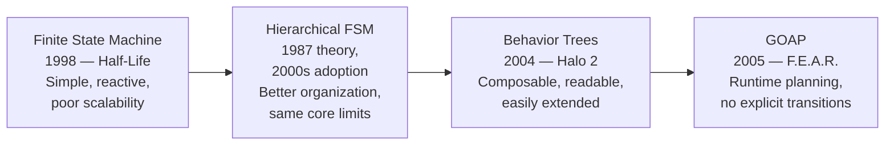

FSMs aren't obsolete — they're foundational. Modern games frequently use FSMs at the **task level** even when using behavior trees or GOAP at the strategic level. Understanding FSMs is understanding the vocabulary that all subsequent techniques either build on or react against.

---

## References

| Source | Author | URL |
|--------|--------|-----|
| "The AI of Half-Life \| Finite State Machines \| AI 101" | Tommy Thompson (AI and Games) | YouTube |
| "Finite State Machines: Theory and Implementation" | Fernando Bevilacqua | [Tuts+ Game Dev](https://code.tutsplus.com/finite-state-machines-theory-and-implementation--gamedev-11867t) |
| "Common Ways to Implement Finite State Machines in Games" | Alex Champandard | [AIGameDev (archived)](https://web.archive.org/web/20190620215624/https://aigamedev.com/open/article/fsm-implementation/) |
| "The AI from Half-Life's SDK in Retrospective" | Alex Champandard | [AIGameDev (archived)](https://web.archive.org/web/20190507183419/https://aigamedev.com/open/article/halflife-sdk/) |
| Half-Life SDK (source code) | Valve Software | [GitHub](https://github.com/ValveSoftware/halflife) |
