# Horizon Zero Dawn (2017) — AI Case Study: Ecosystems, Herds, and Hierarchical Planning

> **Sources:** Tommy Thompson, *"The AI of Horizon Zero Dawn: Part 1 — Rise of the Machines"* and *"Part 2 — Metal Militia"* — AI and Games (YouTube, episodes #37 and #38)
> **Related:** [[fear-goap-case-study|F.E.A.R. GOAP Case Study]] · [[half-life-ai-fsm|Half-Life FSM Case Study]] · [[fsm-theory-and-implementation|FSM Theory & Implementation]]

---

## Overview

Horizon Zero Dawn (Guerrilla Games, 2017) presents one of the most technically ambitious AI problems in the case studies covered so far: a massive open world populated by 28 distinct machine types that must behave plausibly as individual animals, as coordinated herds, and as part of a living, balanced ecosystem — all simultaneously, all at open-world scale.

Guerrilla came to this project without the right tools. Their prior work on the Killzone franchise had produced a first-person-shooter-oriented AI pipeline that was fundamentally mismatched to the design challenges of an open-world ecosystem game. The AI systems described here were largely built from scratch or substantially rebuilt during Horizon's development, by a team of approximately ten people over several years.

The result is one of the most layered AI architectures in any game examined here: multiple planning tiers, a three-level agent hierarchy, six simultaneous navigation meshes, a separate air navigation system, a nuanced sensor pipeline, and a combat utility system — all interacting to produce machine behavior that reads as natural, coordinated, and alive without a single machine having any direct knowledge of another's existence.

---

## Part 1 — Machine Taxonomy: Function as Behavioral Blueprint

There are 28 unique machine types in Horizon Zero Dawn, organized into four functional classes. A machine's class directly determines its behavioral defaults, its role within herds, and how aggressively it responds to threats.

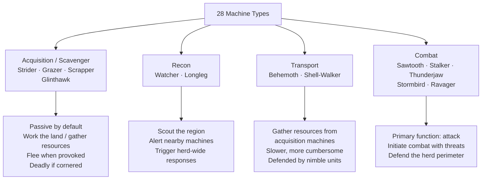

**Key design insight:** A machine's narrative function — what it was built to do within the game's lore — directly determines its gameplay behavior and combat role. The designers didn't independently author "this machine patrols" and "this machine is lore-designated a scout." They are the same decision. This tight coupling between fiction and mechanics is what makes the machines feel purposeful rather than arbitrary.

The largest and most dangerous machines — Thunderjaw, Stormbird — roam alone. Smaller machines cluster into mixed herds. This creates a natural difficulty gradient across the world: lone threats require preparation, but herds require understanding of how group AI responds.

---

## Part 2 — The Three-Tier Agent Hierarchy

This is the foundational architectural decision of Horizon's AI. The game represents AI at three distinct levels of abstraction:

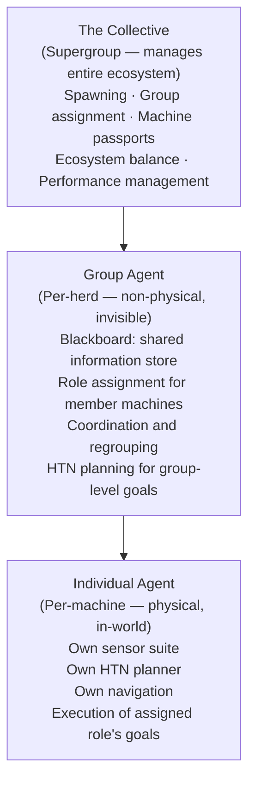

The critical property: **group agents do not physically exist in the game world**. They are coordination infrastructure — pure information containers that hold shared knowledge about their member machines and assign roles. No machine in the world is a "herd leader" in a visible sense; the herd exists as a data structure.

This separation means:
- An individual machine can be reasoned about, spawned, despawned, and transferred between groups without modifying the group's physical presence in the world
- The group can hold information (patrol routes, safe zones, threat data) that no individual machine needs to independently compute or store
- Groups can be restructured, split, and merged as the situation changes without disrupting individual machine behavior mid-execution

---

## Part 3 — HTN Planning: Macro-Behavior vs. GOAP's Flat Chains

Horizon Zero Dawn uses a **Hierarchical Task Network (HTN) planner** — the same technique Guerrilla first built for Killzone 2 (2009). HTN planning is GOAP's successor in this lineage of game AI, and the distinction matters for understanding why it fits open-world ecosystems better.

### HTN vs. GOAP

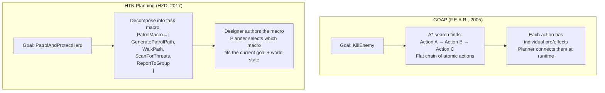

| Property | GOAP | HTN |
|----------|------|-----|
| Plan unit | Single atomic action | Macro (pre-sequenced action group) |
| Designer control | Low — planner composes freely | High — designer authors macros |
| Novel behavior | High — unanticipated combinations possible | Lower — bounded by authored macros |
| Debuggability | Difficult — trace the A* search | Easier — trace which macro was selected |
| Predictability | Lower | Higher |

**Why HTN suits an open-world ecosystem:** In F.E.A.R., short unpredictable plans (1–4 actions) produced surprising combat moments. In Horizon, predictable, well-composed macro-behaviors are essential — Guerrilla needs machines to patrol, scavenge, and herd in ways that feel natural and readable to the player across long, unscripted stretches of time. HTN macros let designers author "good behavior" directly as composable blocks.

### Two Uses of the HTN Planner

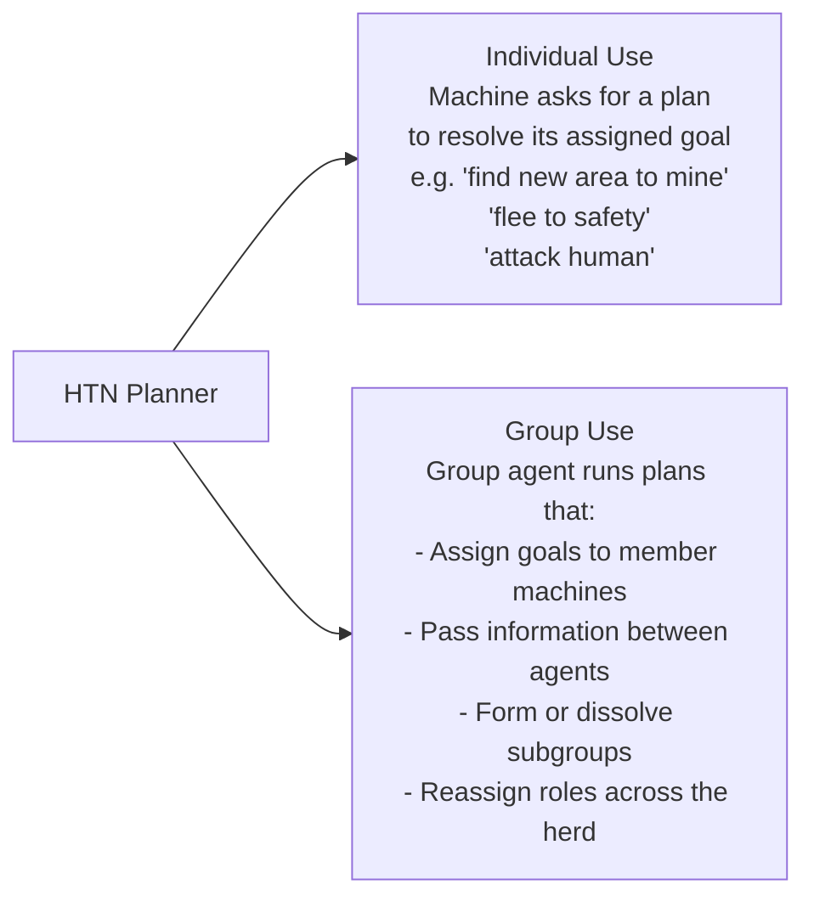

The planner operates at both levels simultaneously — individuals planning their own behavior, groups planning the structure and delegation of group behavior.

---

## Part 4 — The Collective: Ecosystem Management

The Collective is the supergroup that all group agents and individual agents belong to. It is the game's ecosystem manager.

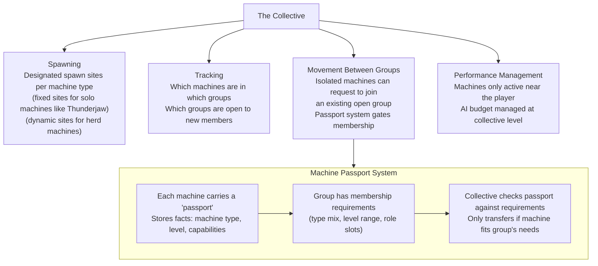

**The passport system** is an elegant solution to a recycling problem: machines that survive after their herd is partially destroyed or dispersed would otherwise become stranded individuals with no purpose. The passport lets the Collective re-integrate them into groups that need their type, maintaining herd diversity without manual designer placement.

The Collective also enforces **role limits** within groups — there can only be so many machines in a "patrol" role, so many in "attack," and so on. This prevents degenerate configurations (an entire herd of combat machines with no scouts) and maintains the structural diversity that makes herds interesting to encounter.

---

## Part 5 — Herd Behavior: Roles, Blackboards, and Reactive Structure

### Relaxed State: The Default Herd Configuration

When a herd spawns or recovers from a threat, it enters a relaxed state with a characteristic composition:

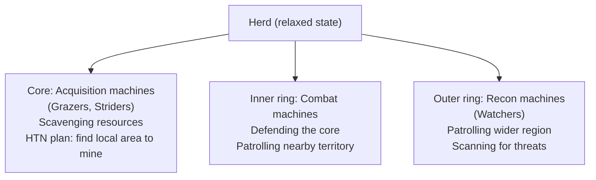

Patrol paths in this state are **auto-generated** by the HTN planner using local geometry data. Two deliberate design choices embedded in patrol generation:

1. **Avoid stealth vegetation** (tall grass, bushes) — machines don't walk through it while patrolling, giving players viable stealth approaches
2. **Pass close to stealth vegetation** — paths are routed near it intentionally, creating opportunities for traps, stealth kills, and hacking

This is an AI system actively engineering player opportunity. The patrol paths aren't random — they're designed (via HTN macro constraints) to create the right moment of gameplay.

### The Blackboard: Shared Group Intelligence Without Hive Mind

Each group agent maintains a **blackboard** — a shared information store accessible to all member machines:

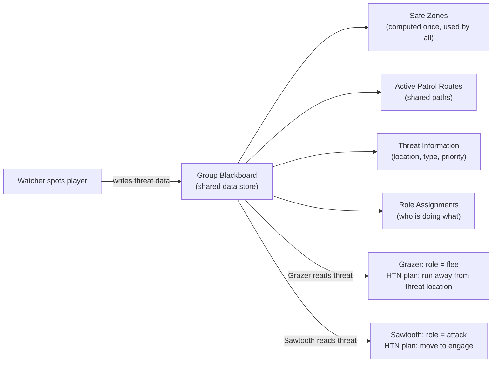

**Critical property:** The blackboard does **not** update instantaneously. There is a propagation delay. This means:

- The player can kill a machine without alerting the group if the kill is unwitnessed and the body isn't discovered
- A machine that is attacked and survives will notify the group — but if it's destroyed before notifying, the group may not respond at all
- The herd doesn't have a hive mind; it has a communication system with latency, which is both realistic and strategically exploitable

### Threat Response: Role Restructuring

When a threat is confirmed and the herd responds, the hierarchy restructures:

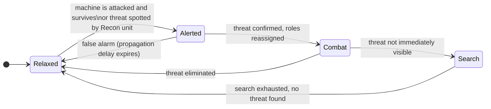

In the Combat state:
- Acquisition machines assume a **flee** role — their group runs away together
- Recon and Combat machine groups rebalance, assigning machines to attack roles based on HTN planning
- The system scales: whether the threat is a single player or a group of human NPCs, the role-assignment math is the same

---

## Part 6 — Combat System: Utility Functions and Managed Chaos

### The "Interesting Attack" Problem

Horizon's combat AI faces the same tension as Halo's (referenced explicitly in the source): if all machines attack simultaneously, the player dies instantly and the experience is unfun. If machines take turns too rigidly, it feels artificial. The solution is a **utility function** that calculates how "interesting" it would be for a given machine to attack the player at this moment.

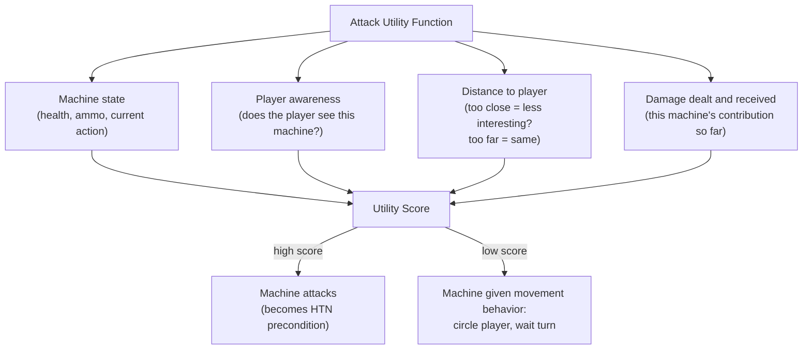

The utility score becomes a **precondition for the HTN planner** — the planner won't generate an attack plan for a machine whose utility score is too low. This elegantly integrates the combat pacing system into the same planning architecture used for everything else.

### Deliberate Openings

While a machine is attacking, others are given circling and waiting behaviors. This is not passive — it is **deliberately creating exploitable moments** for the player:

- A passive machine circling the player is a target they can choose to attack
- The machine that just finished its attack sequence is momentarily vulnerable during recovery
- These windows are engineered into the combat rhythm by the utility system

The combat AI leaves itself open to attack by design. The game trusts the player to exploit these windows — and the difficulty comes from the player's ability to do so under pressure, not from making the AI perfectly efficient.

---

## Part 7 — Sensor Systems: Information Packets and Calibrated Perception

### Beyond Binary Detection

A traditional sensor system gives an AI a binary answer: "did I see/hear something, yes or no?" Horizon's sensor pipeline is richer. Sensors in HZD detect through **information packets** attached to objects in the world.

```mermaid
graph LR
    subgraph Emitters["Stimulus Emitters (carry info packets)"]
        P["Player"]
        NPC["Human NPCs"]
        R["Rocks (thrown)"]
        A["Fired arrows"]
        OM["Other machines"]
        WL["Wildlife"]
    end

    subgraph Packet["Information Packet Contents"]
        WHAT["What it is\n(player, dead body, projectile)"]
        STATE["Its current state\n(alive, dead, hiding, moving)"]
        CONTEXT["Contextual data\n(velocity, threat level)"]
    end

    subgraph Sensors["Machine Sensor Suite (per machine)"]
        VS["Visual sensor\n(Watcher's eye)"]
        RS["Radar / proximity\n(Longleg)"]
        AS["Aural sensor\n(explosions at distance,\nstone throws close by)"]
        CS["Collision sensor\n(player walks into machine)"]
        SS["Smell sensor\n(some machines)"]
    end

    Emitters -->|"attach to"| Packet
    Packet -->|"read by"| Sensors
    Sensors -->|"interpreted by"| AI["Machine AI Response\n(context-dependent per machine type)"]
```

**What information packets enable:**
- A machine distinguishes a dead body lying in front of it from a live arrow that just missed it — not the same stimulus, not the same response
- A player hiding in long grass is visually detectable as "something is there" but the packet's state data marks it as obscured — the machine knows it can't see it clearly and responds accordingly
- Different machines react to the same packet differently based on their sensor suite and AI interpretation logic

### Sensor Sensitivity Calibration

Each machine's sensors have individual **sensitivity values**. A Watcher can be sneaked up on relatively easily. A Stalker is extremely difficult to approach undetected. This isn't a single "detection radius" value — it's a per-sensor, per-machine calibration.

**Sensor strength as a data filter:** A machine with a weak sensor doesn't just have a shorter range — it can receive a degraded version of the information packet. It may detect that *something* is nearby without being able to read the full context of what it is. A machine with a strong sensor gets the full packet and can make more nuanced decisions.

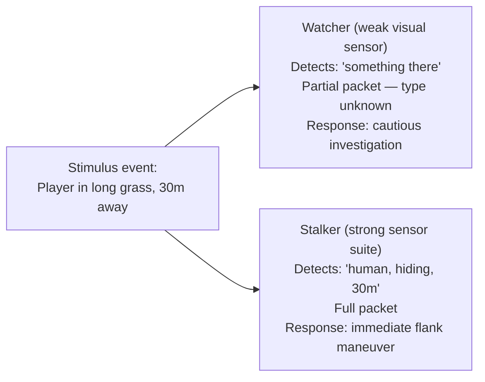

This calibration system is what produces the differentiated feel of sneaking past a Grazer versus a Stalker — it's not just range, it's the resolution of information each machine can extract from the world.

---

## Part 8 — Animation-AI Integration: The Execution Layer

### The "Right Animation at the Right Time" Problem

The insight from F.E.A.R.'s GOAP — that all NPC behavior is fundamentally "animations played in the right place at the right time" — continues here, but the execution challenge is harder. Horizon's machines are varied in size, shape, and movement style, and they need to animate convincingly across a large, non-flat world.

### Root Bone Warping

When a machine is given a movement goal (move to position X), the animation system needs to ensure the movement animation matches the actual distance and time of the traversal:

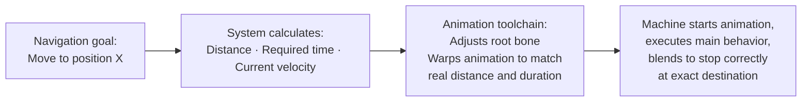

Without this, short distances would cause machines to "slide" (animation longer than movement) or stumble (movement done before animation completes). Root bone warping ensures the animation *is* the movement — they're solved together.

### Wind-Up / Finish Attack Pattern

Attack animations have two deliberate phases:

| Phase | Purpose | Design intent |
|-------|---------|--------------|
| **Wind-up** | Telegraphs the incoming attack | Gives the player a window to react, dodge, or counter |
| **Finish** | The damage-dealing moment | Payoff if the player doesn't react in time |

This is a player-respecting design: every dangerous attack is announced before it lands. The challenge the game presents is reading the telegraph and responding correctly, not surviving a random damage event. The AI system controls locomotion blending to ensure the machine is physically in the right position before the wind-up begins — the attack animation and the navigation goal are coordinated, not independent.

---

## Part 9 — Land Navigation: Six Simultaneous Meshes

### The Scale Problem

A navigation mesh (nav mesh) defines where an AI character can walk based on the terrain geometry. Standard implementations use one mesh. Horizon Zero Dawn uses **six**, built and maintained at runtime:

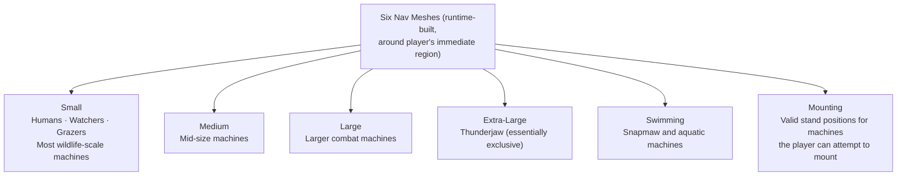

Building at runtime (rather than baking the entire world before release) is necessary at open-world scale: the full nav mesh for the entire game world would be enormous and most of it irrelevant at any moment. Only the region immediately around the player is computed and kept current.

Meshes recompute in real-time as obstacles change — other machines, physics objects, and environmental changes can all alter valid paths.

### Context-Dependent Obstacle Properties

The most behaviorally interesting aspect of HZD's nav system: **obstacles have state-dependent traversability**.

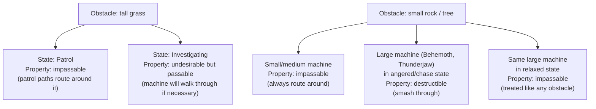

This means the same terrain has different traversability depending on who is crossing it and why. A Thunderjaw on patrol routes around a boulder. A Thunderjaw in pursuit smashes through it. The physics are the same; the **behavioral context changes what counts as an obstacle**.

This produces an important emergent signal for the player: if the environment around them starts being destroyed, something very large and very angry is giving chase. The environmental destruction is a readout of AI state.

---

## Part 10 — Air Navigation: Hierarchical Path Planning over MIP Maps

Land navigation doesn't apply to aerial machines at all. The Glinthawk and Stormbird required an entirely separate navigation system — one of the more technically novel solutions in the game.

### The Problem

Aerial machines need to:
- Fly patrol routes over complex terrain (hills, forests, rock outcrops, mountain climbs)
- Take off from and land on valid ground positions
- Dive-attack the player while in motion
- Not crash into things

Nav meshes are surface-based. They can't represent the 3D volume of air that a flying machine navigates through. A new approach was needed.

### Hierarchical Path Planning over MIP Maps

MIP mapping is a graphics technique that stores a texture at multiple progressively lower resolutions — each level is half the resolution of the one above. The same principle is applied here to the **height map** of the terrain (a 2D grid storing the elevation at each x/y position):

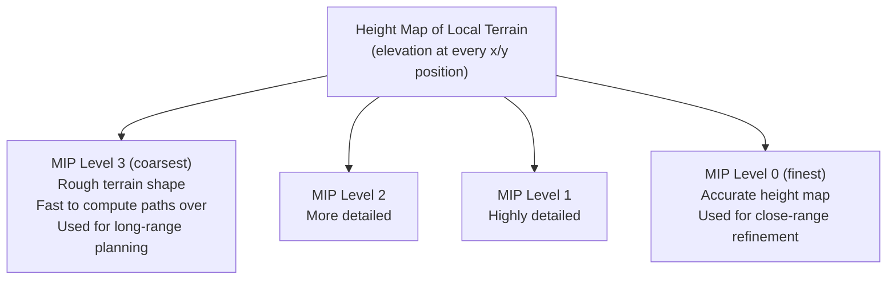

### The A* Refinement Process

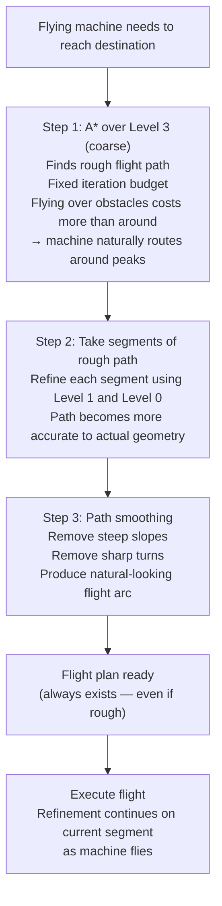

**Key design property:** The machine always has a flight plan — even if the initial plan is approximate. This prevents any "standing still, waiting to compute" behavior. The plan gets progressively better as the machine gets closer to the part of the path it needs to navigate precisely.

**The one known limitation:** Because the system uses the *maximum height* within a region to clear obstacles, flying machines cannot path underneath bridges or rock overhangs. The game's world design accommodates this — it's rarely noticed in play.

### Takeoff, Landing, and the Stormbird's Dive

Takeoff and landing bridge between the air navigation system and the ground nav mesh:

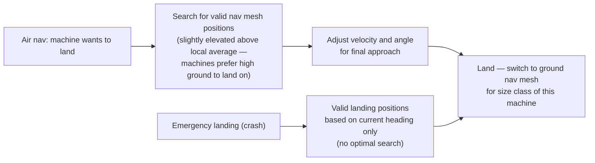

Both landing and crashing use the same underlying system. The crash just constrains the valid position search to wherever the machine is already pointed.

**The Stormbird dive attack** is the most dramatic use of this system — and contains one of the best emergence anecdotes in these case studies:

> During QA testing, the team noticed that the Stormbird would periodically block the sun before making its dive attack, based on where the player was standing relative to the machine's position. The light shift and sudden blinding just before impact was disorienting and effective. At the time, this was **entirely accidental** — the system was simply placing the machine in the optimal attack position, which happened to align with the sun. Afterward, the AI team deliberately engineered the behavior to occur more consistently.

An unintended emergent behavior, discovered to be superior to any intentional design, was then deliberately amplified. This is emergence collaborating with designers rather than competing with them.

---

## Part 11 — Emergent Behavior Analysis

### The Emergence Stack in Horizon Zero Dawn

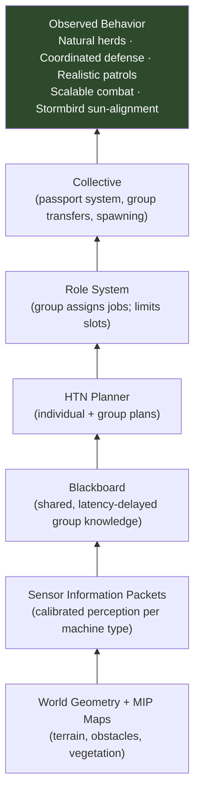

### Three Distinct Emergence Modes

**1. Structural emergence (herd composition)**
No individual machine decides to be part of a herd configuration. The Collective assigns groups, the role system limits slot counts, the HTN assigns goals. The result — a herd with a defended core, inner combat ring, and outer recon patrols — emerges from rules at the Collective level without any "arrange yourselves into a formation" logic.

**2. Reactive emergence (threat response)**
When a herd responds to a threat, the restructuring is not scripted. The blackboard updates with threat data (with latency), individual machines read their new role assignments from the group planner, and the HTN generates new goal plans. The player sees a coherent response: fleeing grazers, attacking sawtooths, reorganizing watchers. No coordination code produced this; it is the aggregate of individually planned responses to shared information.

**3. Incidental emergence (Stormbird sun-alignment)**
The most unexpected kind. The Stormbird's pre-dive sun-blocking behavior was not designed. It fell out of the machine occupying the geometrically optimal attack position — which, given the sun's position in the sky, occasionally produced a blinding silhouette. This was discovered, validated as effective, and deliberately reinforced. The emergent behavior was better than anything the designers had deliberately built.

### No Machine Knows Another Exists

As in F.E.A.R., individual machines in Horizon Zero Dawn have no direct awareness of other machines' states. All coordination flows through the blackboard (for group members) and the Collective (at the ecosystem level). A Sawtooth attacking the player from the right has no knowledge of the Watcher flanking from the left — both are independently executing plans that the group assigned to serve the same goal.

The apparent coordination is a readout of the role system distributing complementary jobs, combined with pathfinding that naturally avoids position conflicts. The same mechanism that produced flanking in F.E.A.R. — exclusion through navigation rather than explicit coordination — produces it here at ecosystem scale.

---

## Part 12 — Comparative Context

### The AI Technique Lineage

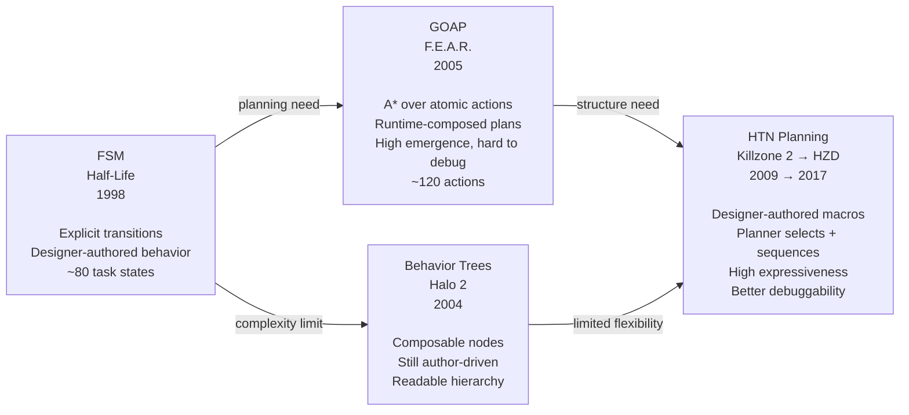

### What HZD Adds Beyond Previous Case Studies

| Concern | Half-Life | F.E.A.R. | Horizon Zero Dawn |
|---------|-----------|----------|-------------------|
| Scale | Single building / corridor | Single level | Open world, 28 machine types |
| Agent tiers | 1 (individual) | 1 (individual) | 3 (individual + group + collective) |
| Inter-agent coordination | None | None | Blackboard + role system |
| Planning technique | Schedules/tasks (FSM) | GOAP (flat A*) | HTN (macro A*) |
| Navigation | Single nav mesh | Single nav mesh | 6 meshes + separate air system |
| Sensor nuance | 32-bit condition flags | Similar | Information packets, per-sensor sensitivity, filtered data |
| Ecosystem management | None | None | The Collective, passport system |
| Behavior origin | Transitions + conditions | A*-planned action chains | HTN macros + role assignment |

Horizon Zero Dawn represents the most architecturally complex AI system in this series — not because any single component is the most sophisticated, but because of the number of interacting systems that must produce coherent, performant behavior simultaneously across an open world.

The team of ten who built it, over several years, starting without the right tools: that context is worth holding.

---

## References

| Source | Episode | Channel |
|--------|---------|---------|
| "The AI of Horizon Zero Dawn: Part 1 — Rise of the Machines" | AI and Games #37 | Tommy Thompson |
| "The AI of Horizon Zero Dawn: Part 2 — Metal Militia" | AI and Games #38 | Tommy Thompson |
| [[fear-goap-case-study\|F.E.A.R. GOAP Case Study]] | — | Internal vault |
| [[half-life-ai-fsm\|Half-Life FSM Case Study]] | — | Internal vault |
