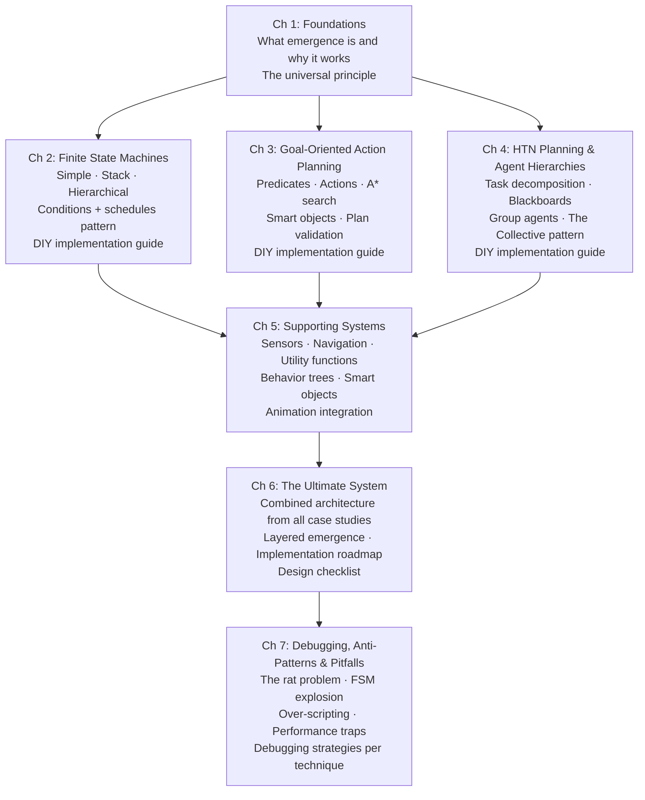
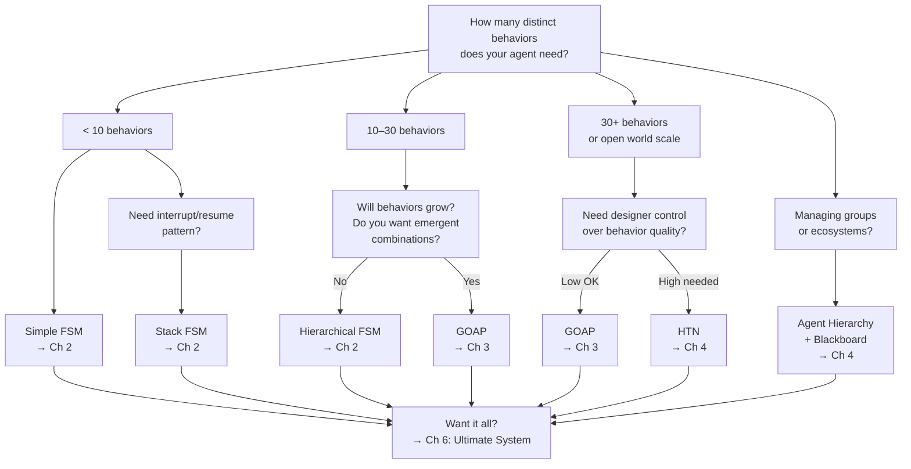

# Designing Emergent AI Behavior
## A Developer's Guide

> *"Emergence doesn't require complexity at any single layer. It requires structured interaction between layers."*
> — Synthesized from the Half-Life, F.E.A.R., and Horizon Zero Dawn case studies

---

## What This Guide Is

A platform- and engine-agnostic reference for designing AI systems where complex, believable behavior arises from simple, composable rules — rather than from scripting every scenario. Every implementation in this guide is written in pseudocode and translates directly to any language: C++, C#, Python, GDScript, Lua, or whatever your project uses.

The guide is organized as chapters. Read them front-to-back if you're new to emergent AI design. Use them as individual references if you're looking for a specific technique.

## What This Guide Is Not

- An engine tutorial (no Unity/Unreal specifics)
- A machine learning or neural network guide
- A guide to scripted AI or cutscene logic
- Complete production code (pseudocode is intentionally simplified)

---

## The Case Studies Behind This Guide

Every design decision here is grounded in analysis of real shipped games. Each case study is a deep technical examination of a production AI system:

| Case Study | Technique | Scope |
|-----------|-----------|-------|
| [[half-life-ai-fsm\|Half-Life (1998)]] | FSM: tasks, schedules, conditions, sensors | Corridor shooter, ~15 NPC types |
| [[fsm-theory-and-implementation\|FSM Theory (Bevilacqua)]] | Simple FSM, Stack FSM | Foundational implementation |
| [[fear-goap-case-study\|F.E.A.R. (2005)]] | GOAP: goals, actions, A\* planning | Linear shooter, ~5 NPC types |
| [[horizon-zero-dawn-ai-case-study\|Horizon Zero Dawn (2017)]] | HTN, agent hierarchy, blackboards, utility | Open world, 28 machine types |

---

## Chapter Map

---

## How to Choose a Technique

---

## The Universal Principle

Every technique in this guide exploits the same fundamental insight:

> **Independent agents, each following simple rules, interacting through shared world state, produce behavior more complex than any individual agent's rules.**

This is true of the three-state ant FSM. It is true of F.E.A.R.'s soldiers who don't know each other exist. It is true of Horizon Zero Dawn's herds with no hive mind. The architecture changes. The principle doesn't.

**Corollary:** You don't design emergent behavior directly. You design the conditions under which it arises.

---

## Core Vocabulary

| Term | Definition |
|------|-----------|
| **State** | A discrete behavioral mode an agent occupies |
| **Transition** | A rule that moves an agent from one state to another |
| **Predicate / Fact** | A boolean statement about the world (true or false) |
| **World State** | The full set of predicates at a given moment |
| **Action** | An atomic behavior with preconditions and effects |
| **Plan** | An ordered sequence of actions that achieves a goal |
| **Goal** | A desired world state the agent tries to achieve |
| **Blackboard** | A shared information store accessible to multiple agents |
| **Utility** | A numeric score representing how desirable an action is |
| **Smart Object** | A world object that self-describes how agents interact with it |
| **Macro / Method** | A pre-authored sequence of actions (HTN terminology) |
| **Emergence** | Complex behavior arising from simple rule interactions |

---

## Citations & Further Reading

| Source | Author | Notes |
|--------|--------|-------|
| [[half-life-ai-fsm\|Half-Life AI Case Study]] | Tommy Thompson (AI and Games) | FSM at production scale |
| [[fsm-theory-and-implementation\|FSM Theory & Implementation]] | Fernando Bevilacqua (Tuts+) | FSM fundamentals |
| [[fear-goap-case-study\|F.E.A.R. GOAP Case Study]] | Tommy Thompson; Jeff Orkin (GDC 2006) | GOAP canonical reference |
| [[horizon-zero-dawn-ai-case-study\|HZD AI Case Study]] | Tommy Thompson (AI and Games) | HTN + hierarchies at scale |
| *Game AI Pro* (ed. Steve Rabin) | Multiple authors | Industry reference anthology |
| "Behavior Trees for AI: How They Work" | Chris Simpson | Game Developer |
| "An Introduction to Utility Theory" | Dave Mark | Game AI Pro, Chapter 9 |
| "The Genius AI Behind The Sims" | Mark Brown (GMTK) | Utility AI case study |
| Half-Life SDK | Valve Software | [github.com/ValveSoftware/halflife](https://github.com/ValveSoftware/halflife) |
| F.E.A.R. Public Tools | Monolith Productions | Publicly available |
