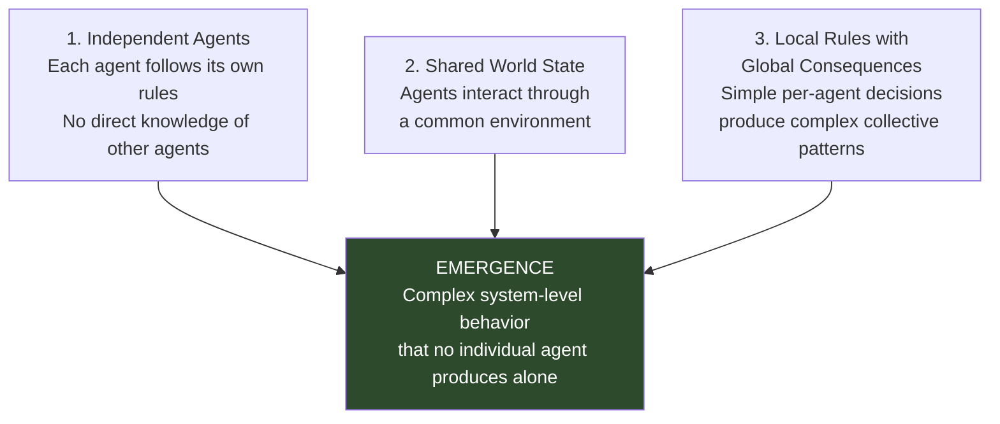
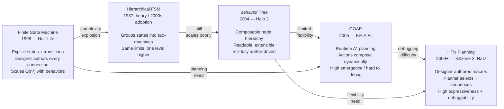
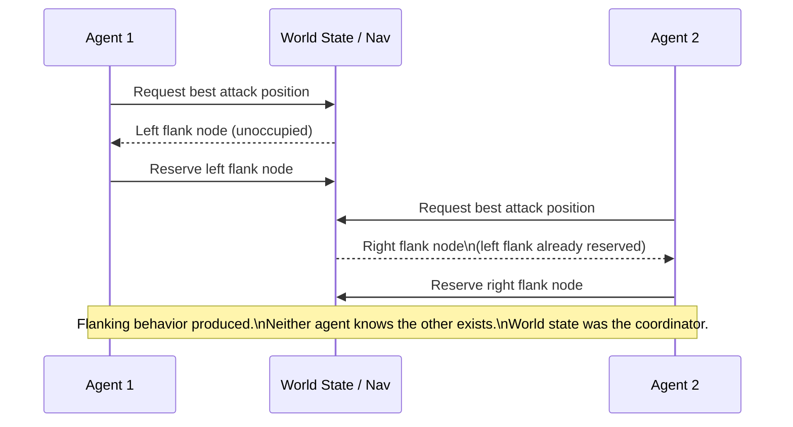
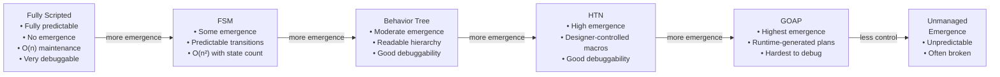
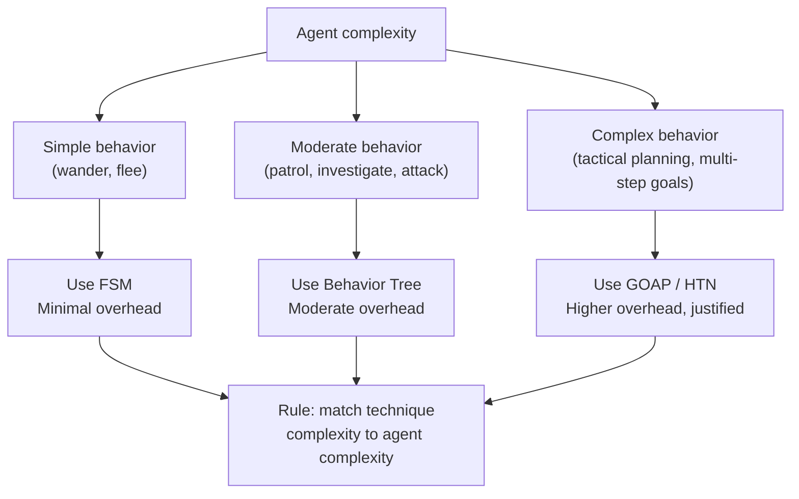

# Chapter 1 — Foundations of Emergent AI Behavior

> **Guide index:** [[00-index|Back to Index]]
> **Next:** [[ch02-fsm|Ch 2 — Finite State Machines]]

---

## 1.1 What Is Emergence?

Emergence is the appearance of properties or behaviors at the system level that are not present in, and cannot be predicted from, any individual component. It's the difference between a single ant (nearly helpless) and an ant colony (capable of agriculture, warfare, and architecture).

In game AI, emergence means:
- NPC soldiers flanking the player without any "flank" instruction in the code
- A herd of machines defending its core without explicit formation logic
- An ant FSM with three states producing a colony that feels alive with dozens of instances

The critical point: **you don't program emergent behavior. You program the conditions under which it arises.**

### The Three Requirements for Emergence

All three case studies satisfy all three requirements — and none of their emergent behaviors exist in spite of this structure. They exist *because* of it.

---

## 1.2 The Universal Principle

> **Independent agents + shared world state = behavior more complex than any individual's rules.**

This holds from the smallest example (the ant FSM: two ants with different stack histories respond differently to the same threat) to the largest (HZD's herds: 28 machine types, no machine knowing another exists, producing ecosystem-level behavior).

### Evidence Across Case Studies

| Game | "Independent agents" | "Shared world state" | Emergent output |
|------|---------------------|----------------------|----------------|
| Half-Life | Each monster has its own conditions bitmask and schedule | World positions, sounds, sight lines | Soldiers take cover, flank, retreat without scripted sequences |
| F.E.A.R. | Soldiers plan independently, zero inter-agent awareness | Navigation nodes, world predicates | Flanking, suppressive fire, leapfrog advances |
| HZD (herd) | Each machine plans individually; group agent is non-physical | Blackboard (with latency) | Coordinated defense, role-specific responses, natural herd dispersal |

The difference between these systems is not that one has emergent behavior and another doesn't — they all do. The difference is the **layer at which rules are defined** and the **richness of the shared world state** those rules operate on.

---

## 1.3 Three Modes of Emergence

The case studies reveal three qualitatively different kinds of emergence:

### Mode 1: Reactive Emergence
Agents respond to world state changes, and their collective responses create patterns the designer didn't explicitly write.

*Example:* Half-Life's soldiers. Each monster individually responds to its 32-bit condition flags invalidating its current schedule. No "coordinated attack" logic exists. The collective pattern — soldiers pressing from different angles — falls out of each independently seeking the best attack position.

### Mode 2: Structural Emergence
The structure of the system itself produces behavioral configurations without any agent deciding to be in that configuration.

*Example:* HZD's herd formation. No machine decides to form a defended core with an outer recon ring. The Collective assigns roles with slot limits; the HTN assigns goals per role; the result is a formation no designer authored.

### Mode 3: Incidental Emergence
Behavior the designers never anticipated, discovered to be effective, and deliberately amplified.

*Example:* The Stormbird in HZD. The AI placed itself in the geometrically optimal attack position before diving. This happened to align with the sun, producing a blinding silhouette. QA discovered this during testing. The AI team then deliberately amplified it. The emergent behavior was *better* than any intentional design.

> **Design implication:** Leave room for incidental emergence. Build systems with enough degrees of freedom that surprising behaviors can appear. Then watch your QA playtest carefully. You may find your best feature by accident.

---

## 1.4 The Technique Lineage

Game AI for NPCs has evolved through a sequence of techniques, each solving the scaling problems of its predecessor:

**Each technique is still valid today.** FSMs power low-level state management in games that use GOAP at a higher level. Behavior trees are the industry default for many use cases. HTN and GOAP both have active production use. The right technique is the one that fits your behavior count, team size, and debugging tolerance.

---

## 1.5 The "No Agent Knows Another Exists" Principle

The most counterintuitive and most powerful discovery across all three case studies:

> **None of the AI agents in Half-Life, F.E.A.R., or Horizon Zero Dawn have any direct knowledge of other AI agents' states.**

F.E.A.R.'s soldiers — famous for their coordinated flanking — literally cannot see each other in the AI sense. Each soldier queries world state, generates its own plan, and executes it. The appearance of coordination is entirely a byproduct of:

1. Navigation exclusion (two agents cannot occupy the same position)
2. Shared goal (both want to reach the player)
3. World state (attack positions are a shared resource)

The architecture that produces the richest apparent coordination is one where individual agents are maximally independent. Direct coordination — "tell agent B to go left while I go right" — produces rigid, predictable behavior. Indirect coordination — "both agents want the best attack position, and the nav system prevents position overlap" — produces adaptive, context-sensitive behavior that reads as intelligent cooperation.

### Design Pattern: Coordination Through Exclusion

---

## 1.6 Emergence Is Not Free

Emergence is powerful, but it has costs that must be planned for.

### The Predictability Trade-off

More emergent systems are less predictable. GOAP agents may plan combinations the designer never anticipated — which is the source of F.E.A.R.'s legendary AI moments, but also the source of its debugging difficulty. HTN trades some emergence potential back for predictability by having designers author macro sequences.

The goal is not maximum emergence — it's *the right amount* for your game. F.E.A.R. wanted maximum tactical surprise in controlled corridors. HZD wanted consistent, natural-feeling ecosystem behavior across an open world. Their techniques match their goals.

### The Performance Trade-off

Every layer of reasoning is CPU time. The F.E.A.R. rat problem demonstrates this: rats used the same GOAP system as soldiers, creating continuous replanning overhead for trivial behaviors. The fix is tiered complexity — simple agents use simple techniques, complex agents use complex ones.

---

## 1.7 Design Philosophy

The following principles recur across every case study and should guide every design decision in this guide:

**1. Rules at every layer, not behavior at any layer.**
Don't design what agents do. Design what constraints they operate under, what information they can perceive, and what options they can choose from.

**2. Constraints are coordinators.**
Limits (navigation exclusion, role slot limits, non-interruptible animations, 32-bit condition caps) produce coordination and realism as side effects. Artificial constraints often produce more believable behavior than unlimited freedom.

**3. Shared state, not shared knowledge.**
Agents share a world. They don't share plans, intentions, or awareness. Coordination emerges from competing for and reacting to the same world state.

**4. The world model is a budget.**
Half-Life's 32-bit condition bitmask isn't just compact — it's a hard limit on how much the AI can "know." This forces designers to prioritize what matters and prevents the AI from becoming an omniscient planner that feels uncanny.

**5. Match planning depth to behavior complexity.**
Rats don't need GOAP. Corridor soldiers do. Open-world herds need HTN. Using a more complex system than the agent requires is waste at best, and a bug vector at worst.

**6. Design for incidental emergence.**
Build systems that have more degrees of freedom than you need for the behavior you intend. Test extensively. The behavior that surprises you may be the best thing in your game.

---

> **Next chapter:** [[ch02-fsm|Chapter 2 — Finite State Machines]]
