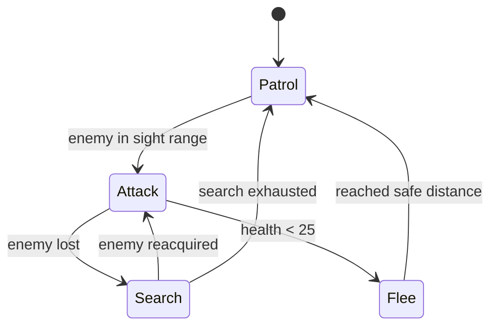
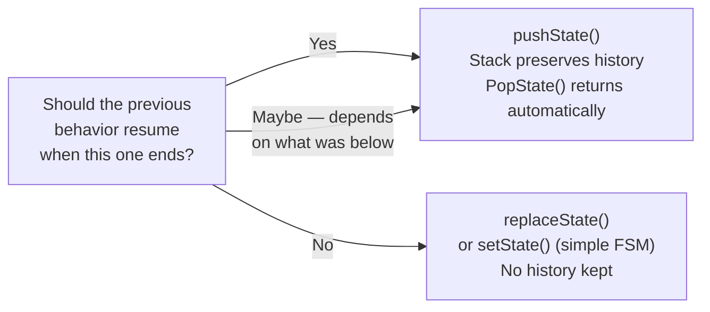
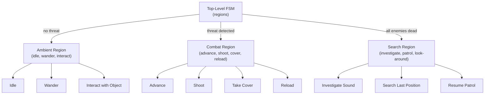
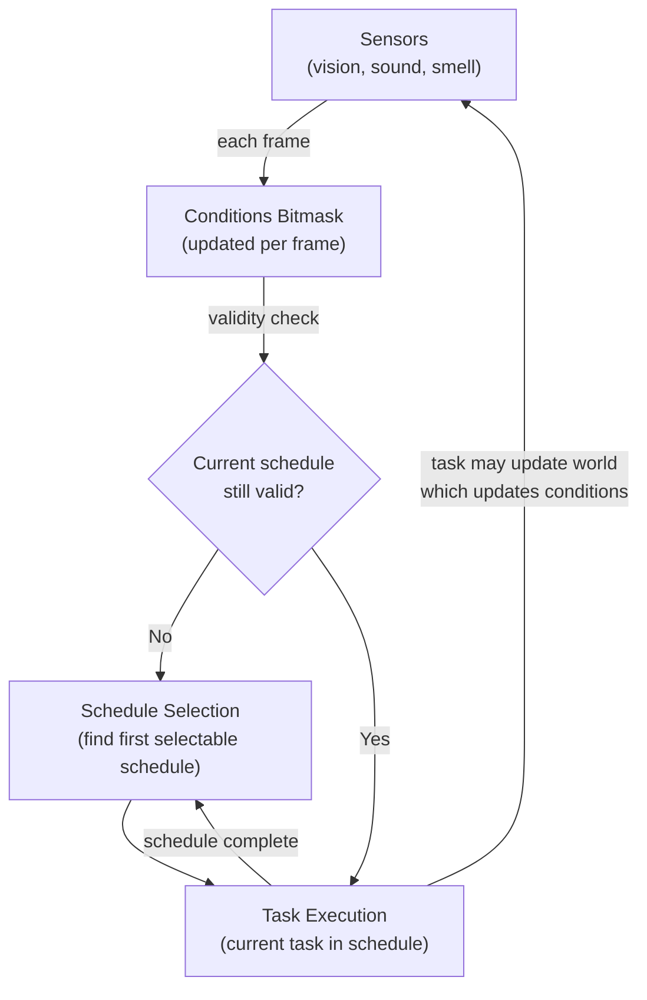
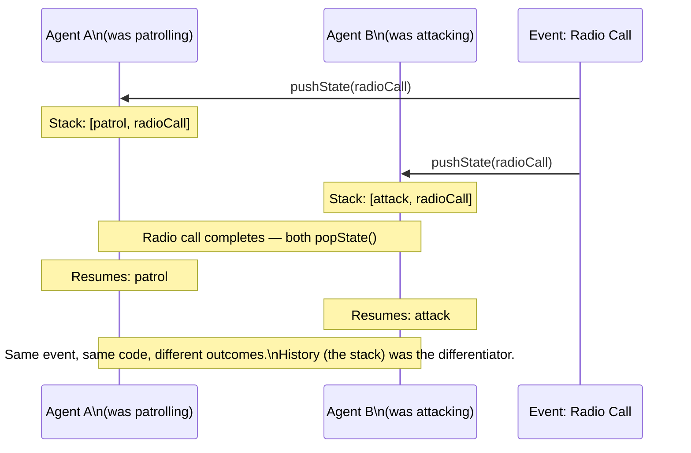

# Chapter 2 — Finite State Machines
## Simple · Stack-Based · Hierarchical · Condition-Gated Schedules

> **Previous:** [[ch01-foundations|Ch 1 — Foundations]]
> **Next:** [[ch03-goap|Ch 3 — GOAP]]
> **Case studies:** [[half-life-ai-fsm|Half-Life]], [[fsm-theory-and-implementation|FSM Theory]]

---

## 2.1 Overview

Finite State Machines are the foundation of game AI. Every technique in this guide either builds on them or uses them internally. F.E.A.R.'s GOAP system uses a 3-state FSM for execution. HZD's HTN planner outputs into FSM-style task execution. Understanding FSMs deeply is a prerequisite for everything else.

**When to use FSMs:**
- 3–15 distinct behaviors
- Well-defined, relatively static transition rules
- Need fast, simple, debuggable AI
- As the execution layer beneath a higher-level planner

**When to look beyond FSMs:**
- Behaviors exceed ~20 states (transition graph becomes O(n²))
- You need the AI to reason about what to do, not just react to conditions
- You need more than one "interruption level" (stack FSM handles one; deeper stacks get fragile)

---

## 2.2 Simple FSM — Implementation

The core insight: **a state is just a function**. The FSM holds a pointer to whichever function is active and calls it every frame. No switch statements, no enum dispatch, no class hierarchy required.

### The FSM Class

```pseudocode
// Generic over TOwner so the FSM is reusable for any agent type
class FSM<TOwner>:
    private currentState: Function(TOwner) = null
    private owner: TOwner

    constructor(owner: TOwner):
        this.owner = owner

    def setState(state: Function(TOwner)):
        if state != currentState:
            if currentState != null:
                currentState.onExit(owner)   // optional lifecycle hook
            currentState = state
            if currentState != null:
                currentState.onEnter(owner)  // optional lifecycle hook

    def update():
        if currentState != null:
            currentState(owner)

    def getCurrentState() -> Function(TOwner):
        return currentState
```

### A Complete Agent

```pseudocode
class GuardAgent:
    position:      Vector3
    velocity:      Vector3
    brain:         FSM<GuardAgent>
    patrolTarget:  Vector3
    lastKnownEnemy: Vector3 | null
    health:        float = 100

    const SIGHT_RANGE       = 20.0
    const ATTACK_RANGE      = 8.0
    const LOW_HEALTH        = 25.0
    const ARRIVAL_THRESHOLD = 1.5

    constructor(startPos: Vector3, patrolTarget: Vector3):
        position      = startPos
        patrolTarget  = patrolTarget
        brain         = FSM(this)
        brain.setState(patrolState)

    def update(dt: float):
        brain.update()
        moveByVelocity(dt)

// ── State functions ──────────────────────────────────────────

def patrolState(guard: GuardAgent):
    guard.velocity = directionTo(guard.patrolTarget) * PATROL_SPEED

    if distance(guard, guard.patrolTarget) < ARRIVAL_THRESHOLD:
        guard.nextPatrolPoint()
    
    enemy = guard.findEnemyInRange(SIGHT_RANGE)
    if enemy != null:
        guard.lastKnownEnemy = enemy.position
        guard.brain.setState(attackState)

def attackState(guard: GuardAgent):
    if guard.lastKnownEnemy == null:
        guard.brain.setState(searchState)
        return

    dist = distance(guard.position, guard.lastKnownEnemy)
    
    if dist > SIGHT_RANGE:
        guard.brain.setState(searchState)
        return

    if guard.health < LOW_HEALTH:
        guard.brain.setState(fleeState)
        return

    if dist > ATTACK_RANGE:
        guard.velocity = directionTo(guard.lastKnownEnemy) * CHASE_SPEED
    else:
        guard.velocity = Vector3.zero
        guard.fireWeapon(guard.lastKnownEnemy)

def searchState(guard: GuardAgent):
    // Move toward last known position
    guard.velocity = directionTo(guard.lastKnownEnemy) * SEARCH_SPEED

    if distance(guard, guard.lastKnownEnemy) < ARRIVAL_THRESHOLD:
        guard.lastKnownEnemy = null
        guard.brain.setState(patrolState)

    enemy = guard.findEnemyInRange(SIGHT_RANGE)
    if enemy != null:
        guard.lastKnownEnemy = enemy.position
        guard.brain.setState(attackState)

def fleeState(guard: GuardAgent):
    // Move away from last known enemy
    away = guard.position - guard.lastKnownEnemy
    guard.velocity = normalize(away) * FLEE_SPEED

    if distance(guard, guard.lastKnownEnemy) > SAFE_DISTANCE:
        guard.brain.setState(patrolState)
```

### State Diagram



---

## 2.3 Stack-Based FSM — Implementation

The stack FSM adds one data structure — a stack — to solve the problem of **stateless transitions**. When a temporary behavior completes, it pops itself and the previous behavior resumes automatically. Neither the interrupting state nor the interrupted state needs to know about the other.

```pseudocode
class StackFSM<TOwner>:
    private stack: List<Function(TOwner)> = []
    private owner: TOwner

    constructor(owner: TOwner):
        this.owner = owner

    def pushState(state: Function(TOwner)):
        // Guard: don't push the same state twice in a row
        if stack.isEmpty() or stack.last() != state:
            if not stack.isEmpty():
                stack.last().onSuspend(owner)  // optional lifecycle hook
            stack.push(state)
            state.onEnter(owner)

    def popState():
        if not stack.isEmpty():
            stack.last().onExit(owner)
            stack.pop()
            if not stack.isEmpty():
                stack.last().onResume(owner)  // optional lifecycle hook

    def replaceState(state: Function(TOwner)):
        // Replace top without restoring the one below
        popState()
        pushState(state)

    def update():
        if not stack.isEmpty():
            stack.last()(owner)

    def getCurrentState() -> Function(TOwner):
        return stack.isEmpty() ? null : stack.last()

    def getStackDepth() -> int:
        return stack.length
```

### The Interruption Pattern

The guard from 2.2, now with a radio-call interruption that pauses whatever was happening:

```pseudocode
def radioCallState(guard: GuardAgent):
    // Plays radio animation in place
    guard.velocity = Vector3.zero
    guard.playAnimation("radio_call")

    if guard.radioCallComplete():
        guard.brain.popState()  // returns to whatever was interrupted

// In any state that can receive a radio:
def patrolState(guard: GuardAgent):
    // ... patrol logic ...
    
    if guard.receivedRadioCall():
        guard.brain.pushState(radioCallState)  // patrol stays below on stack

def attackState(guard: GuardAgent):
    // ... attack logic ...
    
    if guard.receivedRadioCall() and guard.currentAnimation.isInterruptible():
        guard.brain.pushState(radioCallState)
```

### When to Use push vs. replace vs. setState



---

## 2.4 Hierarchical FSM — Implementation

An HFSM groups states into regions. The top-level machine transitions between regions; within each region, a sub-machine handles detailed state logic.

```pseudocode
class HierarchicalFSM<TOwner>:
    private regions: Map<String, FSM<TOwner>>
    private currentRegion: String = null
    private owner: TOwner

    def addRegion(name: String, machine: FSM<TOwner>):
        regions[name] = machine

    def transitionToRegion(name: String, initialState: Function<TOwner>):
        if currentRegion != null:
            regions[currentRegion].onExitRegion(owner)
        currentRegion = name
        regions[currentRegion].setState(initialState)
        regions[currentRegion].onEnterRegion(owner)

    def update():
        if currentRegion != null:
            regions[currentRegion].update()

    def getActiveState() -> Function<TOwner>:
        return regions[currentRegion]?.getCurrentState()
```

### HFSM Structure for a Combat AI



**Key benefit:** Adding a new combat behavior (e.g., `ThrowGrenade`) only requires adding a state inside the Combat region. The top-level transitions and all Ambient/Search states are unaffected. State count still grows, but the transition graph is contained within each region.

**Key limitation:** The top-level machine still needs transitions between regions. As the number of regions grows, the same combinatorial explosion reappears one level up.

---

## 2.5 The Half-Life Pattern: Conditions, Tasks, and Schedules

Half-Life's AI takes the FSM concept significantly further with three innovations that are worth implementing independently of the rest of the system. Together they form a powerful pattern for deliberative, reactive AI. *(Full analysis in [[half-life-ai-fsm|Half-Life case study]], Parts 2–4.)*

### Innovation 1: Conditions Bitmask

Compact world model: 32 binary facts packed into a single integer. Each sensor update sets or clears bits. Schedule validity is checked against this bitmask every frame.

```pseudocode
// Define conditions as bit flags
enum Condition:
    CAN_SEE_ENEMY  = 1 << 0   // 0b00000001
    HEAR_SOUND     = 1 << 1   // 0b00000010
    LIGHT_DAMAGE   = 1 << 2
    HEAVY_DAMAGE   = 1 << 3
    NO_AMMO        = 1 << 4
    ENEMY_DEAD     = 1 << 5
    IN_COVER       = 1 << 6
    NEAR_ALLY      = 1 << 7
    // ...up to 32 total; last 2 reserved for per-agent custom flags

class ConditionSet:
    private bits: uint32 = 0

    def set(c: Condition):
        bits = bits | c

    def clear(c: Condition):
        bits = bits & ~c

    def isSet(c: Condition) -> bool:
        return (bits & c) != 0

    def clearAll():
        bits = 0

    def hasAnyOf(mask: uint32) -> bool:
        return (bits & mask) != 0

    def hasAllOf(mask: uint32) -> bool:
        return (bits & mask) == mask
```

### Innovation 2: Tasks (Atomic Behaviors)

Each task is a single, indivisible action. Tasks cannot be blended — an agent commits to one task at a time. This constraint produces believable priority behavior as a side effect.

```pseudocode
enum TaskStatus:
    RUNNING
    COMPLETE
    FAILED

interface Task:
    def execute(agent: Agent, dt: float) -> TaskStatus
    def onStart(agent: Agent)
    def onEnd(agent: Agent)

class MoveToTask implements Task:
    target: Vector3
    speed:  float
    arrival: float = 1.5

    def execute(agent: Agent, dt: float) -> TaskStatus:
        if distance(agent.position, target) < arrival:
            return COMPLETE
        agent.velocity = directionTo(target) * speed
        return RUNNING

class PlayAnimationTask implements Task:
    animName: String
    blocking: bool = true  // if true, cannot be interrupted

    def execute(agent: Agent, dt: float) -> TaskStatus:
        if not agent.isPlayingAnimation(animName):
            agent.playAnimation(animName)
        if agent.animationComplete(animName):
            return COMPLETE
        return RUNNING

class SelectNewScheduleTask implements Task:
    def execute(agent: Agent, dt: float) -> TaskStatus:
        agent.selectNewSchedule()
        return COMPLETE
```

### Innovation 3: Schedules (Macro-Behaviors)

A schedule chains tasks into a coherent behavior and carries its own validity conditions. The feedback loop — task execution updates conditions, conditions invalidate schedules, new schedule is selected — is what produces reactive emergent behavior.

```pseudocode
class Schedule:
    tasks:               List<Task>
    // Conditions that must NOT be set for this schedule to remain valid
    interruptConditions: uint32
    // Conditions that must ALL be set to select this schedule
    requireConditions:   uint32
    currentTaskIndex:    int = 0
    name:                String

    def canBeSelected(conditions: ConditionSet) -> bool:
        return conditions.hasAllOf(requireConditions)

    def isStillValid(conditions: ConditionSet) -> bool:
        return not conditions.hasAnyOf(interruptConditions)

    def update(agent: Agent, dt: float) -> ScheduleStatus:
        if not isStillValid(agent.conditions):
            return INVALID

        if currentTaskIndex >= tasks.length:
            return COMPLETE

        task = tasks[currentTaskIndex]
        status = task.execute(agent, dt)

        if status == COMPLETE:
            currentTaskIndex++
        elif status == FAILED:
            return INVALID

        return RUNNING

    def reset():
        currentTaskIndex = 0

// Example schedule definition
SCHEDULE_PATROL = Schedule(
    name: "Patrol",
    requireConditions: 0,           // always selectable
    interruptConditions: CAN_SEE_ENEMY | HEAVY_DAMAGE,
    tasks: [
        MoveToTask(target: nextPatrolPoint, speed: WALK_SPEED),
        PlayAnimationTask("look_around"),
        SelectNewScheduleTask()
    ]
)

SCHEDULE_COMBAT_ADVANCE = Schedule(
    name: "CombatAdvance",
    requireConditions: CAN_SEE_ENEMY,
    interruptConditions: NO_AMMO | HEAVY_DAMAGE,
    tasks: [
        MoveToTask(target: attackPosition, speed: RUN_SPEED),
        PlayAnimationTask("shoot", blocking: false),
        SelectNewScheduleTask()
    ]
)
```

### The Agent Update Loop

```pseudocode
class Agent:
    conditions:      ConditionSet
    currentSchedule: Schedule | null
    sensors:         List<Sensor>
    metaState:       MetaState  // Idle | Alert | Prone | Dead

    def update(dt: float):
        if metaState == DEAD:
            return

        // 1. Update sensors → update conditions
        updateConditions()

        // 2. Check current schedule validity
        if currentSchedule == null or currentSchedule.isStillValid(conditions) == false:
            selectNewSchedule()

        // 3. Execute current schedule
        if currentSchedule != null:
            status = currentSchedule.update(this, dt)
            if status == COMPLETE or status == INVALID:
                selectNewSchedule()

    def updateConditions():
        conditions.clearAll()
        for sensor in sensors:
            sensor.updateConditions(this, conditions)

    def selectNewSchedule():
        best = null
        for candidate in availableSchedules:
            if candidate.canBeSelected(conditions):
                best = candidate   // could score/prioritize here
                break
        if best != null:
            currentSchedule = best
            currentSchedule.reset()
```

### Data Flow Diagram



This feedback loop — sensor → condition → schedule → task → world change → sensor — is what produces emergent reactivity. No single component is reactive; the loop is.

---

## 2.6 Emergent Properties of FSMs

### Property 1: History as Context (Stack FSM)

Two agents with identical rules but different stack histories respond differently to the same input:



### Property 2: Constraint-Produced Realism (Tasks)

The Half-Life pattern's prohibition against blending tasks produces realistic priority behavior with zero explicit priority logic. An agent cannot shoot and run simultaneously — it commits to one. Under fire, it stops shooting to retreat. This reads as decisive, purposeful behavior.

> *"Tasks can't be merged or blended — hence if a character needs to get into cover given the player is firing on them, they'll give up shooting in order to retreat."*
> — [[half-life-ai-fsm|Half-Life Case Study, Part 4]]

### Property 3: Group Behavior from Identical Rules + Different State

Multiple agents running the same FSM with different internal state (different conditions bitmasks, different current schedules, different positions) produce naturally varied group behavior with zero coordination logic.

---

## 2.7 FSM Design Checklist

Before building an FSM:

- [ ] List all distinct behaviors — are there more than 15? Consider GOAP or BT instead.
- [ ] Draw the state diagram — count transitions. More than ~30? Consider HFSM or GOAP.
- [ ] Identify interruption scenarios — do you need push/pop? Use Stack FSM.
- [ ] Identify behavior groups — do clusters of states belong together? Use HFSM regions.
- [ ] Decide on state representation — function pointer (simple) or class (state with local data)?
- [ ] Identify conditions — what world facts determine transitions? Model as a bitmask or condition set.
- [ ] Identify schedule chains — group frequently co-occurring tasks into schedules.

---

## 2.8 Pros and Cons Summary

| Aspect | Simple FSM | Stack FSM | HFSM | Half-Life Pattern |
|--------|-----------|-----------|------|------------------|
| Implementation effort | Very low | Low | Medium | Medium-high |
| Debuggability | Excellent | Good | Good | Good (trace schedule) |
| Scalability | Poor (O(n²)) | Poor | Moderate | Moderate |
| Emergent potential | Low | Low-moderate | Moderate | Moderate-high |
| Designer-friendliness | High | High | High | High |
| Interruption handling | Manual | Built-in | Manual | Via conditions |
| Best agent complexity | < 10 behaviors | < 10 + interrupts | 10–30 | 20–80 tasks |

---

## 2.9 Common Mistakes

**1. Forgetting transitions in both directions.**
Every state that can be entered must have a way out. Audit your diagram for dead ends.

**2. Putting transition logic in the FSM class instead of states.**
The FSM should just run the current state. All "should I change state?" logic belongs inside state functions.

**3. Not guarding push against re-pushing the same state.**
If a threat condition fires every frame, the stack will grow unboundedly without the `getCurrentState() != state` guard.

**4. Using the same FSM for wildly different complexity agents.**
Rats don't need schedules and conditions. Using the full Half-Life pattern for a background ambiance agent wastes CPU and makes simple behaviors hard to read. *(See [[fear-goap-case-study|F.E.A.R. rat problem]])*

**5. Designing states instead of conditions.**
If you're adding a new state for every new scenario, you've inverted the paradigm. Add conditions/flags that let existing states handle new scenarios gracefully.

---

> **Next chapter:** [[ch03-goap|Chapter 3 — Goal-Oriented Action Planning]]
