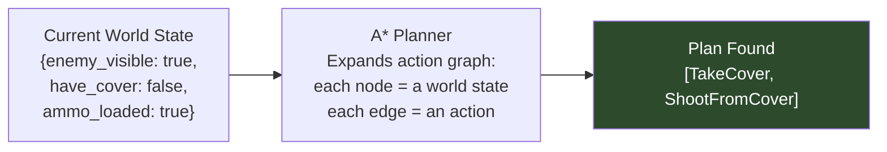
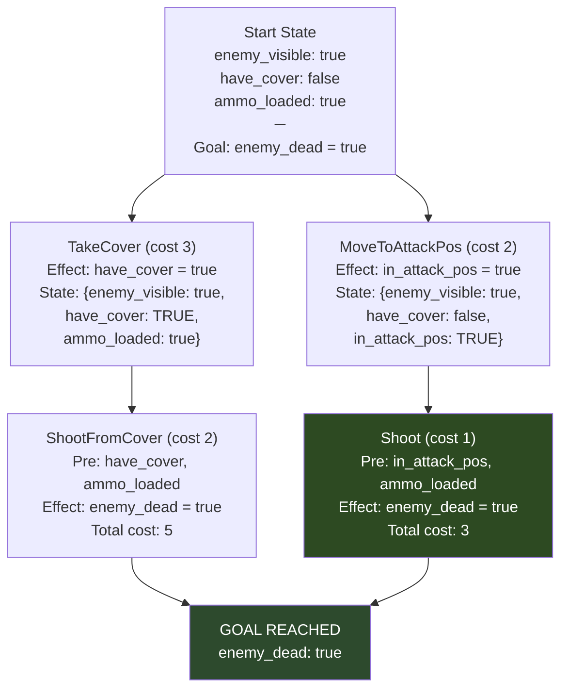
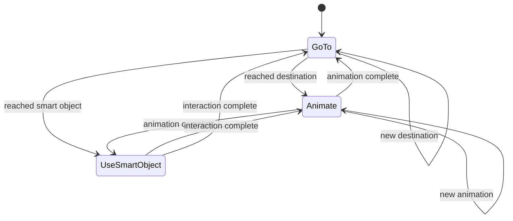
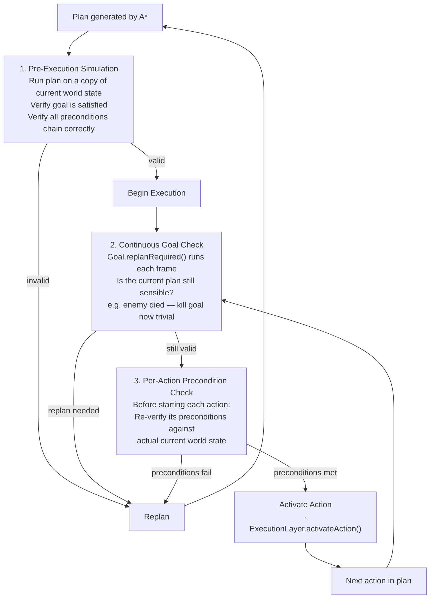
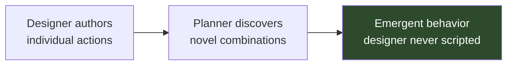

# Chapter 3 — Goal-Oriented Action Planning (GOAP)

> **Previous:** [[ch02-fsm|Ch 2 — FSMs]]
> **Next:** [[ch04-htn-and-hierarchies|Ch 4 — HTN & Agent Hierarchies]]
> **Case study:** [[fear-goap-case-study|F.E.A.R. (2005)]]

---

## 3.1 Overview

GOAP is the technique that shifts AI design from "connect behaviors with transitions" to "define what behaviors *need* and *produce*, then let the planner figure out the connections." This inversion unlocks emergent behavior the designer never explicitly authored.

**When to use GOAP:**
- 15–120+ distinct action types
- Behaviors need to compose in novel combinations at runtime
- You want the AI to find its own solutions to goals you define
- You accept that debugging requires understanding planning search

**When to look beyond GOAP:**
- You need guaranteed, predictable behavior sequences (use HTN macros instead)
- You need more than flat action chains (use HTN decomposition)
- Your agents are simple (use FSM — avoid the rat problem)
- Team is unfamiliar with planning theory and debugging it feels untenable

---

## 3.2 Core Concepts

### World State

The world state is a dictionary of boolean predicates — facts about the world that are either true or false. This is the AI's internal model of reality.

```pseudocode
// World state: a named set of boolean facts
type WorldState = Map<String, bool>

// Examples
worldState = {
    "enemy_visible":    true,
    "have_cover":       false,
    "ammo_loaded":      true,
    "enemy_dead":       false,
    "in_attack_range":  false,
    "weapon_drawn":     true
}
```

**Design rule:** Only include predicates the AI can actually observe and act on. Every predicate added increases the planning state space. Prefer fewer, more expressive predicates.

### Actions

Each action has preconditions (what must be true to run it) and effects (what it changes in the world state). The cost determines how the A* search prefers among valid options.

```pseudocode
class GOAPAction:
    name:          String
    cost:          float          // lower = preferred by A*
    preconditions: WorldState     // what must be true
    effects:       WorldState     // what becomes true/false

    // Is this action executable given the current world state?
    def isPossible(state: WorldState) -> bool:
        for key, value in preconditions:
            if state.get(key, false) != value:
                return false
        return true

    // Apply this action's effects to produce a new world state
    def applyTo(state: WorldState) -> WorldState:
        result = state.copy()
        for key, value in effects:
            result[key] = value
        return result

    // Override: the actual execution logic
    def execute(agent: Agent, dt: float) -> ActionStatus:
        return RUNNING  // subclass implements this

    // Override: called once when the action starts
    def onActivate(agent: Agent):
        pass

    // Override: called once when the action ends/is cancelled
    def onDeactivate(agent: Agent):
        pass
```

### Goals

Goals are desired world states. An agent has a set of goals; it selects the highest-priority one and plans for it. Priority is dynamic — it recalculates based on world state every time the agent needs to select a goal.

```pseudocode
class GOAPGoal:
    name:         String
    desiredState: WorldState  // the state we're trying to achieve

    // Override: dynamic priority based on current world state
    def calculatePriority(worldState: WorldState, agent: Agent) -> float:
        return 0.0  // subclass implements

    // Has the goal been achieved?
    def isAchieved(worldState: WorldState) -> bool:
        for key, value in desiredState:
            if worldState.get(key, false) != value:
                return false
        return true

    // Override: should the current plan be abandoned mid-execution?
    def replanRequired(plan: List<GOAPAction>, agent: Agent) -> bool:
        return false  // subclass implements

    // Override: called when goal is assigned and activated
    def onActivate(agent: Agent):
        pass

    // Override: called when goal is completed or abandoned
    def onDeactivate(agent: Agent):
        pass
```

---

## 3.3 The A* Planner

GOAP uses A* search to find a sequence of actions that transforms the current world state into the goal world state. The heuristic counts the number of predicates that don't yet match the goal.



```pseudocode
class GOAPPlanner:
    // Find the cheapest sequence of actions to achieve the goal
    def plan(
        start:            WorldState,
        goal:             GOAPGoal,
        availableActions: List<GOAPAction>
    ) -> List<GOAPAction> | null:

        // A* search node
        struct SearchNode:
            state:    WorldState
            g:        float              // cost so far
            h:        float              // heuristic (predicates mismatched)
            f:        float              // g + h
            actions:  List<GOAPAction>   // path taken to reach this node
            
            // Priority queue orders by f (ascending)
            def __lt__(other: SearchNode) -> bool:
                return this.f < other.f

        openList   = PriorityQueue<SearchNode>()
        closedList = Set<WorldState>()

        startNode = SearchNode(
            state:   start,
            g:       0.0,
            h:       heuristic(start, goal.desiredState),
            f:       heuristic(start, goal.desiredState),
            actions: []
        )
        openList.push(startNode)

        while not openList.isEmpty():
            current = openList.pop()

            if goal.isAchieved(current.state):
                return current.actions  // ✓ plan found

            if current.state in closedList:
                continue
            closedList.add(current.state)

            for action in availableActions:
                if action.isPossible(current.state):
                    newState   = action.applyTo(current.state)
                    newCost    = current.g + action.cost
                    newActions = current.actions + [action]

                    if newState not in closedList:
                        h = heuristic(newState, goal.desiredState)
                        openList.push(SearchNode(
                            state:   newState,
                            g:       newCost,
                            h:       h,
                            f:       newCost + h,
                            actions: newActions
                        ))

        return null  // no plan found

    // Heuristic: count predicates in goal not yet satisfied
    def heuristic(state: WorldState, goal: WorldState) -> float:
        mismatches = 0
        for key, value in goal:
            if state.get(key, false) != value:
                mismatches++
        return float(mismatches)
```

### A* Search Visualization



A* selects the path through `MoveToAttackPos → Shoot` (total cost 3) over `TakeCover → ShootFromCover` (total cost 5). To make the AI prefer cover, raise `Shoot`'s cost or lower `ShootFromCover`'s.

> **Designer lever: action costs.** You don't change behavior logic to tune AI preference — you change costs. Raising the cost of `Charge` makes the AI prefer `TakeCover`. This is how GOAP separates behavior definition from behavior tuning.

---

## 3.4 The Three-State Execution FSM

Despite replacing complex FSMs for decision-making, GOAP still uses an FSM for *execution* — translating planned actions into engine-visible behavior. F.E.A.R. uses exactly three states. *(See [[fear-goap-case-study|F.E.A.R. Case Study, Part 4]])*



```pseudocode
enum ExecutionState:
    GOTO            // navigating to a position
    ANIMATE         // playing an animation in place
    USE_SMART_OBJECT  // interacting with a world object

class ExecutionLayer:
    state:         ExecutionState = GOTO
    currentAction: GOAPAction | null
    agent:         Agent

    def activateAction(action: GOAPAction):
        action.onActivate(agent)
        currentAction = action
        params = action.getExecutionParams()

        if params.targetSmartObject != null:
            // Navigate to the object first
            agent.navigation.setDestination(params.targetSmartObject.approachPosition)
            state = GOTO
        elif params.targetPosition != null:
            agent.navigation.setDestination(params.targetPosition)
            state = GOTO
        else:
            agent.playAnimation(params.animationName)
            state = ANIMATE

    def update(dt: float) -> bool:   // returns true when action is complete
        switch state:
            case GOTO:
                if agent.navigation.hasReachedDestination():
                    if currentAction.getExecutionParams().targetSmartObject != null:
                        agent.beginInteraction(currentAction.getExecutionParams().targetSmartObject)
                        state = USE_SMART_OBJECT
                    else:
                        agent.playAnimation(currentAction.getExecutionParams().animationName)
                        state = ANIMATE
                return false

            case ANIMATE:
                if agent.isAnimationComplete():
                    currentAction.onDeactivate(agent)
                    return true   // action done
                return false

            case USE_SMART_OBJECT:
                if agent.isInteractionComplete():
                    currentAction.onDeactivate(agent)
                    return true   // action done
                return false

        return false
```

---

## 3.5 Smart Objects

Smart objects are world objects that self-describe how agents interact with them. Instead of hardcoding "how to use a cover node" in agent AI code, the cover node itself carries that information. This makes the world data-driven and decouples AI from level content. *(See [[fear-goap-case-study|F.E.A.R. Case Study, Part 4]])*

```pseudocode
class SmartObject:
    position:          Vector3
    approachPosition:  Vector3        // where the agent should stand
    animationToPlay:   String
    preconditions:     WorldState     // required world state to use
    effects:           WorldState     // what using this object produces
    isOccupied:        bool = false
    maxUsers:          int = 1

    def isAvailable(worldState: WorldState, agent: Agent) -> bool:
        if isOccupied and currentUsers >= maxUsers:
            return false
        for key, value in preconditions:
            if worldState.get(key, false) != value:
                return false
        return true

    def occupy(agent: Agent):
        isOccupied = true

    def release(agent: Agent):
        isOccupied = false

    def toGOAPAction() -> GOAPAction:
        // Smart object exposes itself as a plannable action
        return SmartObjectAction(
            name:         "Use_" + this.name,
            cost:         calculateCost(),
            preconditions: this.preconditions,
            effects:       this.effects,
            targetObject:  this
        )

// Level designer places a cover node:
coverNode = SmartObject(
    position:         Vector3(10, 0, 5),
    approachPosition: Vector3(9.5, 0, 5),
    animationToPlay:  "crouch_behind_cover",
    preconditions:    {"enemy_visible": true},
    effects:          {"have_cover": true, "is_crouching": true},
    maxUsers:         1
)

// The AI planner discovers this as a planning option — no code changes needed
```

### Smart Object Discovery

```pseudocode
// Agent queries nearby smart objects and adds them to its action pool
def getAvailableSmartObjectActions(agent: Agent) -> List<GOAPAction>:
    nearby = worldQuery.getSmartObjectsInRadius(agent.position, SMART_OBJECT_RANGE)
    return [obj.toGOAPAction() for obj in nearby if obj.isAvailable(agent.worldState, agent)]
```

---

## 3.6 Plan Validation: Three Mechanisms

F.E.A.R. uses three overlapping validation mechanisms to handle plans being broken by a dynamic world. All three should be implemented for a robust GOAP system. *(See [[fear-goap-case-study|F.E.A.R. Case Study, Part 6]])*



```pseudocode
class GOAPAgent:
    worldState:      WorldState
    availableGoals:  List<GOAPGoal>
    availableActions: List<GOAPAction>
    planner:         GOAPPlanner
    executionLayer:  ExecutionLayer
    currentGoal:     GOAPGoal | null
    currentPlan:     List<GOAPAction> = []
    currentActionIdx: int = 0

    def update(dt: float):
        // 1. Update world state from sensors
        refreshWorldState()

        // 2. Select highest priority goal
        newGoal = selectHighestPriorityGoal()
        if newGoal != currentGoal:
            abandonCurrentPlan()
            currentGoal = newGoal

        if currentGoal == null:
            return

        // 3. If no plan, generate one
        if currentPlan.isEmpty():
            generatePlan()
            return

        // 4. Continuous replan check (Mechanism 2)
        if currentGoal.replanRequired(currentPlan, this):
            generatePlan()
            return

        // 5. Per-action validation (Mechanism 3) + execution
        if currentActionIdx < currentPlan.length:
            action = currentPlan[currentActionIdx]
            
            if not action.isPossible(worldState):
                generatePlan()  // replan — preconditions no longer met
                return

            done = executionLayer.update(dt)
            if done:
                currentActionIdx++
                if currentActionIdx < currentPlan.length:
                    executionLayer.activateAction(currentPlan[currentActionIdx])
        else:
            // Plan complete
            currentPlan = []
            currentActionIdx = 0

    def generatePlan():
        allActions = availableActions + getAvailableSmartObjectActions()
        
        // Mechanism 1: simulate before committing
        plan = planner.plan(worldState, currentGoal, allActions)
        
        if plan != null and verifyPlanSimulation(plan):
            currentPlan = plan
            currentActionIdx = 0
            if not currentPlan.isEmpty():
                executionLayer.activateAction(currentPlan[0])
        else:
            currentPlan = []   // no valid plan — try again next frame

    def verifyPlanSimulation(plan: List<GOAPAction>) -> bool:
        // Mechanism 1: run plan on a copy of world state
        simState = worldState.copy()
        for action in plan:
            if not action.isPossible(simState):
                return false
            simState = action.applyTo(simState)
        return currentGoal.isAchieved(simState)

    def selectHighestPriorityGoal() -> GOAPGoal | null:
        best = null
        bestPriority = -1.0
        for goal in availableGoals:
            p = goal.calculatePriority(worldState, this)
            if p > bestPriority:
                bestPriority = p
                best = goal
        return best

    def abandonCurrentPlan():
        if currentPlan.isNotEmpty() and currentActionIdx < currentPlan.length:
            currentPlan[currentActionIdx].onDeactivate(this)
        currentPlan = []
        currentActionIdx = 0
```

---

## 3.7 Designing Goals and Actions

### Goal Priority Functions

Priority functions are the mechanism by which world state drives goal selection. They should be fast (called every frame) and return 0 when the goal is completely irrelevant.

```pseudocode
class KillEnemyGoal extends GOAPGoal:
    desiredState = {"enemy_dead": true}

    def calculatePriority(state: WorldState, agent: Agent) -> float:
        if not state.get("enemy_visible", false):
            return 0.0    // no visible enemy — irrelevant

        priority = 50.0
        if state.get("heavy_damage", false):
            priority -= 20.0  // hurt — less eager to engage
        if agent.ammo == 0:
            priority -= 30.0  // no ammo — de-prioritize
        return clamp(priority, 0, 100)

class TakeCoverGoal extends GOAPGoal:
    desiredState = {"have_cover": true}

    def calculatePriority(state: WorldState, agent: Agent) -> float:
        if not state.get("under_fire", false):
            return 0.0
        if state.get("have_cover", false):
            return 0.0    // already in cover — achieved
        priority = 70.0
        if state.get("heavy_damage", false):
            priority += 20.0  // hurt and under fire — very high priority
        return clamp(priority, 0, 100)

class PatrolGoal extends GOAPGoal:
    desiredState = {"at_patrol_point": true}

    def calculatePriority(state: WorldState, agent: Agent) -> float:
        // Patrol is the "default" — high priority when nothing urgent
        if state.get("enemy_visible", false): return 5.0
        if state.get("under_fire", false):    return 0.0
        return 60.0
```

### Action Design Heuristics

**Keep actions atomic.** If an action does more than one logical thing, split it.

```pseudocode
// ❌ Too broad — hard to compose
class CombatSequenceAction:
    // Does everything: navigate, take cover, shoot
    effects = {"enemy_dead": true}

// ✓ Atomic — composable
class MoveToAttackPositionAction:
    cost = 2.0
    preconditions = {"enemy_visible": true}
    effects = {"at_attack_pos": true}

class ShootAction:
    cost = 1.0
    preconditions = {"at_attack_pos": true, "ammo_loaded": true}
    effects = {"enemy_hit": true}

class ReloadAction:
    cost = 3.0
    preconditions = {"ammo_empty": true}
    effects = {"ammo_loaded": true, "ammo_empty": false}
```

**Use costs to express preference, not permission.** Costs bias the planner toward certain action combinations; preconditions enforce hard requirements.

```pseudocode
// Cowardly AI: higher cost on aggressive actions
class CowardlyProfile:
    ChargeAction.cost      = 8.0   // really don't want to charge
    TakeCoverAction.cost   = 1.0   // very eager to take cover
    FleeAction.cost        = 2.0

// Aggressive AI: same actions, different costs
class AggressiveProfile:
    ChargeAction.cost      = 1.0   // prefer charging
    TakeCoverAction.cost   = 4.0   // reluctant to cover
    FleeAction.cost        = 9.0   // almost never flee
```

---

## 3.8 Action Subset Assignment

Not all agents should have access to all actions. In F.E.A.R., designers used a database editor to assign action subsets to each NPC type — controlling sophistication without changing code. *(See [[fear-goap-case-study|F.E.A.R. Case Study, Part 5]])*

```pseudocode
// Action registry: all possible actions in the game
class ActionRegistry:
    allActions: Map<String, GOAPAction>

    def getActionsForProfile(profile: AgentProfile) -> List<GOAPAction>:
        return [allActions[name] for name in profile.allowedActionNames]

// Agent profiles defined in data, not code
SOLDIER_PROFILE = AgentProfile(
    allowedActionNames: [
        "MoveToAttackPos", "Shoot", "ThrowGrenade", "Reload",
        "TakeCover", "ShootFromCover", "Flank", "CallForBackup",
        "MeleePunch", "Dodge"
    ]
)

CIVILIAN_PROFILE = AgentProfile(
    allowedActionNames: [
        "Flee", "Hide", "Cower", "CallForHelp"
    ]
)

RAT_PROFILE = AgentProfile(
    allowedActionNames: [
        "Wander", "Flee"
        // IMPORTANT: Don't give rats full GOAP — use FSM instead (see Ch 7)
    ]
)
```

---

## 3.9 Emergent Properties of GOAP

### Novel Action Combinations

GOAP agents may execute sequences their designers never explicitly authored. If actions `FlankLeft` and `ThrowGrenade` both exist with compatible preconditions and effects, a goal state that no designer specifically designed for may cause the planner to combine them in a novel way.



This is the strongest form of emergence in this guide: behavior that no rule in the system explicitly encodes, generated by the interaction of independently-authored action definitions.

### Exclusion as Coordination

Multiple agents competing for the same smart objects and navigation positions produce apparent coordination with zero inter-agent communication. *(See [[fear-goap-case-study|F.E.A.R. Case Study, Part 7]])*

```pseudocode
// Two soldiers both want the best attack position
// Navigation and smart object systems handle exclusion automatically
// Result: they approach from different angles (the ones that are available)

// No explicit:
// "go left while I go right"
// "cover me while I advance"
// These are byproducts of independent planning + shared resource exclusion
```

---

## 3.10 Pros and Cons Summary

| Aspect | Rating | Notes |
|--------|--------|-------|
| Emergent potential | ★★★★★ | Highest of any technique; unanticipated combinations possible |
| Debuggability | ★★☆☆☆ | Must reconstruct A* search to understand a decision |
| Scalability | ★★★★☆ | Actions compose; adding new actions doesn't break existing plans |
| Designer control | ★★★☆☆ | Define goals + actions; planner chooses sequences |
| Implementation effort | ★★★☆☆ | More complex than FSM; well-understood algorithm |
| Performance | ★★★☆☆ | A* per-NPC per-replan; budget for max plan length |
| Plan predictability | ★★☆☆☆ | Planner may surprise you (for better or worse) |

---

## 3.11 Performance Budget

A* search is not free. Budget it:

```pseudocode
// Cap plan length to bound search complexity
const MAX_PLAN_LENGTH = 6   // rarely need more than 4 in practice (F.E.A.R. avg: 1-2)

// Cap open list size
const MAX_OPEN_NODES = 128

// Don't replan every frame — use a cooldown
class GOAPAgent:
    replanCooldown: float = 0.0
    REPLAN_INTERVAL: float = 0.1   // replan at most 10x/second

    def shouldReplan() -> bool:
        return replanCooldown <= 0.0

    def update(dt: float):
        replanCooldown = max(0, replanCooldown - dt)
        // ...
```

**The rat problem:** Avoid applying GOAP to agents that don't need it. For background NPCs with 2–3 behaviors, use a simple FSM. *(See [[ch07-debugging|Ch 7]] for the full analysis.)*

---

## 3.12 GOAP Design Checklist

- [ ] List all agent goal types — model each as a `GOAPGoal` with `calculatePriority()`
- [ ] List all atomic behaviors — model each as a `GOAPAction` with preconditions + effects
- [ ] Draw the predicate graph — which predicates do actions produce/consume?
- [ ] Assign action costs — low for preferred behaviors, high for costly/risky ones
- [ ] Create agent profiles — which actions can each NPC type access?
- [ ] Define smart objects — what world objects should agents discover and use?
- [ ] Implement all three validation mechanisms
- [ ] Set `MAX_PLAN_LENGTH` and test with your most complex goal
- [ ] Profile replanning overhead with your maximum expected NPC count
- [ ] Verify agents don't block on each other's smart objects in high-density scenarios

---

> **Next chapter:** [[ch04-htn-and-hierarchies|Chapter 4 — HTN Planning & Agent Hierarchies]]
