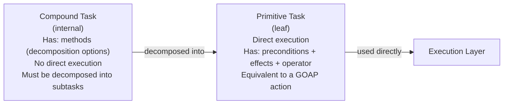
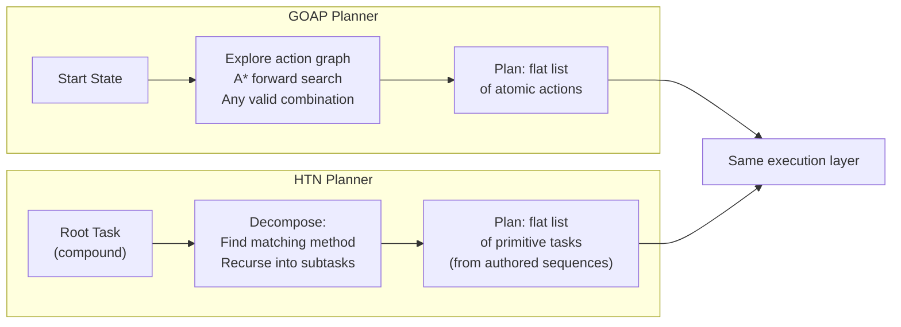
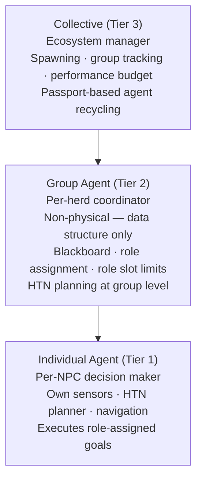
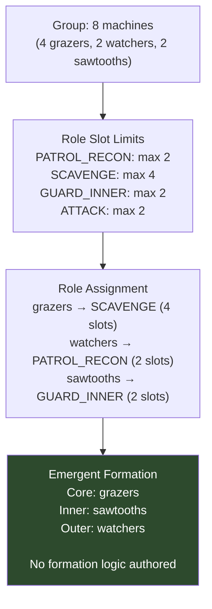
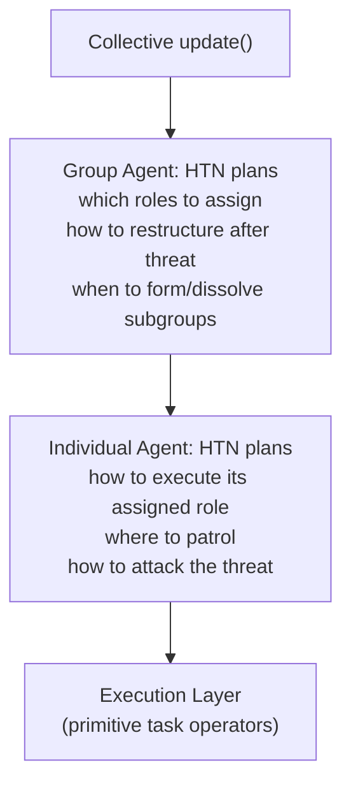

# Chapter 4 — HTN Planning & Agent Hierarchies

> **Previous:** [[ch03-goap|Ch 3 — GOAP]]
> **Next:** [[ch05-supporting-systems|Ch 5 — Supporting Systems]]
> **Case study:** [[horizon-zero-dawn-ai-case-study|Horizon Zero Dawn (2017)]]

---

## 4.1 Overview

HTN (Hierarchical Task Network) planning is GOAP's successor in the main game AI lineage. Where GOAP composes flat action chains at runtime, HTN decomposes high-level tasks into pre-authored subtask sequences. Designers write *how to do things* (as task methods/macros); the planner *selects* which method to use given current world state.

The second major topic in this chapter — agent hierarchies and blackboards — is the pattern that takes multi-agent systems from a collection of independent planners to a structured ecosystem. These two techniques are closely related: HZD uses HTN at both the individual and group levels.

**When to use HTN:**
- Open-world or large-scale AI where behavioral consistency matters
- Team needs to author and inspect AI plans without understanding A* internals
- Emergent potential of GOAP exceeds what you need (more control wanted)
- Building on a codebase where designers, not engineers, will tune most AI

**When to use agent hierarchies + blackboards:**
- Multiple AI agents need loose coordination without direct communication
- Groups need to maintain composition, roles, and structure
- You're managing an ecosystem (spawning, recycling, balancing)

---

## 4.2 HTN Core Concepts

### Primitive vs. Compound Tasks

An HTN has two kinds of tasks:



```pseudocode
interface Task:
    name:          String
    preconditions: WorldState

// Leaf task: directly executable
class PrimitiveTask implements Task:
    effects: WorldState
    cost:    float
    
    def isPossible(state: WorldState) -> bool:
        for key, value in preconditions:
            if state.get(key, false) != value:
                return false
        return true
    
    def applyEffects(state: WorldState) -> WorldState:
        result = state.copy()
        for key, value in effects:
            result[key] = value
        return result
    
    // The actual code that runs during execution
    def operator(agent: Agent, dt: float) -> TaskStatus:
        return RUNNING  // subclass overrides

// Compound task: decomposed by a matching method
class CompoundTask implements Task:
    methods: List<Method>   // ordered; first matching method wins
    
    def findSatisfiedMethod(state: WorldState) -> Method | null:
        for method in methods:
            if method.isPreconditionsMet(state):
                return method
        return null
```

### Methods (Decompositions)

A method defines *how* to accomplish a compound task given certain world conditions. Multiple methods for the same compound task let the planner choose the appropriate approach:

```pseudocode
class Method:
    name:          String
    preconditions: WorldState       // when this method applies
    subtasks:      List<Task>       // ordered sequence of sub-tasks

    def isPreconditionsMet(state: WorldState) -> bool:
        for key, value in preconditions:
            if state.get(key, false) != value:
                return false
        return true
```

**Example: PatrolAndProtect compound task with two methods**

```pseudocode
PATROL_AND_PROTECT = CompoundTask(
    name: "PatrolAndProtect",
    methods: [
        // Method 1: if threat known, defend
        Method(
            name: "DefendFromThreat",
            preconditions: {"threat_known": true},
            subtasks: [
                MoveToDefensePosition,    // PrimitiveTask
                AlertHerd,                // PrimitiveTask
                EngageOrFlee              // CompoundTask (further decomposed)
            ]
        ),
        // Method 2: relaxed patrol (default)
        Method(
            name: "RelaxedPatrol",
            preconditions: {},   // always available if method 1 doesn't match
            subtasks: [
                GeneratePatrolPath,   // PrimitiveTask
                WalkPatrolPath,       // PrimitiveTask
                ScanForThreats,       // PrimitiveTask
                ReportToGroup         // PrimitiveTask
            ]
        )
    ]
)
```

---

## 4.3 The HTN Planner

HTN planning is depth-first decomposition with backtracking. When a method's subtask fails to decompose, the planner tries the next method for that compound task.

```pseudocode
class HTNPlanner:

    def plan(
        rootTask:   Task,
        worldState: WorldState
    ) -> List<PrimitiveTask> | null:
        
        result = decompose(rootTask, worldState, [])
        return result

    def decompose(
        task:      Task,
        state:     WorldState,
        planSoFar: List<PrimitiveTask>
    ) -> List<PrimitiveTask> | null:

        if task is PrimitiveTask:
            if not task.isPossible(state):
                return null  // backtrack
            return planSoFar + [task]

        if task is CompoundTask:
            for method in task.methods:
                if not method.isPreconditionsMet(state):
                    continue

                // Try decomposing all subtasks using this method
                currentState = state
                currentPlan  = planSoFar.copy()
                success      = true

                for subtask in method.subtasks:
                    result = decompose(subtask, currentState, currentPlan)
                    if result is null:
                        success = false
                        break  // this method failed; try next

                    // Apply effects to track state through decomposition
                    if subtask is PrimitiveTask:
                        currentState = subtask.applyEffects(currentState)
                    currentPlan = result

                if success:
                    return currentPlan  // ✓ found a valid decomposition

        return null  // no method worked; backtrack
```

### HTN vs. GOAP Planner Comparison



The output is the same — a flat list of executable tasks. The difference is how you get there: GOAP discovers the sequence; HTN decomposes a pre-authored hierarchy.

---

## 4.4 Blackboard System

A blackboard is a shared information store — like a whiteboard that all agents in a group can read and write. It's the nervous system of a multi-agent group.

Key properties that make it different from a simple shared object:
1. **Decoupled:** readers and writers don't know about each other
2. **Timestamped:** data has a write time; readers can detect staleness
3. **Subscription support:** agents can be notified when data changes

```pseudocode
class Blackboard:
    private data:          Map<String, Any>    = {}
    private timestamps:    Map<String, float>  = {}
    private subscribers:   Map<String, List<Callable>> = {}

    def write(key: String, value: Any):
        data[key]       = value
        timestamps[key] = currentTime()
        notifySubscribers(key, value)

    def read(key: String, default: Any = null) -> Any:
        return data.get(key, default)

    def readWithAge(key: String) -> (Any, float):
        value = data.get(key, null)
        age   = currentTime() - timestamps.get(key, 0)
        return (value, age)

    def isStale(key: String, maxAgeSeconds: float) -> bool:
        age = currentTime() - timestamps.get(key, currentTime())
        return age > maxAgeSeconds

    def hasKey(key: String) -> bool:
        return key in data

    def subscribe(key: String, callback: Callable):
        if key not in subscribers:
            subscribers[key] = []
        subscribers[key].append(callback)

    def unsubscribe(key: String, callback: Callable):
        if key in subscribers:
            subscribers[key].remove(callback)

    def notifySubscribers(key: String, value: Any):
        for callback in subscribers.get(key, []):
            callback(key, value)

    def clear(key: String):
        data.pop(key, null)
        timestamps.pop(key, null)
```

### Blackboard Usage Pattern

```pseudocode
// A Recon machine spots a threat and writes to the group blackboard
def watcherUpdate(watcher: Machine, blackboard: Blackboard):
    if watcher.canSeePlayer():
        blackboard.write("threat_detected",  true)
        blackboard.write("threat_position",  watcher.lastSeenPlayerPos)
        blackboard.write("threat_type",      "player")
        blackboard.write("threat_reporter",  watcher.id)
        watcher.alertAnimation()

// A Combat machine reads threat data and responds
def sawtooth_Update(sawtooth: Machine, blackboard: Blackboard):
    if blackboard.read("threat_detected", false):
        (threatPos, age) = blackboard.readWithAge("threat_position")
        
        if age > 5.0:
            // Stale threat data — investigate, don't commit
            sawtooth.htnBrain.plan(InvestigateThreat, sawtooth.worldState)
        else:
            // Fresh data — engage
            sawtooth.htnBrain.plan(EngageThreat, sawtooth.worldState)
```

**The latency design pattern:** HZD's blackboard doesn't update instantaneously by design. Delayed propagation means the player can kill a machine without alerting the group if the kill is unwitnessed. The blackboard age check is what implements this. *(See [[horizon-zero-dawn-ai-case-study|HZD Case Study, Part 5]])*

---

## 4.5 Agent Hierarchy: Individual, Group, Collective

The three-tier hierarchy is HZD's solution to coordinating many agents at open-world scale. Each tier handles a different scope of concern. *(Full analysis in [[horizon-zero-dawn-ai-case-study|HZD Case Study, Part 2]])*



### Individual Agent

```pseudocode
class IndividualAgent:
    id:           AgentID
    agentType:    AgentType      // Watcher, Grazer, Sawtooth, etc.
    position:     Vector3
    passport:     AgentPassport  // type + capabilities metadata
    group:        GroupAgent | null
    sensors:      List<Sensor>
    worldState:   WorldState     // local world model
    planner:      HTNPlanner
    currentPlan:  List<PrimitiveTask> = []
    taskIndex:    int = 0
    role:         RoleType | null

    def update(dt: float):
        updateSensors()       // sensor → world state
        updateFromBlackboard() // merge group knowledge into local world state
        checkPlanValidity()
        executePlan(dt)

    def updateFromBlackboard():
        if group == null: return
        bb = group.blackboard

        if bb.hasKey("threat_detected") and not bb.isStale("threat_detected", 3.0):
            worldState["threat_known"]    = bb.read("threat_detected")
            worldState["threat_position"] = bb.read("threat_position")

    def checkPlanValidity():
        if currentPlan.isEmpty() or not currentPlan[taskIndex].isPossible(worldState):
            requestReplan()

    def requestReplan():
        currentGoal = determineCurrentGoal()
        if currentGoal == null: return
        
        plan = planner.plan(currentGoal, worldState)
        if plan != null:
            currentPlan = plan
            taskIndex   = 0

    def determineCurrentGoal() -> CompoundTask | null:
        // Goal is determined by the role assigned by the group
        if role == null: return WANDER_TASK  // fallback
        return ROLE_TO_GOAL_MAP[role]

    def executePlan(dt: float):
        if taskIndex >= currentPlan.length: return
        
        task   = currentPlan[taskIndex]
        status = task.operator(this, dt)
        
        if status == COMPLETE:
            taskIndex++
        elif status == FAILED:
            requestReplan()
```

### Group Agent

```pseudocode
enum RoleType:
    PATROL_RECON      // Watchers patrolling
    SCAVENGE          // Grazers mining resources
    GUARD_INNER       // Combat machines defending the core
    ATTACK            // Combat machines engaging threats
    FLEE              // Acquisition machines running away

class GroupAgent:
    id:            GroupID
    members:       List<IndividualAgent>
    blackboard:    Blackboard
    roles:         Map<RoleType, List<IndividualAgent>>
    roleSlotLimits: Map<RoleType, int>    // max agents per role
    planner:       HTNPlanner
    groupState:    WorldState             // group-level world model
    alertLevel:    AlertLevel             // RELAXED / ALERTED / COMBAT

    def update(dt: float):
        updateGroupState()
        checkAlertLevel()
        if alertLevelChanged:
            reassignRoles()
        planner.plan(GROUP_COORDINATION_TASK, groupState)

    def updateGroupState():
        // Aggregate information from all members and blackboard
        groupState["any_threat_detected"] = blackboard.read("threat_detected", false)
        groupState["member_count"]        = members.length
        groupState["combat_count"]        = roles[ATTACK].length

    def checkAlertLevel():
        prevLevel = alertLevel
        if groupState["any_threat_detected"]:
            if alertLevel == RELAXED:
                alertLevel = ALERTED
            elif alertLevel == ALERTED:
                alertLevel = COMBAT
        else:
            // Slowly de-escalate
            if alertLevel == COMBAT:
                alertLevel = ALERTED
            elif alertLevel == ALERTED:
                alertLevel = RELAXED
        alertLevelChanged = (prevLevel != alertLevel)

    def reassignRoles():
        clearRoleAssignments()
        
        for member in members:
            best = calculateBestRole(member)
            assignRole(member, best)

    def calculateBestRole(agent: IndividualAgent) -> RoleType:
        if alertLevel == COMBAT:
            if agent.agentType in COMBAT_TYPES:
                if roles[ATTACK].length < roleSlotLimits[ATTACK]:
                    return ATTACK
            if agent.agentType in ACQUISITION_TYPES:
                return FLEE
            return PATROL_RECON
        
        else:  // RELAXED or ALERTED
            if agent.agentType in RECON_TYPES:
                if roles[PATROL_RECON].length < roleSlotLimits[PATROL_RECON]:
                    return PATROL_RECON
            if agent.agentType in ACQUISITION_TYPES:
                return SCAVENGE
            return GUARD_INNER

    def assignRole(agent: IndividualAgent, role: RoleType):
        if roles[role].length < roleSlotLimits[role]:
            roles[role].append(agent)
            agent.role = role
            // Write to blackboard so agent can read its assignment
            blackboard.write("role_" + agent.id, role)

    def addMember(agent: IndividualAgent):
        members.append(agent)
        agent.group = this
        reassignRoles()

    def removeMember(agent: IndividualAgent):
        members.remove(agent)
        agent.group = null
        agent.role  = null
        roles[agent.role].remove(agent)
        reassignRoles()
```

### The Collective (Ecosystem Manager)

```pseudocode
class AgentPassport:
    agentId:      AgentID
    agentType:    AgentType
    capabilities: Set<String>     // what this agent can do
    // Used by Collective to match agents to groups

class Collective:
    groups:      List<GroupAgent>
    individuals: List<IndividualAgent>  // agents not in any group
    spawnSites:  List<SpawnSite>
    aibudget:    int = 50              // max active agents

    def update(dt: float):
        manageSpawning()
        recycleIsolatedAgents()
        enforceAIBudget()

    def manageSpawning():
        for site in spawnSites:
            if site.needsSpawn() and activAgentCount() < aibudget:
                agent = spawnAgentOfType(site.agentType, site.position)
                assignToNearestCompatibleGroup(agent)

    def recycleIsolatedAgents():
        for agent in individuals:
            bestGroup = findCompatibleGroup(agent.passport)
            if bestGroup != null:
                transferToGroup(agent, bestGroup)

    def findCompatibleGroup(passport: AgentPassport) -> GroupAgent | null:
        for group in groups:
            if group.hasOpenSlotFor(passport):
                return group
        return null

    def transferToGroup(agent: IndividualAgent, group: GroupAgent):
        individuals.remove(agent)
        group.addMember(agent)

    def enforceAIBudget():
        // Despawn agents that are far from the player and over budget
        if activAgentCount() > aibudget:
            candidates = getSortedByDistanceFromPlayer(descending: true)
            for agent in candidates:
                if activAgentCount() <= aibudget: break
                despawnAgent(agent)
```

---

## 4.6 Role Slot Limits as Structural Emergence

Role limits are a simple constraint that produces herd formation as a structural emergent property. No machine "decides" to be part of a defensive ring — the role limits enforce it:



The herd's layered structure — a defended inner core with outer scouts — falls out entirely from role limits and goal assignments. The designer set up the limits and the role-to-goal mapping; the structure emerges from every machine independently seeking its goal within its role.

---

## 4.7 Combining HTN with Group Hierarchy

The planner runs at both levels:



The group's HTN plan produces role assignments and blackboard data. The individual's HTN plan reads those assignments and produces a sequence of primitive tasks. The execution layer runs those tasks.

---

## 4.8 Pros and Cons Summary

### HTN Planner

| Aspect | Rating | Notes |
|--------|--------|-------|
| Emergent potential | ★★★★☆ | High; bounded by authored methods, not combinatorially free |
| Debuggability | ★★★★☆ | Trace which method was selected — inspectable hierarchy |
| Designer control | ★★★★★ | Designers author methods (macros) — direct control over "good behavior" |
| Scalability | ★★★★★ | Hierarchical decomposition doesn't explode like FSM transitions |
| Implementation effort | ★★★☆☆ | More involved than GOAP for method authoring tooling |
| Performance | ★★★★☆ | Decomposition is faster than open-ended A* search |

### Agent Hierarchy + Blackboard

| Aspect | Rating | Notes |
|--------|--------|-------|
| Coordination quality | ★★★★★ | Produces realistic group behavior without direct agent coupling |
| Implementation effort | ★★★★☆ | Three tiers + blackboard is significant infrastructure |
| Open-world scalability | ★★★★★ | Collective manages AI budget; agents activate near player |
| Structural emergence | ★★★★★ | Role limits produce formations, composition, and adaptation |
| Debugging complexity | ★★★☆☆ | Must trace: individual → group → collective to find root cause |

---

## 4.9 HTN & Hierarchy Design Checklist

- [ ] Map behaviors to compound and primitive tasks — which behaviors decompose into others?
- [ ] Author methods for each compound task — what are the conditions for each approach?
- [ ] Define world state predicates used across decompositions
- [ ] Define agent types and their functional roles (combat, recon, acquisition, transport)
- [ ] Define role slot limits per group type
- [ ] Design blackboard key schema — what shared data do agents need?
- [ ] Set blackboard staleness thresholds per key (fast-changing vs. stable data)
- [ ] Implement Collective spawning and recycling logic
- [ ] Profile: test with max active agent count
- [ ] Build a debug view for blackboard contents and role assignments

---

> **Next chapter:** [[ch05-supporting-systems|Chapter 5 — Supporting Systems]]
