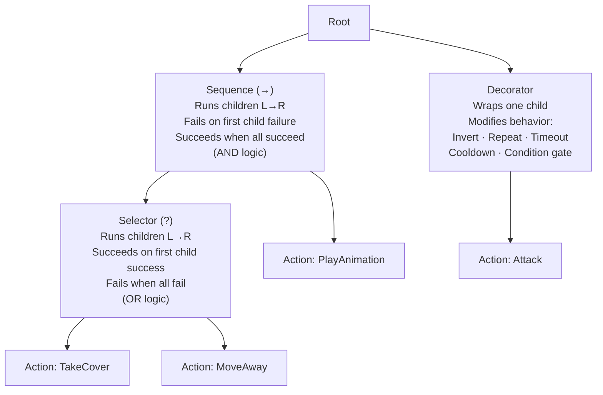
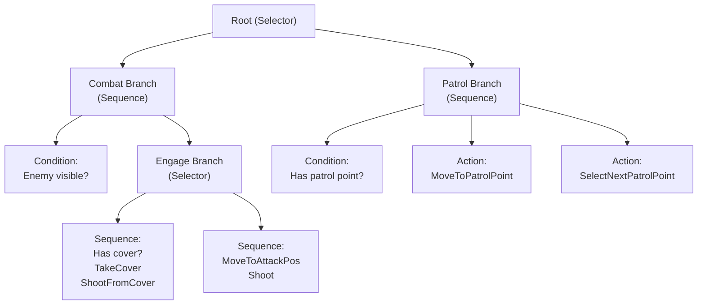
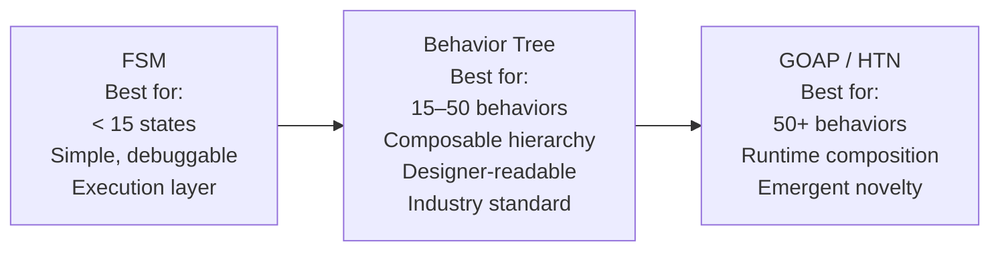

# Chapter 5 — Supporting Systems
## Sensors · Navigation · Utility Functions · Behavior Trees · Smart Objects

> **Previous:** [[ch04-htn-and-hierarchies|Ch 4 — HTN & Hierarchies]]
> **Next:** [[ch06-ultimate-system|Ch 6 — The Ultimate System]]
> **Case studies:** [[half-life-ai-fsm|Half-Life]], [[horizon-zero-dawn-ai-case-study|HZD]], [[fear-goap-case-study|F.E.A.R.]]

---

## 5.1 Overview

The planning and decision systems in Chapters 2–4 are powerful, but they depend on the quality of what feeds them. This chapter covers the systems that give your AI eyes and ears (sensors), the ability to move (navigation), the capacity to prioritize (utility functions), and the tools to interact with a data-driven world (smart objects). It also covers behavior trees — the dominant industry technique that sits between FSMs and planning-based approaches.

---

## 5.2 Sensor Systems

### Binary vs. Rich Sensors

A basic sensor answers one question: "did I detect something — yes or no?" This produces AI that reacts identically to a dead body and a live enemy standing in the same spot. Rich sensors answer more: *what* was detected, *what state* it's in, and *how confidently* the detection happened.

HZD's information packet approach is the gold standard: every perceivable world entity carries a data packet that describes itself, and sensors read that packet with fidelity proportional to their strength. *(See [[horizon-zero-dawn-ai-case-study|HZD Case Study, Part 7]])*

### Information Packets

```pseudocode
// Attached to every perceivable entity in the world
class StimulusPacket:
    sourceId:     EntityID
    sourceType:   EntityType      // Player, NPC, Projectile, DeadBody, Wildlife...
    sourceState:  EntityState     // Alive, Dead, Hidden, Moving, Crouching...
    position:     Vector3
    velocity:     Vector3
    threatLevel:  float           // 0 = harmless, 1 = maximum threat
    timestamp:    float

    def update(entity: WorldEntity):
        position    = entity.position
        velocity    = entity.velocity
        sourceState = entity.currentState
        timestamp   = currentTime()

// Every world entity that can be perceived owns a packet
class PerceivableEntity:
    stimulus: StimulusPacket
    
    def onStateChanged():
        stimulus.sourceState = this.currentState
        stimulus.timestamp   = currentTime()
```

### Sensor Base Class

```pseudocode
class Sensor:
    owner:       Agent
    range:       float
    sensitivity: float   // 0.0 – 1.0; affects data resolution received
    cooldown:    float   // minimum time between detections of the same source

    // Override: can this sensor detect this stimulus at all?
    def canDetect(packet: StimulusPacket) -> bool:
        return distance(packet.position, owner.position) <= range

    // Filter the received data by sensor strength
    def filterPacket(packet: StimulusPacket) -> PerceivedInfo:
        if sensitivity >= 0.8:
            return PerceivedInfo.full(packet)       // see everything
        elif sensitivity >= 0.4:
            return PerceivedInfo.partial(packet)    // type + position, no state
        else:
            return PerceivedInfo.minimal(packet)    // position only

    def perceive(packet: StimulusPacket) -> PerceivedInfo | null:
        if not canDetect(packet):
            return null
        return filterPacket(packet)

class PerceivedInfo:
    sourceId:    EntityID
    position:    Vector3
    sourceType:  EntityType | null  // null if sensitivity too low
    sourceState: EntityState | null // null if sensitivity too low
    confidence:  float              // 0.0–1.0; drives investigation vs. direct response

    static def full(packet: StimulusPacket) -> PerceivedInfo:
        return PerceivedInfo(
            sourceId:    packet.sourceId,
            position:    packet.position,
            sourceType:  packet.sourceType,
            sourceState: packet.sourceState,
            confidence:  1.0
        )

    static def partial(packet: StimulusPacket) -> PerceivedInfo:
        return PerceivedInfo(
            sourceId:    packet.sourceId,
            position:    packet.position,
            sourceType:  packet.sourceType,
            sourceState: null,           // can't read state
            confidence:  0.6
        )

    static def minimal(packet: StimulusPacket) -> PerceivedInfo:
        return PerceivedInfo(
            sourceId:    packet.sourceId,
            position:    packet.position,
            sourceType:  null,           // can't identify
            sourceState: null,
            confidence:  0.2
        )
```

### Specialized Sensors

```pseudocode
class VisualSensor extends Sensor:
    fieldOfView:    float   // degrees
    
    def canDetect(packet: StimulusPacket) -> bool:
        if not super.canDetect(packet): return false
        
        toTarget = normalize(packet.position - owner.position)
        angle    = angleBetween(toTarget, owner.forward)
        inCone   = angle <= fieldOfView / 2.0
        
        // Occlusion: line of sight check
        hasLOS = not physics.raycastHits(
            origin:    owner.eyePosition,
            target:    packet.position,
            layerMask: OPAQUE_GEOMETRY
        )
        
        // Concealment: player in long grass reduces effective confidence
        concealed = packet.sourceState == HIDDEN_IN_VEGETATION
        
        return inCone and hasLOS and not (concealed and sensitivity < 0.7)

class AuditorySensor extends Sensor:
    // No line-of-sight requirement — sound travels around corners
    def canDetect(packet: StimulusPacket) -> bool:
        if packet.sourceType != StimulusType.Sound: return false
        return distance(packet.position, owner.position) <= range

class SmellSensor extends AuditorySensor:
    // Identical to auditory, but only responds to scent-type packets
    // This is exactly Half-Life's implementation: smell = inaudible audio event
    def canDetect(packet: StimulusPacket) -> bool:
        if packet.sourceType != StimulusType.Scent: return false
        return distance(packet.position, owner.position) <= range

class ProximitySensor extends Sensor:
    // Detects physical contact / very close presence
    def canDetect(packet: StimulusPacket) -> bool:
        return distance(packet.position, owner.position) <= range  // very small range
```

### Sensor → World State Integration

```pseudocode
class SensorComponent:
    owner:   Agent
    sensors: List<Sensor>
    
    def update(worldState: WorldState):
        worldState["can_see_enemy"]    = false
        worldState["hear_sound"]       = false
        worldState["smell_detected"]   = false
        worldState["threat_known"]     = false
        
        allEntities = world.getPerceivableEntities(owner.position, MAX_SENSOR_RANGE)
        
        for entity in allEntities:
            for sensor in sensors:
                info = sensor.perceive(entity.stimulus)
                if info != null:
                    integratePerception(info, worldState)
    
    def integratePerception(info: PerceivedInfo, worldState: WorldState):
        if info.sourceType == EntityType.Player:
            if info.confidence >= 0.8:
                worldState["can_see_enemy"] = true
                worldState["enemy_position"] = info.position
            elif info.confidence >= 0.4:
                worldState["threat_known"]   = true  // know something's there
                worldState["threat_position"] = info.position
        
        if info.sourceType == StimulusType.Sound:
            worldState["hear_sound"]      = true
            worldState["sound_position"]  = info.position
```

---

## 5.3 Navigation

Navigation is often where emergence gets physically grounded. The **exclusion principle** — agents can't occupy the same space — is implemented entirely by the navigation system and is responsible for flanking, encirclement, and position-spreading in all three case studies.

### Navigation Mesh (Land)

A nav mesh defines the walkable surface of a level. Each agent queries it to find paths.

```pseudocode
class NavMesh:
    polygons: List<NavPolygon>
    
    def findPath(start: Vector3, end: Vector3, agentRadius: float) -> List<Vector3> | null:
        // A* over polygon graph, accounting for agent size
        // Returns a list of waypoints; null if no path exists

class NavPolygon:
    vertices:   List<Vector3>
    neighbors:  List<NavPolygon>
    traversable: bool = true
    cost:        float = 1.0     // higher cost = less preferred
    
    // Context-dependent cost: agent's behavior state changes traversal preference
    def getCost(agent: Agent) -> float:
        base = cost
        if this.hasTag("stealth_vegetation"):
            if agent.behaviorState == PATROL:
                return INFINITY      // treat as impassable during patrol
            elif agent.behaviorState == INVESTIGATING:
                return base * 3.0   // undesirable but passable
        if this.hasTag("destructible") and agent.agentType in LARGE_TYPES:
            if agent.isAngered():
                return base         // smash through it
        return base
```

### Context-Dependent Obstacle Traversal

This is HZD's key navigation innovation — the same obstacle has different traversability depending on the agent's behavior state:

```pseudocode
// Navigation query with behavioral context
class NavigationAgent:
    agent:    Agent
    navMesh:  NavMesh
    
    def requestPath(destination: Vector3) -> List<Vector3> | null:
        // Pass agent context to the pathfinder
        return navMesh.findPath(
            start:      agent.position,
            end:        destination,
            agentRadius: agent.collisionRadius,
            context:    NavigationContext(
                behaviorState: agent.behaviorState,
                agentType:     agent.agentType,
                isAngered:     agent.isAngered()
            )
        )

// Result: same map, same agent, different paths based on behavior state
// Patrolling Thunderjaw routes around the boulder
// Chasing Thunderjaw smashes through the boulder → signals to player that something is very wrong
```

### Multi-Mesh Architecture (HZD Pattern)

For games with agents of very different sizes, use separate meshes per size class:

```pseudocode
enum NavMeshTier:
    SMALL       // humans, small creatures
    MEDIUM      // medium machines
    LARGE       // large combat machines
    EXTRA_LARGE // Thunderjaw-class — mostly exclusive
    SWIMMING    // aquatic agents
    MOUNTING    // valid positions for player to mount

class NavMeshSystem:
    meshes: Map<NavMeshTier, NavMesh>
    
    def getPathFor(agent: Agent, destination: Vector3) -> List<Vector3> | null:
        tier = getTierForAgent(agent)
        return meshes[tier].findPath(
            agent.position, destination, agent.collisionRadius
        )
    
    def getTierForAgent(agent: Agent) -> NavMeshTier:
        match agent.agentType:
            case THUNDERJAW: return EXTRA_LARGE
            case SAWTOOTH:   return LARGE
            case WATCHER:    return SMALL
            case PLAYER:     return SMALL
            // etc.
    
    def rebuildAroundPoint(center: Vector3, radius: float):
        // Build meshes at runtime only around the active area
        // Critical for open-world performance
        for mesh in meshes.values():
            mesh.rebuildRegion(center, radius)
```

### Exclusion as the Coordination Mechanism

The nav system is the hidden coordinator for all multi-agent behavior. No explicit coordination code needed:

```pseudocode
// Navigation node reservation
class NavigationNode:
    position:   Vector3
    isReserved: bool = false
    reservedBy: AgentID | null

    def tryReserve(agent: Agent) -> bool:
        if isReserved: return false
        isReserved = true
        reservedBy = agent.id
        return true

    def release():
        isReserved = false
        reservedBy = null

// When two agents independently plan to the same attack position,
// the second one simply gets the next best available node.
// Result: natural positional spread → apparent flanking → no flanking code.
```

---

## 5.4 Utility Functions

Utility AI scores actions continuously and selects the highest-scoring one. It's best for decisions where no single answer is always right — the optimal choice depends on a complex interplay of factors.

HZD uses utility functions as preconditions for the HTN planner: an attack plan is only generated if the attack utility score is high enough. The Sims pioneered utility AI for full-game decisions (which activity to do next based on need scores). *(Sources: Dave Mark, "An Introduction to Utility Theory," *Game AI Pro* Ch. 9; GMTK, "The Genius AI Behind The Sims")*

### Core Utility Evaluator

```pseudocode
class UtilityEvaluator:
    factors: List<UtilityFactor>
    
    def evaluate(agent: Agent, context: EvaluationContext) -> float:
        if factors.isEmpty(): return 0.0
        
        total = 0.0
        totalWeight = 0.0
        
        for factor in factors:
            score = clamp(factor.evaluate(agent, context), 0.0, 1.0)
            total       += score * factor.weight
            totalWeight += factor.weight
        
        return totalWeight > 0 ? total / totalWeight : 0.0

class UtilityFactor:
    weight: float
    
    // Returns 0.0–1.0
    def evaluate(agent: Agent, context: EvaluationContext) -> float:
        return 0.0  // subclass implements
```

### HZD's Attack Interest Utility

Scores how interesting it would be for a machine to attack the player right now — from the game design perspective of making combat fun, not making the AI maximally lethal:

```pseudocode
class AttackInterestUtility extends UtilityEvaluator:
    
    constructor():
        factors = [
            HealthFactor(weight: 0.25),
            PlayerAwarenessFactor(weight: 0.35),
            DistanceFactor(weight: 0.20),
            DamageContributionFactor(weight: 0.20)
        ]

class HealthFactor extends UtilityFactor:
    // Healthy machine = more interesting attacker
    def evaluate(agent: Agent, context: EvaluationContext) -> float:
        return agent.health / agent.maxHealth

class PlayerAwarenessFactor extends UtilityFactor:
    // Player unaware of this machine = more interesting surprise attack
    def evaluate(agent: Agent, context: EvaluationContext) -> float:
        return context.playerKnowsAboutAgent(agent) ? 0.3 : 1.0

class DistanceFactor extends UtilityFactor:
    // Sweet spot distance: not too close (claustrophobic), not too far (ineffective)
    MIN_DIST = 3.0
    MAX_DIST = 20.0
    IDEAL_DIST = 8.0
    
    def evaluate(agent: Agent, context: EvaluationContext) -> float:
        dist = distance(agent.position, context.target.position)
        if dist < MIN_DIST or dist > MAX_DIST: return 0.1
        
        // Bell curve around IDEAL_DIST
        deviation = abs(dist - IDEAL_DIST) / (MAX_DIST - MIN_DIST)
        return 1.0 - deviation

class DamageContributionFactor extends UtilityFactor:
    // Machine that hasn't contributed much = more interesting attacker
    def evaluate(agent: Agent, context: EvaluationContext) -> float:
        totalGroupDamage = context.getTotalGroupDamageDealt()
        if totalGroupDamage == 0: return 1.0
        contribution = agent.damageDealt / totalGroupDamage
        return 1.0 - contribution  // low contribution = high score
```

### Using Utility as HTN Precondition

```pseudocode
// The utility score gates whether the planner generates an attack plan
ATTACK_UTILITY_EVALUATOR = AttackInterestUtility()
ATTACK_UTILITY_THRESHOLD = 0.45

class AttackTask extends PrimitiveTask:
    preconditions = {"threat_known": true}
    
    def isPossible(state: WorldState) -> bool:
        if not super.isPossible(state): return false
        
        // Check utility threshold
        score = ATTACK_UTILITY_EVALUATOR.evaluate(ownerAgent, combatContext)
        return score >= ATTACK_UTILITY_THRESHOLD
    
    def operator(agent: Agent, dt: float) -> TaskStatus:
        // ... actual attack execution
```

### The Sims Pattern: Need-Based Utility

For life simulation, strategy, or social AI where agents have ongoing needs:

```pseudocode
class AgentNeeds:
    hunger:  float = 1.0   // 0 = starving, 1 = full
    energy:  float = 1.0
    fun:     float = 0.5
    social:  float = 0.5
    
    def update(dt: float):
        hunger -= HUNGER_DRAIN_RATE * dt
        energy -= ENERGY_DRAIN_RATE * dt
        fun    -= FUN_DRAIN_RATE    * dt
        social -= SOCIAL_DRAIN_RATE * dt

class ActivityOption:
    name:          String
    satisfies:     Map<NeedType, float>  // how much each need this satisfies
    cost:          float                 // time/resource cost
    availability:  Function() -> bool   // is this option available?
    
    def calculateUtility(needs: AgentNeeds) -> float:
        score = 0.0
        for needType, satisfaction in satisfies:
            // Weight satisfaction by how urgent the need is
            urgency = 1.0 - needs[needType]   // low need value = high urgency
            score  += urgency * satisfaction
        return score / cost   // normalize by cost

class UtilitySelector:
    def selectBestActivity(agent: Agent, options: List<ActivityOption>) -> ActivityOption | null:
        best = null
        bestScore = -1.0
        
        for option in options:
            if not option.availability():
                continue
            score = option.calculateUtility(agent.needs)
            if score > bestScore:
                bestScore = score
                best = option
        
        return best
```

---

## 5.5 Behavior Trees

Behavior trees are the dominant AI technique in the modern games industry, used in Unreal Engine natively and adopted across Unity and custom engines. They sit between FSMs (explicit state management) and planning (runtime composition), offering a composable, readable hierarchy of behaviors.

*(Sources: Damian Isla, GDC 2005 "Halo 2 AI"; Chris Simpson, "Behavior Trees for AI: How They Work," Game Developer; Game AI Pro Chapter 6)*

### Core Node Types



| Node Type | Symbol | Behavior | Analogy |
|-----------|--------|----------|---------|
| **Sequence** | → | Run children in order; fail on first failure | AND gate |
| **Selector** | ? | Try children in order; succeed on first success | OR gate / fallback |
| **Decorator** | ◇ | Modify child's return value or execution | Wrapper/modifier |
| **Action (Leaf)** | ▪ | Actually does something; returns Success/Failure/Running | Task/state |
| **Condition (Leaf)** | ◆ | Tests a condition; returns Success or Failure | If-check |

### Node Return Values

```pseudocode
enum BTStatus:
    SUCCESS   // completed successfully
    FAILURE   // failed
    RUNNING   // still executing (spread over multiple frames)

interface BTNode:
    def tick(agent: Agent) -> BTStatus
```

### Implementation

```pseudocode
class SequenceNode implements BTNode:
    children: List<BTNode>
    currentIndex: int = 0

    def tick(agent: Agent) -> BTStatus:
        while currentIndex < children.length:
            status = children[currentIndex].tick(agent)
            
            if status == RUNNING:  return RUNNING
            if status == FAILURE:
                currentIndex = 0   // reset for next evaluation
                return FAILURE
            
            currentIndex++  // SUCCESS: move to next child
        
        currentIndex = 0
        return SUCCESS

class SelectorNode implements BTNode:
    children: List<BTNode>
    currentIndex: int = 0

    def tick(agent: Agent) -> BTStatus:
        while currentIndex < children.length:
            status = children[currentIndex].tick(agent)
            
            if status == RUNNING:  return RUNNING
            if status == SUCCESS:
                currentIndex = 0
                return SUCCESS
            
            currentIndex++  // FAILURE: try next child
        
        currentIndex = 0
        return FAILURE  // all children failed

class InverterDecorator implements BTNode:
    child: BTNode

    def tick(agent: Agent) -> BTStatus:
        status = child.tick(agent)
        if status == SUCCESS: return FAILURE
        if status == FAILURE: return SUCCESS
        return RUNNING

class RepeatUntilFailDecorator implements BTNode:
    child: BTNode

    def tick(agent: Agent) -> BTStatus:
        while true:
            status = child.tick(agent)
            if status == FAILURE: return SUCCESS
            if status == RUNNING: return RUNNING
            // SUCCESS: keep repeating

class ConditionNode implements BTNode:
    condition: Function(Agent) -> bool

    def tick(agent: Agent) -> BTStatus:
        return condition(agent) ? SUCCESS : FAILURE

class ActionNode implements BTNode:
    action: Function(Agent) -> BTStatus

    def tick(agent: Agent) -> BTStatus:
        return action(agent)
```

### Example: Patrol-to-Combat Behavior Tree



```pseudocode
// Built in code (or loaded from data file)
combatTree = SelectorNode([
    // Combat branch: only runs if enemy visible
    SequenceNode([
        ConditionNode(lambda agent: agent.worldState["can_see_enemy"]),
        SelectorNode([
            // Option 1: shoot from cover
            SequenceNode([
                ConditionNode(lambda agent: agent.worldState["have_cover"]),
                ActionNode(lambda agent: agent.shootFromCover())
            ]),
            // Option 2: advance and shoot
            SequenceNode([
                ActionNode(lambda agent: agent.moveToAttackPosition()),
                ActionNode(lambda agent: agent.shoot())
            ])
        ])
    ]),
    // Patrol branch: default behavior
    SequenceNode([
        ConditionNode(lambda agent: agent.hasPatrolPoint()),
        ActionNode(lambda agent: agent.moveToPatrolPoint()),
        ActionNode(lambda agent: agent.selectNextPatrolPoint())
    ])
])
```

### Where BTs Fit in the Ecosystem



**BTs vs. GOAP for emergence:** BTs produce emergent behavior through node composition and reactive re-ticking. GOAP produces emergent behavior through runtime action sequencing. BTs are more predictable and more debuggable; GOAP is more generative. For most games, BTs are sufficient. GOAP is justified when you need the AI to discover behaviors you haven't explicitly authored.

---

## 5.6 Animation-AI Integration

Good AI decisions that produce visually wrong behavior break the illusion immediately. The AI and animation systems must be co-designed.

### The Two-Phase Attack Pattern

Every AI attack should have:
1. **Wind-up (telegraph):** Signals the attack is coming. Gives the player a reaction window.
2. **Finish (payoff):** The damage-dealing moment.

```pseudocode
class TelegraphedAttack:
    windupAnim:    String
    finishAnim:    String
    windupDuration: float
    damageMoment:   float   // seconds into finish anim when damage is dealt
    isInterruptible: bool   // can the wind-up be cancelled?
    
    def execute(agent: Agent, target: Entity) -> TaskStatus:
        if not agent.isPlayingAnimation(windupAnim):
            agent.playAnimation(windupAnim)
            agent.state = WINDING_UP
        
        if agent.state == WINDING_UP:
            if agent.getAnimationProgress() >= 1.0:
                agent.playAnimation(finishAnim)
                agent.state = FINISHING
            return RUNNING
        
        if agent.state == FINISHING:
            progress = agent.getAnimationProgress()
            if progress >= damageMoment / finishAnim.duration and not agent.damageDealt:
                agent.dealDamageTo(target)
                agent.damageDealt = true
            if progress >= 1.0:
                agent.damageDealt = false
                agent.state = IDLE
                return SUCCESS
        
        return RUNNING
```

### Non-Interruptible Animations and Planning

When an animation is committed (non-interruptible), the AI system must respect this:

```pseudocode
// In GOAP: ReplanRequired() cannot fire during non-interruptible animations
def replanRequired(plan: List<GOAPAction>, agent: Agent) -> bool:
    if agent.isPlayingNonInterruptibleAnimation():
        return false   // wait until animation completes
    // ... other replan conditions

// In HTN: same principle
def checkPlanValidity(agent: Agent):
    if agent.currentAnimation?.isNonInterruptible:
        return   // don't invalidate until animation completes
    // ... otherwise validate normally
```

---

## 5.7 Supporting Systems Design Checklist

### Sensors
- [ ] What types of stimuli exist in the world? (sound, sight, smell, touch, proximity)
- [ ] Which agent types respond to which stimuli?
- [ ] Define field-of-view angles per visual sensor
- [ ] Define range and sensitivity per sensor and per agent type
- [ ] What does a partial detection look like? (low confidence → investigate, don't commit)
- [ ] Does vegetation/cover affect detection? Model as stimulus packet state flag.

### Navigation
- [ ] How many distinct agent sizes/types need navigation?
- [ ] Are meshes baked or runtime-built? (Open world → runtime, around player)
- [ ] Which obstacles are context-dependent? (tall grass = impassable for patrol, passable for chase)
- [ ] Do any agents need 3D/aerial navigation?
- [ ] Are navigation nodes reservable? (needed for exclusion-based coordination)

### Utility Functions
- [ ] Which decisions benefit from continuous scoring rather than discrete priorities?
- [ ] What factors contribute to each decision, and what are their relative weights?
- [ ] Does utility govern action selection directly, or serve as a precondition to the planner?
- [ ] Is normalization consistent across all factors (all return 0–1)?

### Behavior Trees (if using)
- [ ] Define the behavior tree root and branch priority order (higher branches = higher priority)
- [ ] Identify re-usable sub-trees (patrol logic, investigate logic) that appear in multiple agents
- [ ] Does your engine/framework support a BT visual editor? If not, consider a data-driven tree loader.
- [ ] Define the tick rate — not every agent needs to tick every frame

---

> **Next chapter:** [[ch06-ultimate-system|Chapter 6 — The Ultimate System]]
