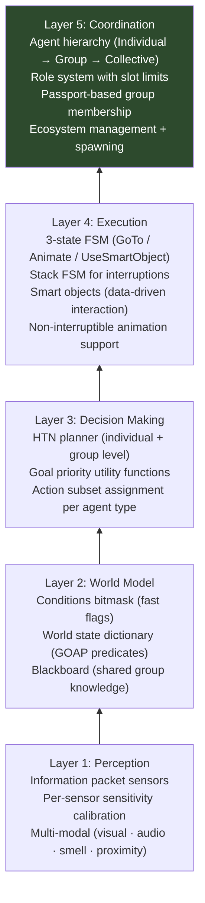
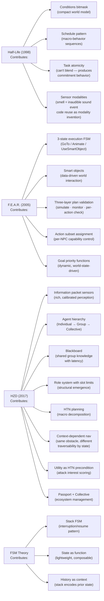
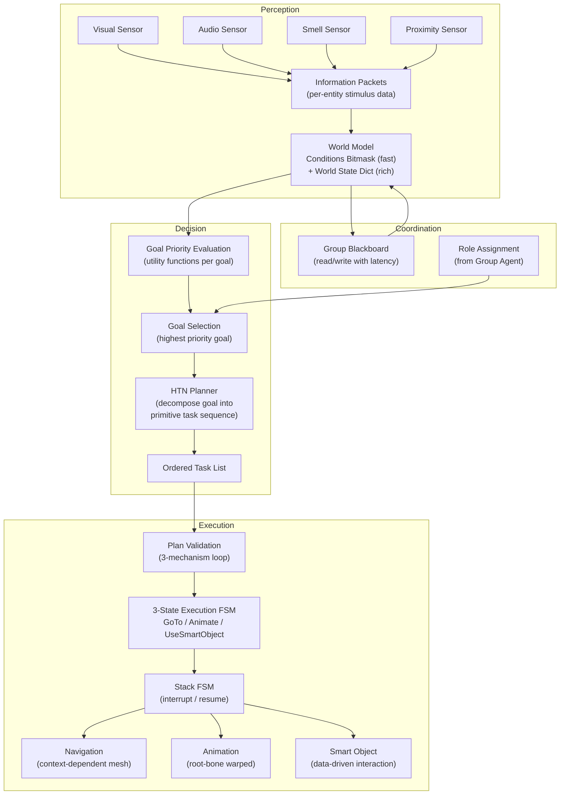
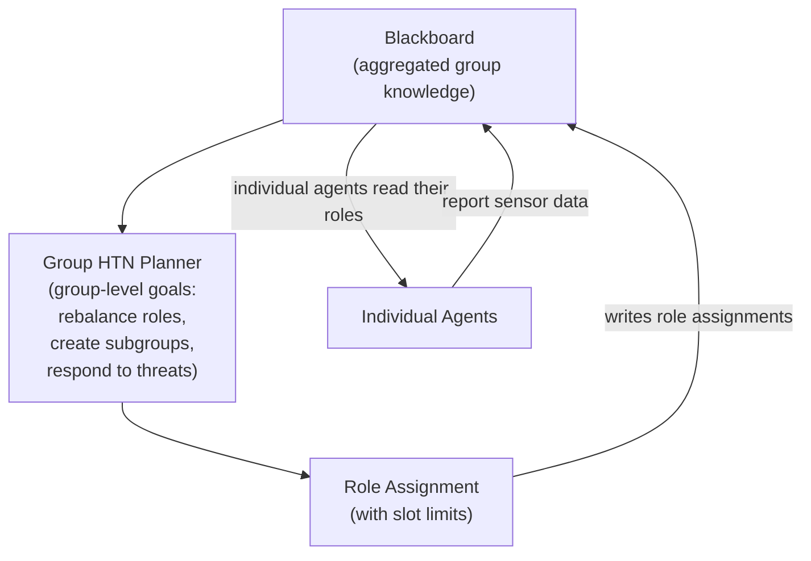
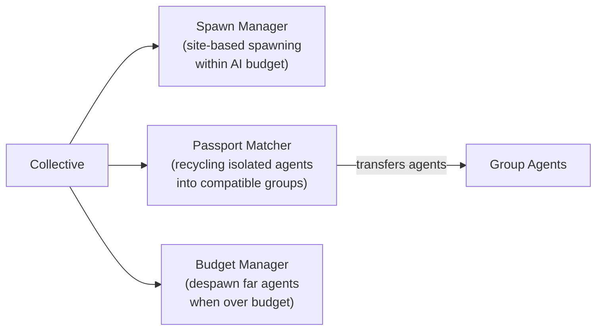
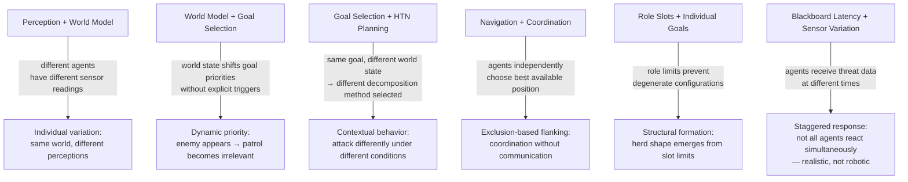
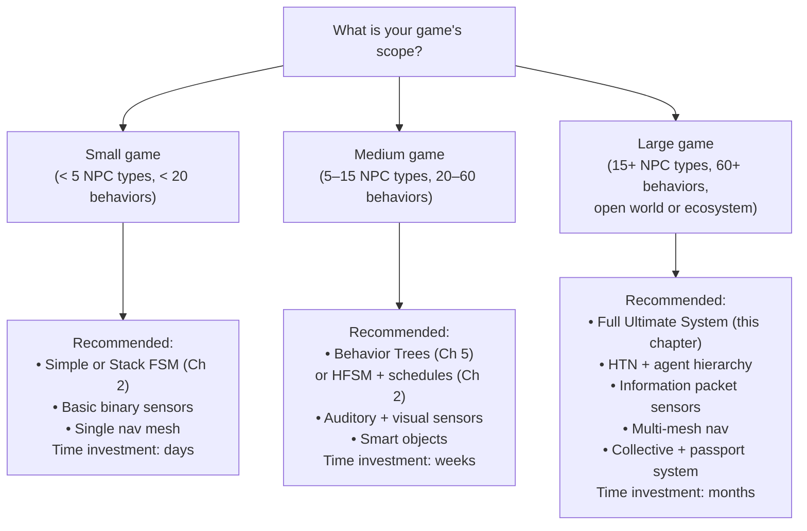

# Chapter 6 — The Ultimate Emergent AI System
## Combining the Best of Every Case Study

> **Previous:** [[ch05-supporting-systems|Ch 5 — Supporting Systems]]
> **Next:** [[ch07-debugging|Ch 7 — Debugging & Anti-Patterns]]
> **Case studies:** [[half-life-ai-fsm|Half-Life]] · [[fear-goap-case-study|F.E.A.R.]] · [[horizon-zero-dawn-ai-case-study|HZD]] · [[fsm-theory-and-implementation|FSM Theory]]

---

## 6.1 What This Chapter Is

This chapter describes a layered AI architecture that synthesizes the strongest elements from every case study. It is not the minimum viable AI system — it's a full-featured design for games that want rich, multi-agent emergent behavior at scale.

You don't need to implement every layer for every project. The chapter also includes a **scaling guide** that helps you decide which layers to include based on your game's scope.

---

## 6.2 Architecture Overview

The Ultimate System combines five distinct contribution layers, each building on the one below it:



**Data flows upward** (perception informs decisions), **commands flow downward** (decisions drive execution), and **coordination flows laterally** (agents share state through blackboards, not direct communication).

---

## 6.3 What Each Case Study Contributes



---

## 6.4 Full System Architecture

### Individual Agent



### Group Agent



### Collective



---

## 6.5 Complete Pseudocode Integration

### The Individual Agent (Full)

```pseudocode
class UltimateAgent:
    // Identity
    id:           AgentID
    agentType:    AgentType
    passport:     AgentPassport

    // Position / physics
    position:     Vector3
    velocity:     Vector3
    forward:      Vector3

    // Perception
    sensors:      SensorComponent   // manages all sensor types
    worldState:   WorldState        // local world model (dict + bitmask)
    conditions:   ConditionSet      // fast 32-bit flags

    // Decision
    goals:        List<HTNGoal>     // goals this agent can pursue
    planner:      HTNPlanner
    availableActions: List<GOAPAction>    // for any GOAP sub-goals
    currentGoal:  HTNGoal | null
    currentPlan:  List<PrimitiveTask> = []
    taskIndex:    int = 0

    // Execution
    executionFSM: ExecutionLayer    // 3-state: GoTo/Animate/UseSmartObject
    interruptFSM: StackFSM         // for temporary interrupt states
    navAgent:     NavigationAgent

    // Coordination
    group:        GroupAgent | null
    role:         RoleType | null
    blackboard:   Blackboard | null  // reference to group's blackboard

    // Timers
    replanCooldown:   float = 0.0
    REPLAN_INTERVAL:  float = 0.1

    def update(dt: float):
        replanCooldown = max(0, replanCooldown - dt)

        // === PERCEPTION ===
        sensors.update(worldState, conditions)

        // === GROUP SYNC ===
        if blackboard != null:
            syncFromBlackboard()

        // === GOAL SELECTION ===
        newGoal = selectBestGoal()
        if newGoal != currentGoal:
            abandonCurrentPlan()
            currentGoal = newGoal

        // === PLANNING ===
        if currentPlan.isEmpty() and currentGoal != null:
            if replanCooldown <= 0:
                generatePlan()
                replanCooldown = REPLAN_INTERVAL

        // === PLAN VALIDATION (Mechanism 2) ===
        if currentGoal != null and not currentPlan.isEmpty():
            if currentGoal.replanRequired(this):
                if not executionFSM.isPlayingNonInterruptibleAnimation():
                    generatePlan()

        // === EXECUTION ===
        if not currentPlan.isEmpty():
            executeCurrentTask(dt)

        // === INTERRUPT LAYER ===
        interruptFSM.update()

    def syncFromBlackboard():
        // Merge relevant blackboard data into local world state
        if not blackboard.isStale("threat_detected", 3.0):
            worldState["threat_known"]    = blackboard.read("threat_detected", false)
            worldState["threat_position"] = blackboard.read("threat_position", null)

        // Read role assignment
        roleKey = "role_" + id
        if blackboard.hasKey(roleKey):
            role = blackboard.read(roleKey)

    def selectBestGoal() -> HTNGoal | null:
        best = null
        bestPriority = 0.0

        for goal in goals:
            // Utility function determines priority
            p = goal.evaluatePriority(worldState, this)
            if p > bestPriority:
                bestPriority = p
                best = goal

        return best

    def generatePlan():
        if currentGoal == null: return

        // Augment available actions with nearby smart objects
        smartActions = getSmartObjectActionsInRange()
        allActions   = availableActions + smartActions

        plan = planner.plan(currentGoal.rootTask, worldState)
        if plan != null and validatePlanSimulation(plan):
            currentPlan = plan
            taskIndex   = 0
            if not currentPlan.isEmpty():
                executionFSM.activateAction(currentPlan[0])

    def executeCurrentTask(dt: float):
        if taskIndex >= currentPlan.length:
            // Plan complete
            currentPlan = []
            taskIndex   = 0
            return

        task = currentPlan[taskIndex]

        // Mechanism 3: per-action precondition check
        if not task.isPossible(worldState):
            generatePlan()
            return

        status = executionFSM.update(dt)
        if status == COMPLETE:
            taskIndex++
            if taskIndex < currentPlan.length:
                executionFSM.activateAction(currentPlan[taskIndex])

    def validatePlanSimulation(plan: List<PrimitiveTask>) -> bool:
        // Mechanism 1: simulate the plan on a copy of world state
        simState = worldState.copy()
        for task in plan:
            if not task.isPossible(simState): return false
            simState = task.applyEffects(simState)
        return currentGoal.isAchievedIn(simState)

    // Interrupt system: push temporary behaviors without abandoning the plan
    def reactToUrgentStimulus(stimulus: StimulusPacket):
        if stimulus.threatLevel >= FLINCH_THRESHOLD:
            interruptFSM.pushState(flinchReactionState)

    def receivedAlertFromGroup():
        if not interruptFSM.isInState(alertReactionState):
            interruptFSM.pushState(alertReactionState)

    def getSmartObjectActionsInRange() -> List<GOAPAction>:
        nearby = world.getSmartObjectsInRadius(position, SMART_OBJECT_RANGE)
        return [obj.toGOAPAction() for obj in nearby if obj.isAvailable(worldState, this)]
```

---

## 6.6 Emergence from Layer Interactions

This is the system's most important property. Emergent behaviors in the Ultimate System arise at the boundaries between layers:



---

## 6.7 Layered Scaling Guide

You don't need to build the full system for every project. Match the layers to your scope:



### Layer-by-Layer Inclusion Decision

| Layer | Include when... | Skip when... |
|-------|----------------|--------------|
| Information packet sensors | You need nuanced detection (hiding, partial visibility, confidence gradients) | Binary detect/not-detect is sufficient |
| Conditions bitmask | You have 10+ world facts and need fast validation | You have < 8 facts; use bool fields directly |
| Goal utility functions | Goals compete dynamically based on world state | Goals have static, well-defined priority order |
| HTN planning | You have designers authoring behavior macros and/or open-world scale | Behaviors are small/static enough for FSM or BT |
| 3-state execution FSM | Your planner outputs abstract actions (GOAP/HTN) | Your FSM states are already concrete behaviors |
| Smart objects | Level designers should define interaction data, not AI programmers | All interactions are in hardcoded AI logic |
| Stack FSM (interrupts) | You have temporary override behaviors (react to stimulus, dialogue, etc.) | Interruptions are handled via transitions |
| Blackboard | Multiple agents in a group need shared information | Single-agent game or agents never coordinate |
| Group agent + role system | You have groups that should adapt their composition to situations | Each agent behaves fully independently |
| Collective + passport | You have an open world with dynamic spawning and agent recycling | Level has a fixed set of agents |

---

## 6.8 Initialization and Bootstrapping Order

```pseudocode
// Game/level startup sequence
def initializeAISystem():
    // 1. Build navigation meshes for the starting region
    navSystem.buildAroundPoint(playerStartPosition, NAV_BUILD_RADIUS)

    // 2. Spawn initial agents via the Collective
    collective.initialize(levelSpawnSites)
    collective.initialSpawn(playerStartPosition)

    // 3. Assign agents to groups
    for agent in collective.individuals:
        collective.recycleIsolatedAgents()

    // 4. Initialize group blackboards with patrol route data
    for group in collective.groups:
        group.initializeBlackboard()
        group.assignInitialRoles()

    // 5. Begin AI update loop
    aiUpdateScheduler.start()

// Per-frame update order matters:
def aiUpdate(dt: float):
    // 1. Update collective (spawning/despawning) — least frequent
    collective.update(dt)

    // 2. Update group agents (role assignment, blackboard) — moderate frequency
    for group in collective.groups:
        group.update(dt)

    // 3. Update individual agents (full pipeline) — every frame
    for agent in collective.allActiveAgents:
        agent.update(dt)

    // 4. Rebuild nav meshes if player moved significantly
    if player.hasMovedMoreThan(NAV_REBUILD_THRESHOLD):
        navSystem.rebuildAroundPoint(player.position, NAV_BUILD_RADIUS)
```

---

## 6.9 Update Frequency Tiers

Not everything needs to run every frame. Tiered update frequencies dramatically reduce CPU overhead:

```pseudocode
class TieredUpdateScheduler:
    frameCount: int = 0

    def update(dt: float):
        frameCount++

        // Every frame: sensors, execution, animation
        for agent in activeAgents:
            agent.sensors.update(agent.worldState, agent.conditions)
            agent.executionFSM.update(dt)

        // Every 3 frames: plan validity check
        if frameCount % 3 == 0:
            for agent in activeAgents:
                agent.checkPlanValidity()

        // Every 6 frames: goal selection + replanning
        if frameCount % 6 == 0:
            for agent in activeAgents:
                agent.updateGoalSelection()

        // Every 10 frames: group agent updates
        if frameCount % 10 == 0:
            for group in groups:
                group.update(dt * 10)

        // Every 30 frames: collective (spawning/despawning)
        if frameCount % 30 == 0:
            collective.update(dt * 30)
```

---

## 6.10 The Emergence Design Checklist

Use this checklist when designing a new AI character or system to ensure the architecture supports emergence rather than working against it.

### Perception Layer
- [ ] Does each agent type have distinct sensor sensitivity values?
- [ ] Do stimuli carry rich data (type, state, confidence) or just position?
- [ ] Is concealment (vegetation, cover) modeled as a stimulus state flag?
- [ ] Can sensors return partial information (low confidence = investigation, not attack)?

### World Model Layer
- [ ] Are world state predicates minimal and necessary? (Fewer is better)
- [ ] Is the blackboard propagation delay intentional? (Latency = stealth opportunity)
- [ ] Are conditions cleared and refreshed every frame from sensor data?

### Decision Layer
- [ ] Do goal priority functions return 0 when the goal is completely irrelevant?
- [ ] Are action costs used for preference tuning rather than permission gating?
- [ ] Are action subsets assigned per NPC type, not hardcoded in agent code?
- [ ] Is the planner output validated before execution (simulation check)?

### Execution Layer
- [ ] Are all agent behaviors expressible as GoTo / Animate / UseSmartObject?
- [ ] Do attack animations have a telegraph (wind-up) phase?
- [ ] Are non-interruptible animations flagged and respected by replanning logic?
- [ ] Do smart objects carry their own preconditions and effects?

### Coordination Layer
- [ ] Are role slot limits defined for every group type?
- [ ] Does the blackboard have defined staleness thresholds per key?
- [ ] Can agents be recycled (transferred between groups) without losing behavioral coherence?
- [ ] Is the navigation system reserving nodes to prevent agent clustering?

### Emergence Validation
- [ ] Have you observed any unintended behaviors during playtesting?
- [ ] Are unintended behaviors harmful (→ fix) or interesting (→ amplify)?
- [ ] Can you identify any emergent behavior you didn't design explicitly?
- [ ] Does the group-level behavior feel more sophisticated than any individual agent's rules?

---

## 6.11 Key Design Principles, Cited

| Principle | Source | Application |
|-----------|--------|-------------|
| "No agent knows another exists" | [[fear-goap-case-study\|F.E.A.R., Part 7]]; [[horizon-zero-dawn-ai-case-study\|HZD, Part 11]] | Never give agents direct access to other agents' state |
| Tasks cannot be blended | [[half-life-ai-fsm\|Half-Life, Part 3]] | Commitment to one action at a time produces decisive, believable behavior |
| Constraints are coordinators | [[half-life-ai-fsm\|Half-Life, Part 2]] (32-bit limit); [[horizon-zero-dawn-ai-case-study\|HZD, Part 5]] (role slots) | Artificial limits produce realism and coordination as side effects |
| Smell = inaudible audio event | [[half-life-ai-fsm\|Half-Life, Part 3]] | Reuse existing infrastructure before building new systems |
| Blackboard latency is a feature | [[horizon-zero-dawn-ai-case-study\|HZD, Part 5]] | Delayed propagation creates stealth opportunities and realistic response stagger |
| Action costs for preference, not permission | [[fear-goap-case-study\|F.E.A.R., Part 5]] | Raise cost of behaviors you want to discourage; don't remove them |
| Match complexity to agent complexity | [[fear-goap-case-study\|F.E.A.R., Part 8]] (rat problem) | Use FSMs for simple agents; save planners for complex ones |
| Emergence through exclusion | [[fear-goap-case-study\|F.E.A.R., Part 7]]; [[horizon-zero-dawn-ai-case-study\|HZD, Part 11]] | Navigation position reservation produces flanking without coordination code |
| Leave room for incidental emergence | [[horizon-zero-dawn-ai-case-study\|HZD, Part 10]] (Stormbird) | Build systems with more degrees of freedom than you need; watch QA carefully |
| All behavior is "animation at the right time" | [[fear-goap-case-study\|F.E.A.R., Part 4]]; [[horizon-zero-dawn-ai-case-study\|HZD, Part 8]] | The execution layer's simplicity (3 states) is the point |

---

> **Next chapter:** [[ch07-debugging|Chapter 7 — Debugging, Anti-Patterns & Pitfalls]]
