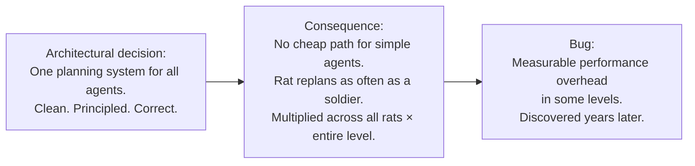
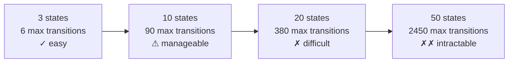
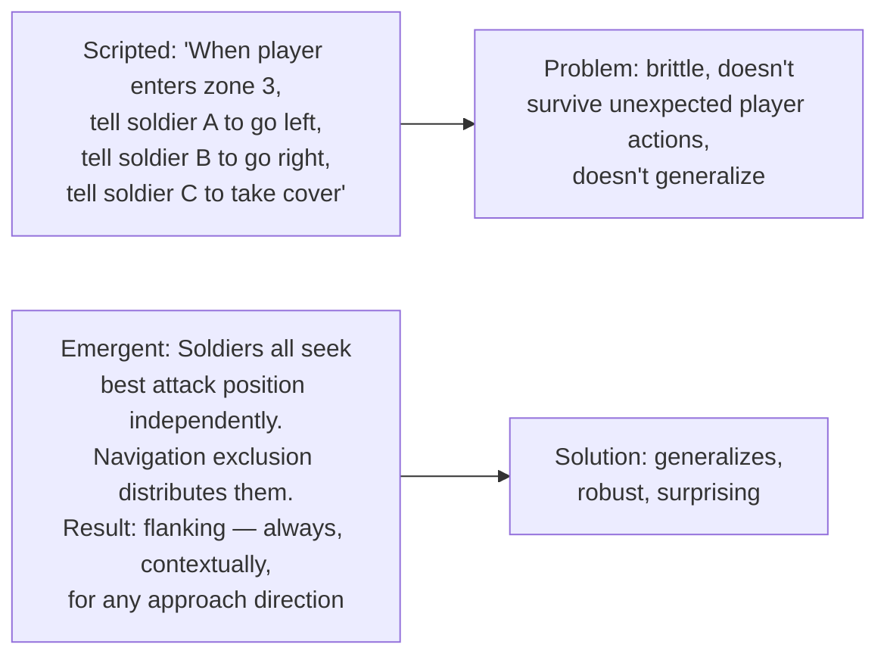
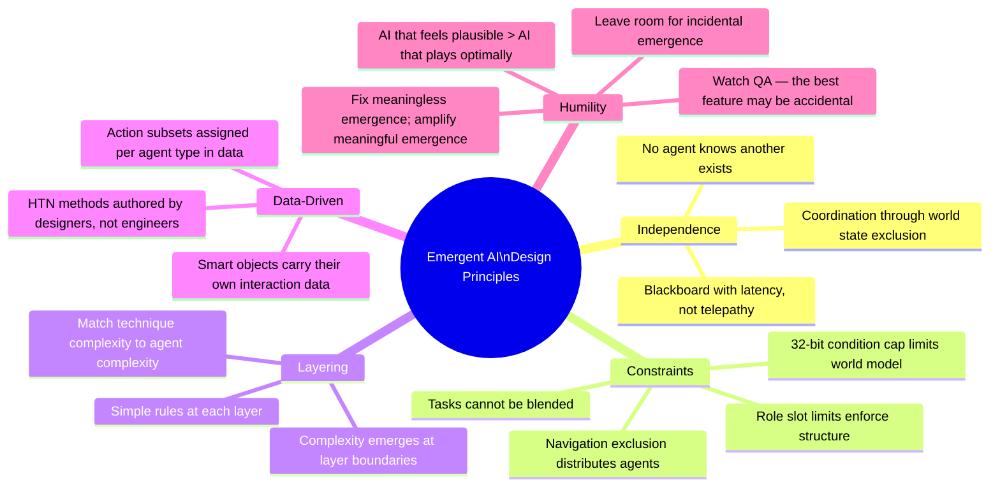

# Chapter 7 — Debugging, Anti-Patterns & Pitfalls

> **Previous:** [[ch06-ultimate-system|Ch 6 — The Ultimate System]]
> **Guide index:** [[00-index|Back to Index]]
> **Case studies:** [[fear-goap-case-study|F.E.A.R.]], [[half-life-ai-fsm|Half-Life]], [[horizon-zero-dawn-ai-case-study|HZD]]

---

## 7.1 The Rat Problem: The Cost of Generality

The most instructive bug in all the case studies comes from F.E.A.R. Discovered in a 2014 research paper, years after the game shipped:

> *Rats in F.E.A.R. use the same GOAP system as soldiers. Their `ReplanRequired()` function checks player distance — but doesn't filter on whether the player is still relevant. A rat that sees the player in the first seconds of a level will continue replanning for that rat's entire existence, even 20 minutes later when the player is across the map.*
> — [[fear-goap-case-study|F.E.A.R. Case Study, Part 8]]

### Why It Happened



### The Fix

```pseudocode
// ❌ Original: same system for everything
class Rat:
    brain: GOAPAgent   // full GOAP, continuous replanning

// ✓ Fixed: use the minimum system that works
class Rat:
    brain: StackFSM    // two states: wander, flee
    
    def wanderState(rat: Rat):
        rat.velocity = randomWanderDirection()
        if rat.canSeePlayer():
            rat.brain.pushState(fleeState)
    
    def fleeState(rat: Rat):
        rat.velocity = awayFrom(rat.lastKnownPlayerPos) * FLEE_SPEED
        if distance(rat, rat.lastKnownPlayerPos) > SAFE_DISTANCE:
            rat.brain.popState()
```

**Rule:** Choose the simplest system that produces acceptable behavior for an agent. Complexity should scale with behavioral requirement.

---

## 7.2 FSM Transition Explosion

### The Problem

As behavior count grows, FSM transition count grows O(n²). At 30 states, you have potentially 870 possible transitions to maintain. Adding one state requires updating every other state that should be able to reach it.



### Signs You're Hitting This Limit

- "I need to add a behavior but I'm not sure which other states should know about it"
- Your state diagram has crossing edges you're afraid to draw
- You've found bugs where an agent is stuck in a state it can't exit
- Adding a new state required modifying 5+ existing states

### Solutions by Severity

**Mild (10–20 states): Hierarchical FSM**
Group related states into regions. Transitions within a region stay local. *(See [[ch02-fsm|Ch 2, Section 2.4]])*

**Moderate (20–50 behaviors): Behavior Tree**
Replace the FSM with a BT. Behavior trees don't have transitions — they have priority order. Adding a new behavior means inserting it at the right point in the hierarchy, not updating all other behaviors. *(See [[ch05-supporting-systems|Ch 5, Section 5.5]])*

**Severe (50+ behaviors, needs runtime composition): GOAP or HTN**
Stop authoring connections. Define what behaviors need and produce. Let the planner find connections at runtime. *(See [[ch03-goap|Ch 3]] and [[ch04-htn-and-hierarchies|Ch 4]])*

---

## 7.3 Debugging FSMs

FSMs are the most debuggable technique. The current state is inspectable at any frame.

```pseudocode
// Debug overlay: print current state name
def debugDraw(agent: Agent):
    drawLabel(agent.position, agent.brain.getCurrentStateName())
    drawArrow(agent.position, agent.velocity)

// Transition logging
class FSM:
    def setState(state: Function):
        if DEBUG_AI:
            log("[FSM] " + owner.id + ": " + currentStateName + " → " + state.name)
        // ... set state as normal

// Pause and inspect
def debugInspectAgent(agent: Agent):
    print("Current state: " + agent.brain.getCurrentStateName())
    if agent.brain is StackFSM:
        print("Stack: " + agent.brain.getStackNames())
    print("Conditions set: " + agent.conditions.getSetFlagNames())
    print("Current schedule: " + agent.currentSchedule?.name)
    print("Current task index: " + agent.taskIndex)
```

---

## 7.4 Debugging GOAP

GOAP is the hardest technique to debug. When a behavior seems wrong, you have to reconstruct the A* search decision.

### Debug Logging for GOAP

```pseudocode
class GOAPPlanner:
    def plan(...) -> List<GOAPAction> | null:
        if DEBUG_GOAP:
            log("[GOAP] Planning for goal: " + goal.name)
            log("[GOAP] Start state: " + start.toString())
            log("[GOAP] Available actions: " + availableActions.map(a -> a.name))
        
        // ... search ...
        
        if result != null and DEBUG_GOAP:
            log("[GOAP] Plan found: " + result.map(a -> a.name + "(cost " + a.cost + ")"))
        elif DEBUG_GOAP:
            log("[GOAP] No plan found for goal: " + goal.name)
        
        return result
```

### The GOAP Debug Dump

When a behavior looks wrong, dump the full decision context:

```pseudocode
def debugDumpGOAPDecision(agent: GOAPAgent):
    print("=== GOAP DEBUG DUMP: " + agent.id + " ===")
    print("Current world state:")
    for key, value in agent.worldState:
        print("  " + key + " = " + value)
    
    print("\nGoal priorities:")
    for goal in agent.availableGoals:
        p = goal.calculatePriority(agent.worldState, agent)
        print("  " + goal.name + ": " + p)
    
    print("\nSelected goal: " + agent.currentGoal?.name)
    
    print("\nCurrent plan:")
    for i, action in enumerate(agent.currentPlan):
        marker = "→ " if i == agent.taskIndex else "  "
        print(marker + action.name + " (cost: " + action.cost + ")")
    
    print("\nAvailable actions (possible given current world state):")
    for action in agent.availableActions:
        possible = action.isPossible(agent.worldState)
        print("  [" + (if possible then "✓" else "✗") + "] " + action.name)
        if not possible:
            for key, value in action.preconditions:
                if agent.worldState.get(key, false) != value:
                    print("    Missing: " + key + " should be " + value)
```

### Common GOAP Bugs

| Bug | Symptom | Cause | Fix |
|-----|---------|-------|-----|
| No plan found | Agent stands idle | No action chain can satisfy goal | Check: is there a path from any start state to goal? Draw action graph. |
| Infinite replanning | Agent constantly interrupts itself | ReplanRequired() fires every frame | Add cooldown; check what condition is perpetually failing |
| Wrong action chosen | Agent does unexpected thing | Cost values are unbalanced | Log costs; adjust costs to express preferences correctly |
| Plan works in test, fails in play | Plan succeeds in simulation but fails in execution | World state at simulation time ≠ world state at execution time | Increase validation frequency; reduce plan length |
| Agent oscillates | Keeps switching between two plans | Two goals have nearly equal priority that flip-flops | Add hysteresis (stick with current goal unless new goal exceeds current by threshold) |

```pseudocode
// Hysteresis: don't switch goals unless new goal significantly outweighs current
class GOAPAgent:
    GOAL_SWITCH_THRESHOLD = 10.0

    def selectBestGoal() -> GOAPGoal | null:
        best = null
        bestPriority = -1.0
        
        for goal in availableGoals:
            p = goal.calculatePriority(worldState, this)
            if p > bestPriority:
                bestPriority = p
                best = goal
        
        // Only switch if significantly better (hysteresis)
        if currentGoal != null and best != currentGoal:
            currentPriority = currentGoal.calculatePriority(worldState, this)
            if bestPriority - currentPriority < GOAL_SWITCH_THRESHOLD:
                return currentGoal  // stick with current goal
        
        return best
```

---

## 7.5 Debugging HTN

HTN plans are more inspectable than GOAP because the hierarchy is explicit.

```pseudocode
def debugHTNPlan(agent: HTNAgent):
    print("=== HTN DEBUG: " + agent.id + " ===")
    print("Root task: " + agent.currentGoal.rootTask.name)
    print("Plan (primitive tasks):")
    for i, task in enumerate(agent.currentPlan):
        marker = "→ " if i == agent.taskIndex else "  "
        print(marker + task.name)
        if not task.isPossible(agent.worldState):
            print("    ⚠ PRECONDITION FAIL:")
            for key, value in task.preconditions:
                if agent.worldState.get(key, false) != value:
                    print("      " + key + " should be " + value + ", is " + agent.worldState.get(key))

// Decomposition trace (add to planner during debugging)
class HTNPlanner:
    def decompose(task, state, plan) -> ...:
        if DEBUG_HTN:
            indent = "  " * debugDepth
            log(indent + "Decomposing: " + task.name)
        
        debugDepth++
        result = // ... decompose ...
        debugDepth--
        
        if DEBUG_HTN:
            if result != null:
                log(indent + "✓ " + task.name + " → [" + result.map(t -> t.name).join(", ") + "]")
            else:
                log(indent + "✗ " + task.name + " failed — all methods exhausted")
        
        return result
```

---

## 7.6 Debugging Agent Hierarchies and Blackboards

```pseudocode
// Blackboard inspection
def debugBlackboard(group: GroupAgent):
    print("=== BLACKBOARD: Group " + group.id + " ===")
    bb = group.blackboard
    
    for key in bb.getAllKeys():
        (value, age) = bb.readWithAge(key)
        stale = bb.isStale(key, 3.0) ? " [STALE]" : ""
        print("  " + key + " = " + value + " (age: " + age + "s)" + stale)

// Role assignment inspection
def debugRoles(group: GroupAgent):
    print("=== ROLES: Group " + group.id + " ===")
    for role, agents in group.roles:
        limit = group.roleSlotLimits[role]
        print("  " + role + ": " + agents.length + "/" + limit)
        for agent in agents:
            print("    - " + agent.id + " (" + agent.agentType + ")")
```

---

## 7.7 Performance Anti-Patterns

### Anti-Pattern 1: Planning Every Frame

```pseudocode
// ❌ Re-runs A*/HTN search every frame — catastrophic for CPU
def update(dt: float):
    plan = planner.plan(currentGoal, worldState)
    execute(plan[0])

// ✓ Plan on demand, cache the result
def update(dt: float):
    replanCooldown -= dt
    if currentPlan.isEmpty() or replanCooldown <= 0:
        generatePlan()
        replanCooldown = REPLAN_INTERVAL
    executePlan(dt)
```

### Anti-Pattern 2: Scanning All World Entities for Sensors

```pseudocode
// ❌ O(agents × entities) — breaks at scale
def updateSensors():
    for entity in world.getAllEntities():  // potentially thousands
        for sensor in sensors:
            sensor.perceive(entity.stimulus)

// ✓ Spatial query first — only check entities within max sensor range
def updateSensors():
    MAX_SENSOR_RANGE = sensors.map(s -> s.range).max()
    nearby = world.getEntitiesInRadius(position, MAX_SENSOR_RANGE)
    for entity in nearby:
        for sensor in sensors:
            sensor.perceive(entity.stimulus)
```

### Anti-Pattern 3: Rebuilding the Entire Nav Mesh on Every Obstacle Change

```pseudocode
// ❌ Full rebuild is expensive
onObstacleChanged(obstacle: Obstacle):
    navMesh.rebuildFull()

// ✓ Incremental rebuild of affected region only
onObstacleChanged(obstacle: Obstacle):
    affectedRegion = obstacle.bounds.expand(REBUILD_MARGIN)
    navMesh.rebuildRegion(affectedRegion)
```

### Anti-Pattern 4: World State With Too Many Predicates

```pseudocode
// ❌ 50 predicates = 2^50 possible states — A* search becomes intractable
worldState = {
    "door_1_open": false, "door_2_open": false, ..., "door_20_open": false,
    "has_key_1": false, "has_key_2": false, ...,
    // etc.
}

// ✓ Abstract where possible
worldState = {
    "have_access_to_target": false,  // computed from doors + keys together
    "enemy_visible": true,
    "have_cover": false,
    "ammo_loaded": true
}
```

### Anti-Pattern 5: Deep Plan Lengths

```pseudocode
// ❌ Long plans become stale during execution
// Plan: [WalkToKeyRoom, PickupKey, WalkToDoor, OpenDoor, WalkToEnemy, Attack]
// By the time agent reaches step 5, the world has changed dramatically

// ✓ Keep plans short (1-4 actions); replan frequently
const MAX_PLAN_LENGTH = 4

// For longer-horizon goals, use HTN hierarchical decomposition
// or a separate strategic planner that updates less frequently
```

---

## 7.8 AI Anti-Patterns: Design Level

### Anti-Pattern: Scripting Instead of Emerging



**Test:** If your AI requires level-specific scripts to behave intelligently, the AI system is not doing its job. Emergent AI should produce intelligent behavior in any geometry, any approach order, any player strategy.

### Anti-Pattern: Giving Agents Too Much Information

More information is not always better. Half-Life's 32-bit condition cap forced designers to decide what the AI actually needs to know. An AI that knows everything becomes:
- Uncanny (feels like it's cheating)
- Hard to design stealth around
- More expensive to compute

```pseudocode
// ❌ AI knows exact player position at all times
worldState["player_position"] = player.exactPosition  // cheating

// ✓ AI knows player position only from sensory information
// If player is hidden, worldState["player_position"] = lastSeenPosition
// If never seen, worldState["player_position"] = null
```

### Anti-Pattern: Hive Mind Coordination

Directly sharing agent plans and intentions produces robotic, unrealistic coordination:

```pseudocode
// ❌ Explicit coordination: agents tell each other what to do
agentA.broadcastToGroup("I'm going left, you go right")
agentB.receiveInstruction("go right")

// ✓ Emergent coordination: agents share world state, not plans
blackboard.write("left_flank_reserved", agentA.id)
// agentB independently finds left flank unavailable and chooses right flank
// Same outcome, but generalizes to any number of agents and any geometry
```

### Anti-Pattern: Meaningless Emergence

Emergence must serve the game. Random behavior without impact frustrates players. The question is not "does emergence happen?" but "does emergence produce *meaningful* variation that enriches the player's experience?"

> *"Meaningless emergence: random events without impact frustrate players; emergence must serve narrative or gameplay purpose."* — Game AI research literature

A Stormbird blocking the sun is meaningful emergence: it makes combat more difficult and disorienting at a dramatically appropriate moment. A guard randomly walking into a wall is technically emergent but meaningless — it should be caught and patched.

**Test for meaningful emergence:** Does the unexpected behavior make the game more interesting, or does it break the game's logic? Amplify the former. Fix the latter.

---

## 7.9 The "Uncanny Valley" of AI

AI that behaves too perfectly is as immersion-breaking as AI that behaves stupidly.

| Problem | Symptom | Fix |
|---------|---------|-----|
| Perfect aim | AI always hits first shot | Add missed-shot animation; add reaction time delay |
| Instant threat detection | AI always knows player's exact position | Add sensor confidence; require sustained detection before response |
| Telepathic coordination | All AI reacts simultaneously to the same event | Add blackboard latency; stagger update frequencies |
| Never-failing plans | AI always completes objectives | Make some actions fail probabilistically; let plans be invalidated by world |
| Overly optimal pathing | AI always takes the mathematically shortest route | Add cost variation; sometimes take the "interesting" not just "efficient" path |

The goal is AI that feels *plausible*, not AI that plays optimally. Players intuitively understand that real humans make mistakes, communicate imperfectly, and commit to suboptimal decisions. AI that mimics these properties feels more alive.

---

## 7.10 Debug Tooling Recommendation

These tools are worth building early — they pay back many times over during development:

| Tool | What it shows | Value |
|------|--------------|-------|
| In-world state labels | Current FSM state / HTN task / active goal per agent | Instant visual feedback during play |
| Blackboard inspector | All keys, values, ages, staleness flags | Debug group coordination problems |
| Plan visualizer | Current plan as an ordered list; current task highlighted | See what the agent intends to do next |
| Condition dump | All conditions/world state predicates, which are set | Diagnose why a plan was or wasn't selected |
| Sensor visualization | Sensor ranges, field-of-view cones, current detections | Debug detection and stealth issues |
| Navigation debug | Agent's current path; reserved nodes shown | Debug stuck agents and unexpected routes |
| Role/group inspector | Group membership, role assignments, slot usage | Debug herd/group behavior |
| Replay logging | Time-stamped log of all decisions and transitions | Post-mortem analysis of unexpected behavior |

---

## 7.11 Final Design Principles Summary

Synthesized from every case study and formalized for use:



---

> **Guide complete.** Return to the [[00-index|Index]] or dive into a case study for deeper context on any specific technique.
